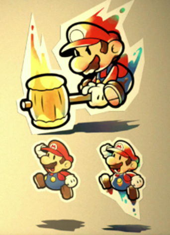
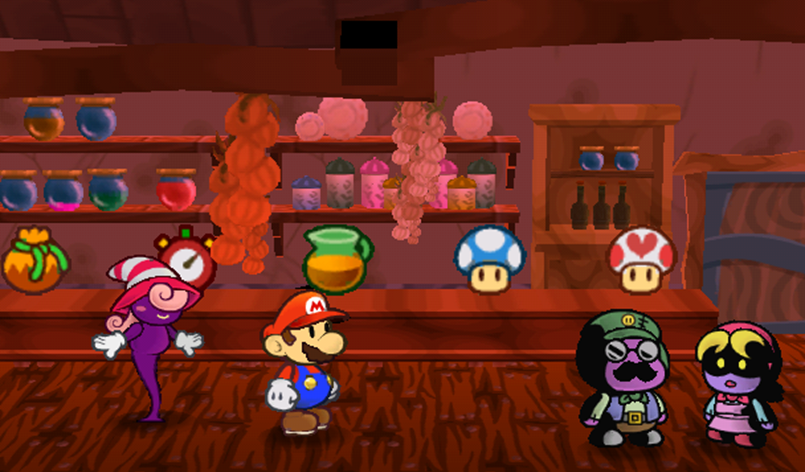

# Character Creation
{: .no_toc }

*1*. *Choose a Species*{: .header-font }  
    Species are the types of creatures that occupy the Mushroom Kingdom. A character's Species modifies their Stats, adds extra Skill Specialisations, and provides many other traits.  
    For more options, consider looking at the Species Compendium!

*2*. *Get Your Stats*{: .header-font }  
    At level 1, you begin play with a 1 in *Heart*{: .heart-color }, *Spirit*{: .spirit-color } and *Courage*{: .courage-color }, plus the advantages of your Species.  
    Then, you can choose one of those stats to receive another +1 boost, representing your character's unique personal qualities.

*3*. *Assign your Skills*{: .header-font }  
    All Skills fall under the umbrella of one Stat – for example, *Athletics*{: .heart-color } is a *Heart*{: .heart-color } Skill, while *Notice*{: .spirit-color } is a *Spirit*{: .spirit-color } Skill.  
    During character creation, your Stats receive varying Skill Points and Skill Specialisations to further customise your character.  
    - a. Choose one Stat's Skills to receive +4 Skill Points and +2 Skill Specialisations.  
    - b. Then, choose a second Stat's Skills to receive +3 Skill Points and +1 Skill Specialisation.  
    - c. Finally, the remaining Stat's Skills receive +2 Skill Points and +1 Skill Specialisation.

{: .center-img }

{: .tip-callout }
> *It's okay if your character concept isn't fully formed to begin with! As you ready on you might find some interesting content that you want to work in, or during play you might pick up a Badge you hadn't considered working with. The joy of roleplay is finding new directions to take your character! *{: .icon-right }

*4*. *Define your Skill Specialisations*{: .header-font }  
    While Skills are broad general capabilities for your character, Specialisations are the specific things they excel in.  
    Your Specialisations are up to you to define. You can even assign Specialisations to Skills you otherwise don't have any points in!  
    But as a general rule, they shouldn't be so vague that they always apply, or so specific that they rarely make a difference.

*5*. *Design your Techniques*{: .header-font }  
    Your [Techniques]({{ "/techniques" | absolute_url }}) are the special moves that help your character excel in combat. Usually these are straightforward attacks, but you can customise them to be as complex as you wish.  
    You begin play with two Innate Techniques. It's recommended that you keep at least one Technique that costs *0 FP*{: .spirit-color }, so that you always have a basic attack option and can make [First Strikes]({{ "/combat#first-strikes" | absolute_url }}).

*6*. *Fill up your pockets*{: .header-font }  
    Finally, you start with 100 Coins (or more or less, depending on your campaign) to spend on [Items]({{ "/inventory#items" | absolute_url }}), [Power-Ups]({{ "/inventory#power-ups" | absolute_url }}), [Gear]({{ "/inventory#gear" | absolute_url }}) and [Badges]({{ "/inventory#badges" | absolute_url }}). Items, Power-Ups and Gear of all sizes occupy one of your 10 inventory slots, while Badges are small enough to not take up space – but the Badges you can actually equip and use at the same time will be restricted by your *BP*{: .courage-color }. 

{: .center-img }

{: .tip-callout }
> *Don't stress too much about getting the right Items or Badges right out of the gate – you might find it easier to just jump in with nothing but the clothes on your back and the Coins in your pocket. You can always go shopping once you know what you're dealing with – or make do with what you can find! *{: .icon-right }
