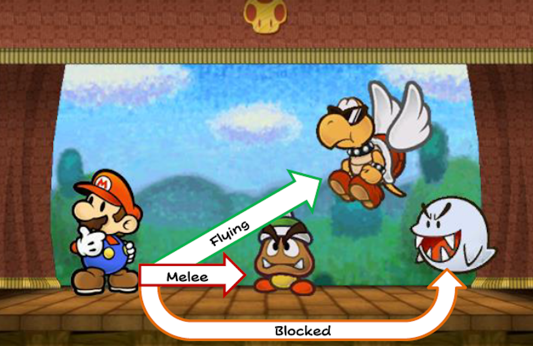

# Combat
{: .no_toc }

  

    Table of contents
  

  {: .text-delta }
- TOC
{:toc}

Combat in Paper Story is largely abstract; allied characters act as a single group, arranging themselves in a front-to-back formation at the start of combat (either arranged as they wish, or dictated based on circumstance).

{: .center-img }

Typically combats are between two groups, players and enemies. If players are fighting it out or enemies are split between factions, though, it can get more complicated and require more groups.

During each round of combat each player has a turn, during which they can take one action. Turns proceed through the group one-by-one, going from front to back.  

At the end of the players' turns, each enemy group takes their actions in sequence, until there are no more enemies and the next round of combat begins.

## Initiative and the Surprise Round

Before most combats, all players have to roll Initiative to see how quickly they react – in other words, who gets a First Strike.

Typically this check depends on *Athletics*{: .heart-color }, but *Trickery*{: .spirit-color }, *Notice*{: .spirit-color } or other checks may be more appropriate, depending on how the fight begins.  

Importantly, not every fight demands you check for Initiative or the Surprise Round! It all depends on how the narrative flow leads into battle; if you're standing face-to-face with the enemy long enough to have some banter, no matter how quickly you move you probably won't get the drop on them.

If you're proceeding with Initiative, you'll need to decide who moves first.
Players usually fight as one group, but if they're divided up at all, the order they act in is decided by which group has the most Grades of Success in total.  
If any player groups are tied, then it's the GM's call.  
In any case, enemies never move ahead of the players.

Your Initiative determines how soon you can defend yourself, and how well you can coordinate your actions with your allies.  
With a *Good*{: .good-color } result, a player can act in the Surprise Round to deliver a First Strike on behalf of their group!  
Each extra Grade of Success allows them to partner up with one other ally during the Surprise Round, as long as that ally also rolled well enough to act alongside them.  
Who moves first exactly is a tactical decision for you and your allies to make; if you really can't decide, it's usually better for the highest results to move first.

{: .example-callout}
> *Example: Striking in Tandem*{: .header-font }
>
> A quick-witted Paratroopa gets the drop on their enemies, moving with *Wonderful*{: .wonderful-color } speed!  
> They're followed by two Yoshi twins with a *Great*{: .great-color } result each, and their Cleft guardian brings up the rear with a *Good*{: .good-color } result.
>
> While each party member moved quickly enough to score a First Strike, they can't all go at the same time. The Paratroopa can attack with up to two allies, but the Yoshi's can only pair up with one other ally, and the Cleft can't pair up with anyone at all.
>
> So the Paratroopa could attack with one of the Yoshi's, or the Yoshi's could attack together, or the Cleft could attack on their own.

On the other hand if a player *fails*{: .underlined .bold } their Initiative check, one of the enemies can make a First Strike against them instead!  
No matter how many people fail their Initiative checks, the same enemy can't make multiple attacks in the Surprise Round.

{: .example-callout}
> *Example: Getting Ambushed*{: .header-font }
>
> A Thwomp, a Whomp and a Boo are set on upon by a deadly Chomp!
>
> The Thwomp and the Whomp both fail their Initiative checks, scoring no Grades of Success. The Boo fares a bit better with a *Nice*{: .nice-color } result.
>
> Both the Thwomp and the Whomp failed, but the Chomp can only make one First Strike.
>
> If there were two Chomps they could each make a First Strike against the Thwomp and the Whomp. If there was a third Chomp, though, they'd still only get two First Strikes, since the Boo isn't vulnerable to attack yet.

The Surprise Round is a sudden burst of action, so it isn't counted as a full round.  
While players can take action and have a chance to react to damage, this isn't considered a "turn" in the traditional sense.  
So [Statuses]({{ "/statuses" | absolute_url }}) and other durations aren't affected by the Surprise Round.

## First Strikes

First Strikes are quick and decisive actions taken during the Surprise Round.

With a First Strike you can strike quickly in the chaos before battle lines are drawn!

A First Strike can be any one Innate or Gear Technique, with the following caveats:
- First Strikes can't affect multiple enemies, and if they would normally affect multiple enemies, they're limited to just the one target.  
Otherwise, they ignore targeting restriction and can reach any target.
- First Strikes can't have an associated cost, whether that's *FP*{: .spirit-color }, *SP*{: .courage-color } or otherwise.

Whatever Technique they use, characters attacking with a First Strike don't roll any dice.  
The Grades of Success they scored for Initiative are instead used for their Primary and Secondary Checks.

## Free Actions and Reactions

When the chips are down, players generally can't carry out more than one action on their turn.  
But there are cases where taking action is so straightforward, they don't have to think about it.

Whenever something calls for a reaction (such as [*Guarding*{: .underlined .heart-color }]({{ "/skills_in_detail#guard---guarding-reactively" | absolute_url }})), or a free action (such as [Charming]({{ "/example_of_play" | absolute_url }}) foes), players can carry it out and make any rolls necessary without using up their own actions. 

## Targeting

When targeting someone with a [Technique]({{ "/techniques" | absolute_url }}) or an [Item]({{ "/inventory#items" | absolute_url }}), the first thing you need to consider is if they're an eligible target.  
Most attacks are made in melee range. Line up your groups and imagine a line between yourself and the target – if there are no enemies in between you, you're in melee range and good to go!

If however a target is Flying or otherwise out of reach, they can't be targeted in melee and will generally require *Ranged*{: .positive-color }, *Reach*{: .positive-color } or *Aerial*{: .positive-color } Techniques.  
The good news is they're not able to block you off from other targets.

The same general rules apply to players – if you want to protect your teammates, you usually want to be standing in front of them, but it becomes harder to stop ranged or airborne attackers. If you need to get in front of your teammates, try [*Swapping*{: .underlined .heart-color }]({{ "/skills_in_detail#coordination---swapping" | absolute_url }}) positions.

{: .center-img }

## Damage and Knockouts

Eventually, you're bound to take damage in a fight – you may even drop down to *0 HP*{: .heart-color } and be knocked out!

Once you have *0 HP*{: .heart-color } you're KO'd, and you can't really do anything; you can't block attackers from targeting allies behind you in melee, and you can't take actions on your turn.

Healing effects work like normal, but even if you restore your *HP*{: .heart-color }, you're still KO'd. But Life Shrooms, *Revive*{: .positive-color } and similar effects can perk you up and get you back into the fight, immediately!  
If your turn would have passed by the time you get revived, you can take your turn immediately after revival.

Otherwise, you need a decent rest before you can get back up – or at least a 10 minute power nap. Typically these rests fully restore *HP*{: .heart-color } and *FP*{: .spirit-color }.

{: .center-img }

{: .tip-callout }
> *You're bound to run into some terrifying beasts on your adventure. But don't be afraid! Be brave! Even if your Game is Over, you can always pick yourself back up and try again. *{: .icon-right }

