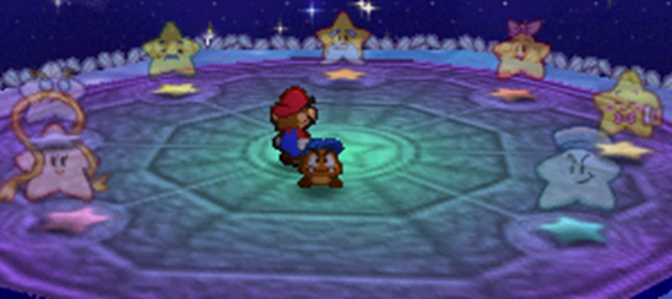

{: .float-right }

# Exceptional Techniques
{: .no_toc }

While *[Exceptional Results]({{ "/grades_of_success#exceptional-results" | absolute_url }})*{: .underlined .courage-color } are often their own reward, they can take on meaning in the heat of battle, allowing you to slightly tweak the Technique you're using.

When your Primary or Secondary Check generates *SP*{: .courage-color }, instead of adding it to your *SP*{: .courage-color }, you can spend it on these options at-will.

{: .content-callout }
> ## Primary Checks
> 
> - *1 SP*{: .courage-color }: Add +1 DMG to one of this Technique's Strikes.
> - *1 SP*{: .courage-color }: This Technique gains or loses an instance of one of the following Traits, if it would be appropriate to do so:  
> {: .content-callout }
> > - *Aerial*{: .positive-color }
> > - *Burst*{: .positive-color }
> > - *Element*{: .positive-color }
> > - *Indirect*{: .positive-color }
> > - *Launch*{: .positive-color }
> > - *Ranged*{: .positive-color }
> > - *Reach*{: .positive-color }
> > - *Selective*{: .positive-color }
> > - *Strike-Through*{: .positive-color }
> > - *Throw*{: .positive-color }
> > - *Delayed*{: .negative-color }
> - *2 SP*{: .courage-color }: Increase *both*{: .underlined .bold } the duration and Status Level of one of this Technique's existing Statuses by 1 each.
> - *2 SP*{: .courage-color }: This Technique gains or loses an instance of one of the following Traits, if it would be appropriate to do so:  
> {: .content-callout }
> > - *Homing*{: .positive-color }
> > - *Sequential*{: .positive-color }
> > - *Blowback*{: .negative-color }
> - *3 SP*{: .courage-color }: This Technique adds a new Status onto either the user or their targets with no check required, lasting 1 turn at Status Level 1.
> - *3 SP*{: .courage-color }: This Technique gains or loses an instance of one of the following Traits, if it would be appropriate to do so:  
> {: .content-callout }
> > - *All*{: .positive-color }
> > - *Overrun*{: .positive-color }
> > - *Piercing*{: .positive-color }
> > - *Sequential*{: .positive-color }
> > - *Exhausting*{: .negative-color }
> - *5 SP*{: .courage-color }: This Technique gains or loses an instance of one of the following Traits, if it would be appropriate to do so:  
> {: .content-callout }
> > - *Group*{: .positive-color }
>

{: .content-callout }
> ## Secondary Checks
> - *1 SP*{: .courage-color }: Increase *both*{: .underlined .bold } the duration and Status Level of one of this Technique's existing Statuses by 1 each.
> - *1 SP*{: .courage-color }: If this Technique would restore *HP*{: .heart-color } or *FP*{: .spirit-color } to the user and/or their targets, it restores an additional +1.
> - *1 SP*{: .courage-color }: Choose a Status; this Technique dismisses that Status from the user and/or their targets.  
> For the purposes of this effect, variations of the same Status (e.g. Boost, Tutor, Weaken) count as different Statuses.
> - *2 SP*{: .courage-color }: This Technique restores either *+1 HP*{: .heart-color } or *+1 FP*{: .spirit-color } to the user and/or their targets.
> - *2 SP*{: .courage-color }: This Technique adds a new Status to the user and/or their targets with no check required, lasting 1 turn at Status Level 1.

{: .example-callout}
> *Example: Exceptional Techniques*{: .header-font }
>
> A Goomba attacks with an *Excellent*{: .excellent-color } headbonk against a mighty dragon!  
>
> Ordinarily, they'd land two Strikes for 1 DMG each, but they decide to use some of the *5 SP*{: .courage-color } they'd normally gain to pump it up a little.  
> They choose to deal more damage across their strikes, paying *2 SP*{: .courage-color } to boost damage by +2.  
> Then, they inflict a light Stun for *3 SP*{: .courage-color }.  
>
> The end result is a headbonk that deals 1 DMG, then 3 DMG, and Stuns the enemy for 1 turn at Status Level 1.

{: .center-img }

{: .tip-callout }
> *Don't forget about your Star Power! Unspent Star Power won't do you any good. The blessings of the Stars keep all adventurers safe, and are an excellent way to get past troublesome foes.* 
> {: .icon-right }

