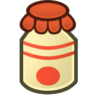

# How to Play
{: .no_toc }

  

    Table of contents
  

  {: .text-delta }
- TOC
{:toc}

## The Stats

Characters in Paper Story all follow the same general rules. They all have three Stats, and a variety of Skills that fall under the umbrella of those stats.

 ***Heart** – your Health Points and physical ability. Characters have 5 HP x their Heart – to a minimum of 1 HP.*
{: .heart-color .icon-left }

 ***Spirit** – your Flower Points and mental/technical ability. Characters have 5 FP x their Spirit.*
{: .spirit-color .icon-left }

 ***Courage** – your Badge Points and spiritual/social ability. Characters have 3 BP x their Courage.*
{: .courage-color .icon-left }

In addition, players have some special stats used for combat, which aren't related to the main three stats.

 ***Power** – your raw combat skill and capacity for dealing damage to foes. The base damage for your [Techniques]({{ "/techniques" | absolute_url }}) is determined by your Power. You begin play with 1 Power, unless your Species modifies it.*
{: .icon-left }

 ***Attack** – how hard you can hit in the heat of the moment. Under most circumstances, your Attack is 0, but it can temporarily go up or down. Every one of your [Strikes]({{ "/techniques#strikes" | absolute_url }}) are modified by your Attack.*
{: .icon-left }

 ***Defense** – whenever you're struck in combat, you reduce the damage by your Defense. You get your full Defense against all strikes made against you, even if they're made by the same attacker. For most species, your beginning Defense is 0, though this can be improved with [Gear]({{ "/inventory#gear" | absolute_url }}).*
{: .icon-left }

Before we go any further, there's just a few more general rules to cover off:

- Players generally have one "action" per turn, representing something they want to do with the time they have. Usually this warrants a skill check (and thus, rolling dice).  
When there's no time pressure (such as outside of battle), these actions can be resolved in any order.

- If something is measured in "turns", outside of battle, treat 1 turn as being about a minute.

- If a number is divided in any way, unless otherwise specified, round the remainder down to the nearest whole number – to a minimum of 1.  
Be careful, sometimes this will go down to 0! Usually when it would give an unfair advantage for ½ of 1 to wind up the same as ½ of 2. In these cases though the minimum is specified.

Things get a little more complicated in battle, but the following core rules are at the heart of everything in Paper Story!

## Rolling and Nudging Dice

Paper Story uses the Nudge System, a lightweight form of conflict resolution where you roll a pool of dice, then try to nudge the results into your favour.

For every Skill point and relevant Specialisation you have on any given check, you can roll an additional six-sided die (1d6).  
Non-player characters (NPC's) don't have Stats, Skills or Specialisations, and they don't roll at all.

The spotlight is always on the players. No matter what, your success and failure hinges on your own actions.

When you make a check you're using your Skill, and the Stat it falls under, to try and make something happen, which prompts a dice roll.  
Each time you roll your dice, you're hoping to roll 4 or more; the Target Number.  
When a die shows a number equal to or greater than that, it counts as a Success. And if you roll a 6, you can add another d6 to your pool and roll it, too!

Your Stats make you more consistent, allowing you to nudge the results into your favour. For every point you have in the appropriate Stat, you can modify a die result by 1. If this turns it into a 6, you can roll another d6, just the same as if you'd rolled it naturally.

{: .example-callout}
> *Example: Standard Checks*{: .header-font }
>
> A Koopa with *3 Heart*{: .heart-color } and *2 Coordination*{: .heart-color } tries to hammer a Goomba, making an attack roll.
> He rolls two dice (2d6) for his *Coordination*{: .heart-color }, and rolls 4 and 1. 4 is a successful result, so this counts as 1 Success – a *Nice*{: .nice-color } result!
> He can then spend his 3 points in *Heart*{: .heart-color } to increase the 1 to a 4, making 2 Successes. (A *Good*{: .good-color } result!)

Be warned, though – if at any point more than half of your dice are 1's, you suffer a Critical Failure! You lose all your Successes, and your action may fail spectacularly.

{: .example-callout}
> *Example: Critical Failure*{: .header-font }
>
> A Bob-Omb with *2 Heart*{: .heart-color } and *2 Guard*{: .heart-color } attempts to block a spinning shell attack from an enemy Koopa.
> He rolls two dice (2d6) for his *Guard*{: .heart-color }, and rolls 4 and 1. 4 is a successful result, so this counts as 1 Success – a *Nice*{: .nice-color } result, able to block the damage.
> The Bob-Omb thinks they can do better, and nudges their 4 into a 6, giving them another d6 to roll.
> The new d6 comes up 1; and now more than half their dice are 1's! It's a Critical Failure. They got greedy!
> The Bob-Omb takes the damage full-force, and the GM decides this failure causes the Koopa to spin around them, Disorienting them for the next turn!

## Rolling Without A Dicepool

Due to situational penalties or a lack of skill you might find yourself rolling at 0 dice – or less. In these cases you can't use your Stats at all!  
Anything less than 1 die is rolled as 1d6, with negative numbers subtracting from the number of Successes.

{: .example-callout}
> *Example: Rolling without Dice*{: .header-font }
>
> A Boo with *1 Courage*{: courage-color } and *0 Persuade*{: courage-color } tries to talk his way out of a dire situation. He rolls one die (1d6), with a result of 3 – he can't fix that up with his *Courage*{: courage-color }, so he has no Successes!

## Rolling With Your Friends

So what do you do when your skills fall short? You turn to your teammates!

When you take an action to assist someone else's check, you take ½ the dice you would have for the action (rounded down, to a minimum of 0) and add them to the other character's dicepool.

Then, they can use your Stat points as well as their own to nudge the dice in their favour.

You have to have at least 1d6 yourself to assist! Otherwise your help isn't 
useful enough to provide any advantage.

{: .example-callout}
> *Example: Working together*{: .header-font }
>
> A Koopa, a Bandit and a Dayzee try to lift a heavy stone statue to inspect what's underneath, using *Athletics*{: .heart-color }.
> The Koopa volunteers to lead the job; they have *3 Heart*{: .heart-color } and *3 Athletics*{: .heart-color }. The Bandit has *2 Heart*{: .heart-color } and *2 Athletics*{: .heart-color }, and the Dayzee has just *1 Heart*{: .heart-color } and *1 Athletics*{: .heart-color }.
> The Koopa can roll 3d6 from their own *Athletics*{: .heart-color }, and +1d6 from the Bandit – they don't get any dice from the Dayzee, because their *Athletics*{: .heart-color } is too low.
> The four dice come up 2, 2, 3 and 3. Fortunately, pooling together everyone's *Heart*{: .heart-color }, the group has *6 Heart*{: .heart-color } to spend, enough to boost everything to 4 for a *Great*{: .great-color } result!

## Partial Bonuses

In some cases you may receive a situational bonus for part – but not all – of your check. Such as a *Guard (VS Ranged)*{: .heart-color } Specialisation, when you're being attacked both in range and in melee, or a [Disoriented]({{ "/statuses#disoriented" | absolute_url }}) enemy, when you're attacking them and their healthy allies at the same time.

In these cases, you only receive the benefit if it would apply to *more than half*{: .underlined } of the check (whether that's the number of different targets you're attacking, the number of different attacks you're blocking, or anything else).
