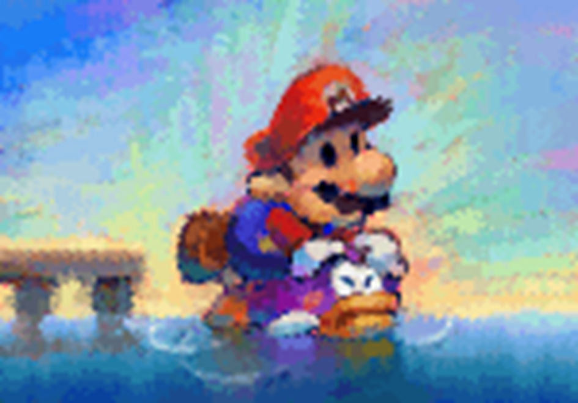
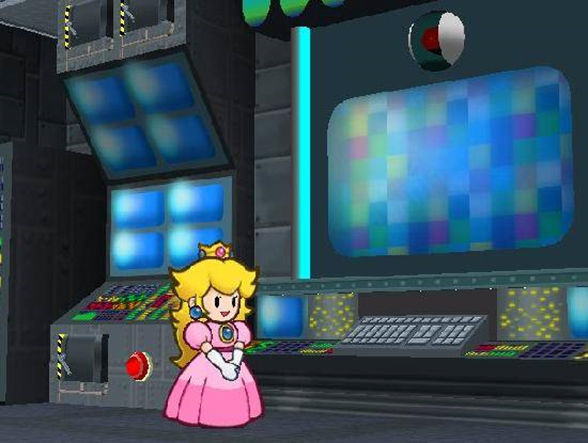
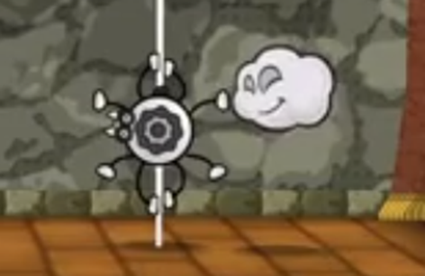
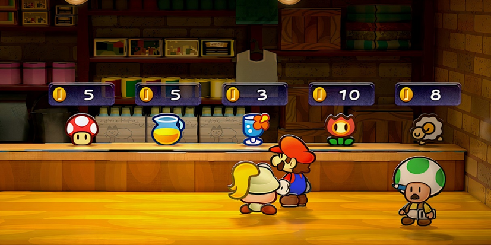
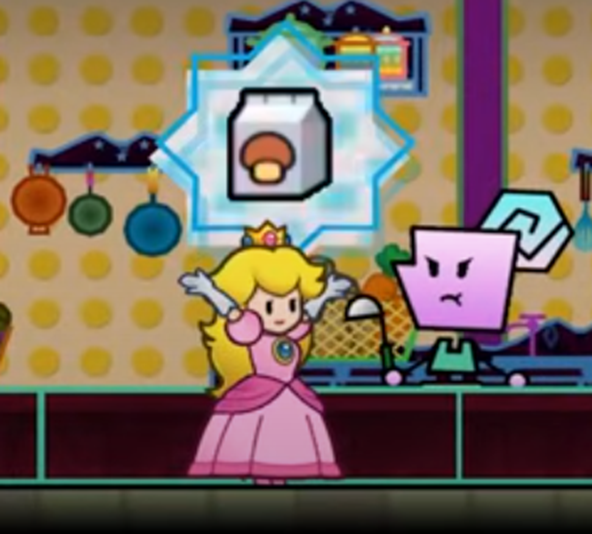
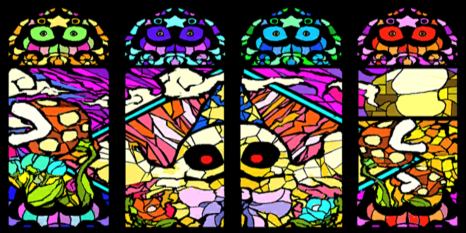
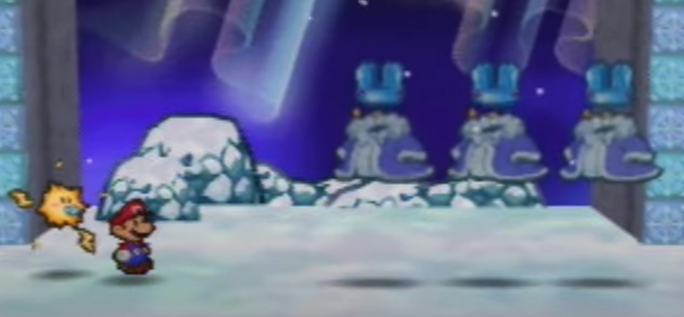

# Personal Traits
{: .no_toc }

  

    Table of contents
  

  {: .text-delta }
- TOC
{:toc}

A character's Personal Traits are all their special qualities which are passively active, with a wide variety of effects.  

Generally speaking, if multiple instances of a Trait would apply – such as multiple Contact Traits – only one is active at a time.  
Typically this applies to the stronger Trait, or in the case of a negative Trait like Weakness, the more troublesome Weakness.  
This can be subjective though, and in some cases up to the character to decide, so make sure to check with your GM.

{: .content-callout }
> ## Adapted
> 
> A character with this Trait is comfortable in a particular environment, situation or Terrain, such as the desert, while burrowing or underwater.
>
> They ignore the related hazardous penalties (such as restricted breathing, or burning up in the sun) and treat movement through it as simple as if they were walking.  
> Unless things get especially dangerous or they need to move quickly, they typically don't need to make checks to move around in that environment.  
>
> Note though that being Adapted to an environment doesn't offset someone else benefitting from that environment; if a Terrain would improve an enemy's capabilities, they don't receive any extra protection from that.

{: .content-callout }
> ## Carrier
> 
> A character with this Trait can carry one other character easily; usually they carry them around on their back, but the specifics will vary depending on the character.  
> 
> As an action, a character can either pick up an adjacent ally or climb aboard an adjacent ally with Carrier – similarly to [*Swapping*{: .heart-color}]({{ "/skills_in_detail#coordination---swapping-places" | absolute_url }}), both characters can make a *Coordination*{: .heart-color} check to speed this up.  
> With a *Great*{: .great-color } result from both characters, this becomes a free action.  
> 
> During either character's turn, they can split back up as a free action, with the carried character taking up a space adjacent to the carrier.  
> If the carrier is Dazed, Stunned or KO'd, both characters split up immediately.  
>
> While a character is being carried they move with the carrier, occupy the same space in combat and take their turn after the carrier. They can't be targeted if the carrier is in the way, and likewise, the carrier can't be targeted by attacks if their passenger would block them.  
> 
> If an attack would affect both characters at the same time (e.g. Group, Quake), it hits them as normal.

{: .center-img }

{: .tip-callout }
> *The combination of Adapted and Carrier can be a huge help to allies in a sticky situation. Bloopers and Cheep Cheeps are great at this, giving you a chance to shine whenever the water calls to your adventure. You can even ferry people around during battle!* 
> {: .icon-right }

{: .content-callout }
> ## Clone
> 
> You are able to split your mind and body into two or more like-minded individuals.  
> While your Items and Badges don't get copied, you can divide them as you see fit whenever you split up.
>
> With an action and a successful *Steady*{: .courage-color } check, you can either split up into two perfect copies or merge two nearby clones back together.  
> With a *Great*{: .great-color } result this becomes a free action!  
> Otherwise, all parties involved lose an action for the turn.
>
> When you first split apart, the number of Grades you earn becomes your Copy Level.  
> The Copy Level can fluctuate from there, either dropping by 1 (when one of you splits up again), or increasing by 1 (when a pair of clones merges back together).
>
> While split apart, each copy is weaker than the sum of its parts; both you and your copies have your max *HP*{: .heart-color } and max *FP*{: .spirit-color } capped at *no more than*{: .bold .underlined } ½ your maximum, plus the Copy Level – or your ordinary maximum, whichever's lower.
>
> Whenever two copies recombine, pool together the remaining *HP*{: .heart-color } and *FP*{: .spirit-color } of both copies, up to the limit of the new form's maximum.
>
> {: .example-callout }
> > *Example: Fuzzy Splits*{: .header-font }
> > 
> > A Fuzzy with *15 HP*{: .heart-color } splits apart, with a *Good*{: .good-color } result for a Copy Level of 2 – giving them a maximum of *7 + 2*{: .heart-color } for *9 HP*{: .heart-color }.  
> > Later the clone takes 5 damage, going down to *4/9 HP*{: .heart-color }.
> >
> > When re-combining, the Fuzzy goes back to having *15 HP*{: .heart-color } at maximum.  
> > Since their combined *HP total*{: .heart-color } would have been *9 + 4*{: .heart-color } for *13 HP*{: .heart-color }, the Fuzzy is brought back to *13/15 HP*{: .heart-color }!
>
> While split up you can make actions as normal, but your clones don't roll for their actions; they instead automatically receive a number of Grades of Success equal to their dicepool, or the Copy Level (whichever's lower).  
> Since they don't roll, they can't benefit from *[Exceptional Results]({{ "/grades_of_success#exceptional-results" | absolute_url }})*{: .underlined .courage-color } at all.
>
>
> {: .example-callout }
> > *Example: Many Hands Make Light Work*{: .header-font }
> > 
> > While split in two, a Fuzzy and their clone attack in tandem! Their normal attack plan is to repeatedly bounce on the enemy with *3 Athletics*{: .heart-color }.  
> > 
> > The original Fuzzy can roll and make their attack as normal.  
> > The Copy Level is only 2, though – so while the clone would get a *Great*{: .great-color } result with 3 Grades of Success, it's limited to 2 Grades for a *Good*{: .good-color } attack.
>
> It's difficult to divide your consciousness up like this; whenever your or one of your clones are seriously startled, or one of you takes more damage than you Copy Level, you must make a *Steady*{: .courage-color } check.
>
> The exact difficulty depends on the situation, with damaging attacks starting at 1 Grade for each point of damage taken beyond the Copy Level.  
> If you fail, the Copy Level drops by 1; if the Copy Level is reduced to 0 this way, you lose control!
>
> When you lose control of your copies you're left completely Stunned (6) for the next turn!  
> Meanwhile, your clones are free to act however they please.  
> Most of the time your clones will take the opportunity to recombine or run away, but they might take more troublesome actions, too...
>
> 
> {: .center-img }
> 
> {: .tip-callout }
> > *Cloning yourself as much as you dare is a great way to get a lot of extra actions; just make sure you don't get in over your head.* 
> > {: .icon-right }
> >
> 

{: .content-callout }
> ## Construct
> 
> A character with this Trait has an artificial body. They may still have the spark of life, but they're fundamentally different from organic life.
> 
> - Constructs can equip Built-In Gear, which are functionally identical to Gear, but occupy a part of their body as well as their inventory. This Gear is harder to disarm (granting +1d6 to checks to hold onto them), but losing them is bound to cause more problems than normal.
> - Constructs don't need to breathe, and may not even have a mouth, granting them a number of passive immunities in addition to their listed Traits (such as immunity to scent-based effects).
> - Lifelike Constructs (such as Bob-Ombs or Puppets) can, and often need to, eat.  
> However, True Constructs (such as Mechas) can't, preventing them from using Mushrooms, Syrups and other Items. They may still be able to use [Power-Ups]({{ "/inventory#power-ups" | absolute_url }}), though it might take some effort.
> - Constructs can't be healed through conventional means; *Crafts*{: .spirit-color } and appropriate tools are required in place of *Heal*{: .heart-color }. They otherwise follow all the standard rules for recovering *HP*{: .heart-color }.  
> Lifelike Constructs can still rest and be healed with *Magic*{: .spirit-color }, though other Constructs need more specific methods (like recharging their batteries) – typically, they can't even recover from resting.
> 
> 
> {: .center-img }
> 
> {: .tip-callout }
> > *Don't feel like you have to play Constructs as soulless automatons if you don't want to. Many Constructs still think – and feel – for themselves.* 
> > {: .icon-right }
> >
>

{: .content-callout }
> ## Contact
> 
> An attacker making contact with this character is harmed in some way, which may interrupt their attack and cause more debilitating effects.  
>
> Even if the attack has no effect due to Immune, a Secure Status or some other effect, as long as the attacker would have touched the character with this Trait its effects can still be triggered.

{: .content-callout }
> ## Devotion
>
> A character with this Trait favours a particular element, skill or fighting style – making them a little less flexible than others characters.  
> A broad category of effects are considered "restricted" for them.
>
> - When designing an Innate or Gear Technique, traits restricted by a character's Devotion have twice the effective *FP Cost*{: .spirit-color }.  
> Tech Defaults work as normal.
> - When paying for the cost of an ongoing ability (such as Invisibility), each *FP*{: .spirit-color } payment costs twice as much.
> - When casting spells on the fly, they pay twice as much *FP*{: .spirit-color } per die for spells restricted by their Devotion – for more details, see *[Magic – Spontaneous Spells]({{ "/skills_in_detail#magic---spontaneous-spells" | absolute_url }})*{: .spirit-color .underlined }.
>
> {: .example-callout }
> > *Example: Devotion*{: .header-font }
> >
> > Exactly how restrictive a character finds their Devotion can vary from game to game, or character to character.  
> > Devotion is a useful starting point to thinking about your character's flavour, but shouldn't be seen as the be-all and end-all.
> >
> > Someone devoted to fighting with Fire will probably to use Water attacks, or to conjure a rainstorm.  
> > But maybe they can get creative and use their fire to create a concussive Blast, or billow out smoke to create Smog Terrain.
> >
> > Ultimately, what your Devotion means to your character is up to you and your GM to decide.

{: .content-callout }
> ## Elevation
> 
> A character with this Trait is able to lift themselves above the battlefield, though they are themselves unable to fly and can't move much at all while elevated.  
>
> Elevated targets sit somewhere above the battlefield, though not entirely out of reach.  
> If a character with this Trait is on the ground, they can make an *Athletics*{: .heart-color } check as an action to elevate themselves – with a *Great*{: .great-color } result, it becomes a free action.  
>
> It's possible, though difficult, for elevated characters to lift other creatures.  
> This generally requires an *Athletics*{: .heart-color } check in and of itself, and the elevated character is often restricted by the height they can gain and the distance they can climb before resting.  
>
> Only *Aerial*{: .positive-color }, *Reach*{: .positive-color } or *Ranged*{: .positive-color } attacks can strike an elevated target.  
> Unlike a flying character, an elevated character receives no special benefits on their melee attacks, and making a melee attack without *Reach*{: .positive-color } causes their elevated state to end immediately.  
>
> An elevated character struck by an *Aerial*{: .positive-color }, *Launch*{: .positive-color } or otherwise powerful attack may have to make a *Steady*{: .courage-check } check or be knocked to the ground.
>
> 
> {: .center-img }
> 
> {: .tip-callout }
> > *Getting to high ground can give you the edge against any melee attackers, whether it's by elevation, flight or some other means. Just watch out for pesky jump men!* 
> > {: .icon-right }
> >
>

{: .content-callout }
> ## Efficient
> 
> A character with an Efficient ability is better at managing their *FP*{: .spirit-color } under specific circumstances. 
>
> This doesn't affect their standard Techniques in battle, but makes their other uses more cost-effective – especially *Magic*{: .spirit-color } checks.
> 
> - When paying for the cost of an ongoing ability (such as Invisibility), the ability lasts twice as long for each *FP*{: .spirit-color } payment.
> - When casting spells on the fly with *Magic*{: .spirit-color }, they pay less *FP*{: .spirit-color } – for more details, see *[Magic – Spontaneous Spells]({{ "/skills_in_detail#magic---spontaneous-spells" | absolute_url }})*{: .spirit-color .underlined }.
> - When activating the effects of a [Badge]({{ "/inventory#badges" | absolute_url }}) or [Power-Up]({{ "/inventory#power-ups" | absolute_url }}), they pay ½ as much *FP*{: .spirit-color }.

{: .content-callout }
> ## Fly
> 
> Flying targets sit somewhere above the battlefield, though not entirely out of reach. 
>
> A character with this Trait is generally assumed to be flying unless they specifically choose not to.  
> If they're on the ground, they can make an *Athletics*{: .heart-color } check as an action to start flying – with a *Great*{: .great-color } result, it becomes a free action.  
>
> It's possible, though difficult, for flying characters to carry other creatures.  
> Unless they have the Carrier trait this requires an *Athletics*{: .heart-color } or similar check, and they're often restricted by the height they can gain and the distance they can fly before resting.  
>
> Only *Aerial*{: .positive-color }, *Reach*{: .positive-color } or *Ranged*{: .positive-color } or similar attacks in range can reach an airborne target – although flying characters can make melee attacks against targets anywhere in battle!  
>
> A flying character struck by an *Aerial*{: .positive-color } or *Launch*{: .positive-color }, or otherwise smacked around by a powerful blow, must make a *Steady*{: .courage-color } check or be knocked to the ground.  
> The exact difficulty depends on the situation, but typically a Grade of Success for every 2 points of damage is enough to stay airborne.

{: .content-callout }
> ## Handless
> 
> This character has no hands.
>
> Typically this isn't an impediment to their life, and they can manipulate objects with the appendages they have or some small intangible force of will, but any check that requires fine motor skills or upper body strength requires a higher Grade of Success than normal.  
> Steering controls with *Coordination*{: .heart-color } or making things with *Crafts*{: .spirit-color } can be particularly challenging, for example.
>
> If a character has a relevant specialisation for an action, ignore their Handless penalty; they're generally good enough at this kind of action that they can work around their shortcomings.
>
> 
> {: .center-img }
> 
> {: .tip-callout }
> > *It can be easy for a Handless or Legless character to stumble into some scenario that's just more difficult for them. But don't lose heart! Your specialisations help guide the way, giving you clear paths to take that you're just as capable in as anyone else. Think creatively about how to use your assets, and how to solve problems your way!* 
> > {: .icon-right }
> >
>

{: .content-callout }
> ## Hover
> 
> A hovering character sits slightly above ground level, floating in the air, and can even fly through the air for short bursts of time – though they can't gain nearly as much height as a character with Fly.
>
> Hovering characters can make melee attacks against targets anywhere in battle.  
> These function similarly to *Aerial*{: .positive-color } attacks, but can't force flying targets to the ground or otherwise trigger relevant Weaknesses without the *Aerial*{: .positive-color } trait.
>
> Despite their hovering above the ground, melee attacks can still reach hovering characters just fine.  
> Since they're not touching the ground, they're safe from *Quake*{: .positive-color } or *Underfoot*{: .positive-color } and similar attacks.

{: .content-callout }
> ## Immune
> 
> A character with this Trait is completely immune to some kind of hazard, Technique or attack, taking no damage or adverse effects from it.  
> They usually even benefit from the attack!  
>
> If any part of the effect a character is Immune to is positive, they can choose to take on those positive effects in addition to any effects their Immune Trait would provide.
>
> Where applicable, Immune applies before Weakness or Resist.

{: .content-callout }
> ## Intangibility
>
> A character with Intangibility can become solid or intangible as an action.  
>
> While intangible they appear translucent and are virtually untouchable, effectively making them [Secure]({{ "/statuses#secure" | absolute_url }}), though certain methods may affect them or bring them back to a solid state.  
>
> This intangibility can usually be shared with another target, too, though in this case neither character can move or act while intangible.  
> 
> Characters with Intangibility and Invisibility can use them as the same ability, activating and paying for both as if they were one Trait.  
>
> Generally this ability takes an action to activate, costs *1 FP*{: .spirit-color } per turn, and can't be used under serious stress (such as during combat).  
> Each turn after the first requires more *FP*{: .spirit-color } and a *Steady*{: .courage-color } check, requiring a Grade of Success for each turn that's already passed.  
> If you fail, you become [Dazed]({{ "/statuses#dazed" | absolute_url }}) for 1 turn.  
>
> If you otherwise take damage, or become [Dazed]({{ "/statuses#dazed" | absolute_url }}) or [Stunned]({{ "/statuses#stunned" | absolute_url }}), you become tangible immediately.

{: .content-callout }
> ## Invisibility
>
> A character with Invisibility can become visible or invisible as an action.  
>
> While invisible they are virtually undetectable, effectively making them [Secure]({{ "/statuses#secure" | absolute_url }}), though certain methods may reveal their presence.  
> 
> This invisibility can usually be shared with another target, too, though in this case neither character can move or act while invisible.  
> 
> Characters with Invisibility and Intangibility can use them as the same ability, activating and paying for both as if they were one Trait.  
> 
> Generally this ability takes an action to activate, costs *1 FP*{: .spirit-color } per turn, and can't be used under serious stress (such as during combat).  
> Each minute after the first requires more *FP*{: .spirit-color } and a *Steady*{: .courage-color } check, requiring a Grade of Success for each minute that's already passed. 
> If you fail, you become [Dazed]({{ "/statuses#dazed" | absolute_url }}) for 1 turn.  
> If you otherwise take damage or become [Dazed]({{ "/statuses#dazed" | absolute_url }}) or [Stunned]({{ "/statuses#stunned" | absolute_url }}), you become visible immediately.

{: .content-callout }
> ## Latent
>
> Characters with this trait have untapped power within them, allowing them to quickly and easily use the effects of a specific [Item]({{ "/inventory#items" | absolute_url }}) or [Power-Up]({{ "/inventory#power-ups" | absolute_url }}).  
>
> This requires an action and functions exactly as if they used that Item or Power-Up.  
> Power-Ups must be used on the user, while Items can be used on themselves or a single other target.  
> If the Item could normally be used on a group, it's localised to a single target instead.
>
> The user doesn't make any check, and the action can't be improved by *[Aiming]({{ "/skills_in_detail#aim---item-attacks" | absolute_url }})*{: .heart-color .underlined } or *[Administering Medicine]({{ "/skills_in_detail#heal---administering-medicine" | absolute_url }})*{: .heart-color .underlined }.
>
> Typically this effect costs at least *5 FP*{: .spirit-color }, and can't restore more *FP*{: .spirit-color } to a target than it would cost.
> The exact cost, effect and duration may vary depending on the source of this power.
>
> 
> {: .center-img }
> 
> {: .tip-callout }
> > *Latent effects are rare, usually requiring specialised Gear or Magic effects to access, but their consistency can make adventuring a breeze!* 
> > {: .icon-right }
> >
>

{: .content-callout }
> ## Legless
>
> This character has no legs, or else lacks some other form of propulsion to get around on the ground.
>
> Typically this isn't an obstacle for them, and they can get around well enough, but any check that requires leg strength or quick footwork requires a higher Grade of Success than normal.  
> Running around with *Athletics*{: .heart-color } or switching places with *Coordination*{: .heart-color } can be particularly challenging, for example.
>
> If a character has a relevant specialisation for an action, ignore their Legless penalty; they're generally good enough at this kind of action that they can move around effortlessly.  
> 
> Airborne and Hovering characters ignore their Legless penalty.

{: .content-callout }
> ## Mimicry
>
> The ancient art of the Duplighosts is similar to *Magic*{: .spirit-color }, but its tighter focus allows it to reach greater heights.  
>
> A character with this ability can make a *Magic*{: .spirit-color }, *Trickery*{: .spirit-color } or *Steady*{: .courage-color } check as an action to transform completely into another creature, and maintain that form by paying the *FP cost*{: .spirit-color } at the start of each turn.  
> A transformed character can revert back to their own form at any point during their turn as a free action, requiring no check.
>
> This transformation is a complete physical transformation with an added affect on the user's psyche, allowing them to act just like their target!  
> Effectively they have all the Traits, Innate Techniques and other physical qualities of their new form – even their Skill Specialisations!
>
> While transformed, you lose your own Techniques and Traits, but you retain your own Inventory, Stats, Skills, Power and Skill Specialisations.  
> Any Gear or Badges obtained as part of your transformation can be equipped at-will as a free action.
>
> {: .example-callout }
> > *Example: Anything You Can Do*{: .header-font }
> >
> > A high level Duplighost spies a Goomba in the field, and transforms into their exact double!
> >
> > The GM has to do some quick thinking.  
> > While the enemy Goomba usually headbonks for just 1 damage, the GM decides to treat it as a two-hitting Technique with 1 Power; the enemy Goomba isn't especially skilled, so there's room for improvement.
> >
> > The Duplighost can use their 3 Power with this Technique, seriously souping it up!  
> > The attack now deals 3 damage, and strikes twice with an additional Grade of Success.  
> > 
> > They don't have any *Athletics*{: .heart-color } dice themselves, but the GM rules that this new form comes with an *Athletics*{: .heart-color } specialisation in jumping – giving them 1d6 to try their new headbonk!
> >
>
> Transformations become harder and more expensive to maintain the less familiar you are with the intended form, though skilled shapeshifters can offset the cost with higher results.  
> For each Grade of Success achieved beyond the requirements, you can pay *1 less FP*{: .spirit-color } per turn.  
> If this would reduce the *FP Cost*{: .spirit-color } to less than 0, this transformation becomes a free action!
>
> If you can't see the target or otherwise follow a visual reference, Mimicry checks require an additional Grade of Success.
> 
> - *Nice!*{: .nice-color }: A ordinary creature that you're familiar with, such as an allied Goomba. Costs *1 FP*{: .spirit-color } per turn.
> - *Good!*{: .good-color }: An ordinary or familiar creature, such as an enemy Goomba or an allied Chomp. Costs *2 FP*{: .spirit-color } per turn.
> - *Great!*{: .great-color }: An unusual or large target, such as a Piranha Plant, Chomp, or Hothead. Costs *3 FP*{: .spirit-color } per turn.
> - *Wonderful!*{: .wonderful-color }: An ordinary or familiar creature, with copies of their Gear (including Gear Techniques) and Badges. Costs *4 FP*{: .spirit-color } per turn.
> - *Excellent!*{: .excellent-color }: An extremely unusual or large target, such as a dragon or giant Blooper. You might not even have seen it before – it might not even exist! Includes copies of their Gear, Gear Techniques and Badges, if applicable. Costs *5 FP*{: .spirit-color } per turn.
> 
> Naturally, these transformations are difficult and very unstable; if you lose focus while transformed (such as by taking damage), you must make a *Steady*{: .courage-color } check, requiring the same Grade of Success as if you were transforming into your current form.  
> On failure, you revert forms on the spot.
>
> 
> {: .center-img }
>
> {: .tip-callout }
> > *Mimicry is an incredibly powerful Trait. Even investing in it a little bit will allow you to transform into your enemies and allies, expanding your options in and out of battle. And if you get really good at it, you can essentially do anything! It's as open-ended as Magic itself, if you get creative.* 
> > {: .icon-right }
> >
>

{: .content-callout }
> ## Mirage
> 
> You can conjure ghostly mirages with little more than a thought.  
> These may be illusory copies of yourself, or some other convincing illusion.
>
> Make a *Magic*{: .spirit-color } or *Trickery*{: .spirit-color } check as an action; you pay *1 FP*{: .spirit-color } for every mirage created, and can conjure up to 1 for each Grade of Success.  
> If you attempt to create more with another action, the existing mirages dissipate immediately.
>
> Each of the mirages are functionally lifeless, with no ability to take actions of their own.  
> On your turn you can freely direct them to fly around like ghosts and act out actions, but they are completely intangible and pass straight through solid matter.  
> Nevertheless, if they would be attacked or otherwise lose *HP*{: .heart-color }, they will immediately dissipate, and you can dispel individual mirages at-will.
>
> You can use the mirages to effortlessly disguise your own actions as long as you have at least one near you.  
> While doing so you can *[Dodge]({{ "/skills_in_detail#trickery---dodging" | absolute_url }})*{: .spirit-color .underlined } as if Boosted by a Status Level equal to the number of mirages near you.  
> Each successfully dodged Strike then causes one of the mirages to be hit instead, destroying them instantly.
>
> Maintaining this illusion requires constant concentration; at the start of every turn you can choose and attempt one of the following:
>
> - Pay *1 FP*{: .spirit-color } for every mirage still active.
> - Make a *Steady*{: .courage-color } check with a Grade of Success for every turn that's already passed.
>
> If you fail to do either of the above, all of your mirages disappear!
>
> 
> {: .center-img }
>
> {: .tip-callout }
> > *In the thick of battle, it doesn't matter if your illusions are unconvincing – they just need to distract the enemy for a split second.* 
> > {: .icon-right }
> >
>

{: .content-callout }
> ## Resilient
> 
> A character with this Trait is hard to keep down.  
>
> After being KO'd, they can make a *Steady*{: .courage-color } check as an action whenever they would be normally be able to act.
>  
> With a *Nice*{: .nice-color } result they can get back up, and if they have less than *5 HP*{: .heart-color } they recover back up to *5 HP*{: .heart-color }; with an extra Grade of Success, they can act immediately, too!  
>
> Each successful Resilient check increases the required Grades of Success for future checks in that scene or encounter. If this would force the minimum required above *Unbelievable*{: .unbelievable-color }, then that result becomes impossible.
>   
> If a Resilient character is KO'd by one of their Weaknesses, their Resilient Trait is rendered inactive until they can naturally recover.

{: .content-callout }
> ## Resist
> 
> A character with this Trait has some measure of Defense versus certain elements or effects, even protecting them from Piercing attacks or attacks they'd otherwise be weak to!  
> 
> However this Defense bonus *only*{: .underlined } applies to the specified kind of attack.  
> If an attack or other effect of their resisted type would inflict a Status, this character receives +1d6 to checks to resist or overcome that Status for each point of Resist they have.  
>
> They may also take on a side-effect of the attack, similar to Immune, which applies even if the damage would be negated.  
>
> Where applicable, Immune overrules Resist, and Resist overrules Weakness.

{: .content-callout }
> ## Sinker
> 
> A character with this Trait cannot swim in water or other liquids, at all, though they can walk around at the bottom.
>  
> If they're Adapted to the environment, they don't risk drowning, and can move comfortably as if they were on dry land.  
> Otherwise, their ability to move (e.g. *Athletics*{: .heart-color }) is hampered, as if they were Weakened (1), and if they need to breathe they may risk drowning.  

{: .content-callout }
> ## State
>
> You are able to enter a different State, either at-will or in response to other actions, which provides its own benefits and drawbacks. The details vary from State to State.

{: .content-callout }
> ## Undead
> 
> A character with this Trait isn't, technically speaking, alive.  
> They may still have the spark of "life", but they're fundamentally different from their living counterparts.
>
> - Undead can never truly be ended; even if they aren't Resilient, their spirit will linger on in some fashion.
> - Undead don't need to breathe, granting them a number of passive immunities in addition to their listed Traits (such as immunity to scent-based effects).
> - Lifelike Undead (such as Boos or Broozers) can, and often need to, eat – though they may have different preferences to the living.  
> However, True Undead (such as Dry Bones) can't eat at all, preventing them from using Mushrooms, Syrups and other curatives.
> - Undead can't be healed through conventional means; typically, only *Magic*{: .spirit-color } substitution or appropriate *Magic*{: .spirit-color }-based Techniques will work, which may even need to be a particular element.  
> True Undead can't even recover *HP*{: .heart-color } when they rest!  
> Undead otherwise follow all the standard rules for recovering *HP*{: .heart-color }.

{: .content-callout }
> ## Weakness
> 
> You are vulnerable to a specific type of hazard, Technique or attack.  
> 
> You can still *Guard*{: .heart-color } against attacks that trigger your Weakness, and any Resist you have still apply, but you don't receive any Defense unless otherwise specified, and may take on a negative effect.
>
> Whenever a Strike would trigger your Weakness, you may take extra damage which can't be *Guarded*{: .heart-color } against, or the damage you've taken may be modified.  
> Any other effects (like Statuses) only apply once per attack, no matter how many Strikes hit you.
>
> If you can *[Superguard]({{ "/skills_in_detail#guard---guarding-reactively" | absolute_url }})*{: .heart-color .underlined } a Strike, though, you can ignore the Weakness altogether!
>
> If the Technique would bestow a status effect on its own, that still applies even if you prevent the damage – and depending on your Weakness, it might even be worse than usual!  
> You usually can't protect against Statuses added by the triggering Technique or by your Weakness with *Steady*{: .courage-color }, unless one of your Resists applies, and instead have to suffer the full brunt of their effects.  
> You can still reduce their duration through *Steady*{: .great-color } actions on your turn, as normal.
>
> Where applicable, Immune and Resist apply before Weakness.
