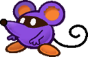
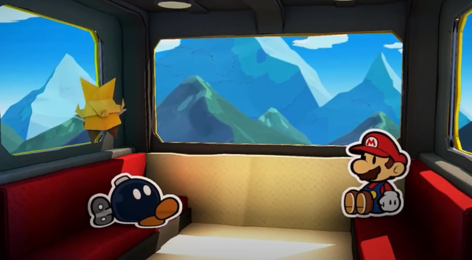
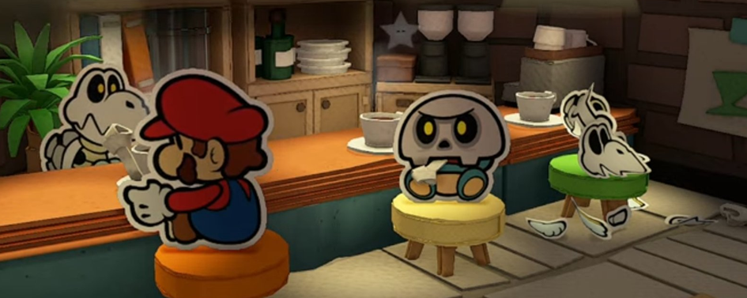

# Species
{: .no_toc }

  

    Table of contents
  

  {: .text-delta }
- TOC
{:toc}

# Species

While all the peoples of the Mushroom Kingdom are wildly different, their advantages are roughly alike. A playable Species in Paper Story looks something like this:

---
{: .species-separator }

{: .specie-callout }
> ## Species Name
> {: no_toc }
>
> 
> {: .float-right-desktop }
> A description of the Species and how they fit into the world. These descriptions are simple and general, and do not define individual members of their Species.
>
> *Stat Modifiers*{: .text-gamma .header-font }  
> *Base Power & Defense*{: .text-gamma .header-font }  
>
> {: .specie-pros-callout }
> > *Pros*{: .text-gamma .header-font }  
> > The Skill Specialisations and other Traits that make denizens of that Species more capable.  
> > *Some Traits, like Immune, will be described in more detail like this.*{: .mgl .fs-3 }
> > 
> > {: .specie-inner-pros-callout }
> > > Some collections of positive traits will be grouped in a coloured box, like this.
>
> {: .specie-cons-callout }
> > *Cons*{: .text-gamma .header-font }  
> > The Traits that a character of that Species have to deal with that are generally less desirable.  
> > *Some Traits, like Weakness, will be described in more detail like this.*{: .mgl .fs-3 }
> > 
> > {: .specie-inner-cons-callout }
> > > Some collections of negative traits will be grouped in a coloured box, like this.
>
> {: .specie-inner-callout }
> > *Other Traits*{: .text-gamma .header-font }  
> > Any other qualities the species has that may not fit neatly into a Pro or a Con go here in one large block underneath Pros and Cons.  
> > Most often this is for Species with a State Trait, which grants them contextual bonuses/penalties.
>
> {: .specie-inner-callout }
> > *Tech Defaults*{: .text-gamma .header-font }  
> > Sets of Technique Traits a character of that Species can include when they start designing a Technique, without affecting its cost.  
> > Multiple instances of a Trait are listed as "Trait x2", "Trait x3", and so on.  
> >
> > Each Technique can only benefit from one set of Tech Defaults without affecting its cost at a time.  
> > 
> > Each set of Tech Defaults is set apart by colour and by line, with multiple Traits in a set split up by commas.  
> >
> > Example Tech 1  
> > *Example Tech 2, 2nd part of Tech 2*{: .alt-grey-line }  
> > Example Tech 3
> >
> > Any *Required*{: .underlined } or *Optional*{: .underlined } effects are listed underneath, and can (or must) be taken as additional Tech Defaults on any Innate Technique.
>
> {: .specie-inverted-callout }
> > *Example Techniques*{: .text-gamma .header-font .text-grey-lt-000 }  
> > *An example of a Technique a first-level character of this Species might use.*{: .text-grey-lt-000 }  
> > *Includes potential outcomes and skills required for Primary and Secondary checks.*{: .text-grey-lt-000 }  
> >
> > {: .specie-inner-callout }  
> > > *Example*{: .header-font } (**X FP**{: .spirit-color })  
> > > Primary Check  
> > > Secondary Check  
> > > Includes potential outcomes and skills required for Primary and Secondary checks.  
> > > *The traits used to make this Technique are shown here*{: .italic .fs-3 }
> > >
> >
>

---
{: .species-separator }

Some of the more commonly adventurous folk of the Mushroom Kingdom are listed here; it is however far from all the available options, as the Mushroom Kingdom and its surrounds are huge and incredibly diverse.

For some of the rarer Species, or those less inclined to adventure – from Toads to Chomps to Piantas – refer to the [Species Compendium]({{ "/species_compendium" | absolute_url }}).

---
{: .species-separator }

{: .specie-callout }
> ## Bob-Omb
>
> 
> {: .float-right-desktop }
> Bob-Ombs are demolitions experts. As much as it confuses people, Bob-Ombs suffer no ill effects from blowing themselves up, and many seem to relish the act.  
> Despite this they are rarely violent and often even-tempered.
>
> ***+1 Heart**{: .heart-color }, **+1 Spirit**{: .spirit-color }*{: .text-gamma .header-font }  
> *1 Power, 1 Defense*{: .text-gamma .header-font }  
>
> {: .specie-pros-callout }
> > *Pros*{: .text-gamma .header-font }  
> > *+ Athletics (Explode)*{: .heart-color }  
> > *+ Crafts (Demolition)*{: .spirit-color }  
> > *or **+ Crafts (Explosives)**{: .spirit-color }*{: .mgl }  
> > *+ Crafts (Repairs)*{: .spirit-color }  
> > Immune (Poison)  
> > 1 Resist (Ice)  
> > Construct (Lifelike)
>
> {: .specie-cons-callout }
> > *Cons*{: .text-gamma .header-font }  
> > Weakness (Blast, Fire)  
> > *You take +2 damage and detonate harmlessly, leaving you completely Stunned (6) for the next 2 turns.*{: .mgl .fs-3 }  
> > Handless
>
> {: .specie-inner-callout }
> > *Tech Defaults*{: .text-gamma .header-font }  
> > Burst  
> > *Indirect*{: .alt-grey-line }  
> > Ranged  
> > *Scaling*{: .alt-grey-line }
> > 
> > *Optional*{: .underlined }: Element (Blast) on attacks,  
> > ***or**{: .underlined } Element (Blast) and Variant (*Athletics*{: .heart-color}) on Indirect attacks.*{: .mgl-big }
>
> {: .specie-inverted-callout }
> > *Example Techniques*{: .text-gamma .header-font .text-grey-lt-000 }  
> >
> > {: .specie-inner-callout }  
> > > *Quick Blast*{: .header-font } (**0 FP**{: .spirit-color })  
> > > Quickly detonates to blast foes away.  
> > > *Athletics (+Explode)*{: .heart-color }:  
> > > *Nice!*{: .nice-color }: 4 DMG  
> > > *Element (Blast), Indirect, Variant (**Athletics**{: .heart-color }), Strong, Commitment (Primary)*{: .italic .fs-3 }
> > >
> >
> > {: .specie-inner-callout }  
> > > *Bob-Ombast*{: .header-font } (**7 FP**{: .spirit-color })  
> > > A powerful explosion that blasts everything away – including your allies.  
> > > *Athletics (+Explode)*{: .heart-color }:  
> > > *Nice!*{: .nice-color }: 4 DMG  
> > > *Good!*{: .good-color }: 8 DMG  
> > > Deals +2 DMG for each extra Grade.  
> > > *Element (Blast), Scaling, Variant (**Athletics**{: .heart-color }), All (Indirect), Strong x3, Unwieldy*{: .italic .fs-3 }
> >
>

---
{: .species-separator }

{: .specie-callout }
> ## Boo
>
> 
> {: .float-right-desktop }
> The origins of Boos are shrouded in mystery. What is known for sure though is they're ghosts with a penchant for trickery. While most are reclusive, few Boos can resist a good scare.
>
> *+2 Spirit*{: .text-gamma .header-font .spirit-color }  
> *1 Power, 0 Defense*{: .text-gamma .header-font }  
>
> {: .specie-pros-callout }
> > *Pros*{: .text-gamma .header-font }  
> > *+ Trickery (Dodge)*{: .spirit-color }  
> > *+ Knowhow (Lore)*{: .spirit-color }  
> > *+ Bully (Surprises)*{: .courage-color }  
> > Immune (Fear, Poison)  
> > Immune (Shadow)  
> > *You recover **HP**{: .heart-color } equal to the attack's raw damage (minimum **1 HP**{: .heart-color }).*{: .mgl .fs-3 }  
> > *If there's any excess **HP**{: .heart-color }, your Attack is Boosted (1) for a number of turns equal to the excess **HP**{: .heart-color }.*{: .mgl .fs-3 }  
> > Hover  
> > Fly  
> > Intangibility  
> > Invisibility  
> > Mirage  
> > Undead (Lifelike)
>
> {: .specie-cons-callout }
> > *Cons*{: .text-gamma .header-font }  
> > Weakness (Life Magic, Sudden Light, Stars)  
> > *Any **HP**{: .heart-color } you would normally recover is treated as damage instead; then, you take double damage.*{: .mgl .fs-3 }  
> > *If this Technique wouldn't usually deal damage, it deals 2 Piercing damage.*{: .mgl .fs-3 }  
> > *You're left Dazed (1) for a number of turns equal to the damage taken.*{: .mgl .fs-3 }  
> > Legless
>
> {: .specie-inner-callout }
> > *Tech Defaults*{: .text-gamma .header-font }  
> > Boost (*Dodge*{: .spirit-color })  
> > *Element (Shadow)*{: .alt-grey-line }  
> > Fear x2  
> > *Secure (Intangible)*{: .alt-grey-line }
> > 
> > *Optional*{: .underlined }: Element (Shadow) on Indirect or Ranged Techniques.
> >
>
> {: .specie-inverted-callout }
> > *Example Techniques*{: .text-gamma .header-font .text-grey-lt-000 }  
> >
> > {: .specie-inner-callout }  
> > > *Frightening Smack*{: .header-font } (*0 FP*{: .spirit-color })  
> > > A spooky backhand terrifies the foe, causing them to either flee or cower in fear.  
> > > *Coordination*{: .heart-color }:  
> > > *Nice!*{: .nice-color }: 1 DMG    
> > > *Good!*{: .good-color }: 2 DMG  
> > > *Bully (+Surprises)*{: .courage-color }:  
> > > The target chooses to attempt to flee, or one of the below Statuses.  
> > > *Nice!*{: .nice-color }: Stun (1) or -1 Attack for 4 turns  
> > > *Good!*{: .good-color }: Stun (2) or -2 Attack for 4 turns  
> > > *Great!*{: .great-color }: Stun (3) or -3 Attack for 4 turns  
> > > *Wonderful!*{: .wonderful-color }: Stun (4) or -4 Attack for 4 turns  
> > > *Fear x4, Unwieldy*{: .italic .fs-3 }
> >
> > {: .specie-inner-callout }  
> > > *Outta Sight*{: .header-font } (*0 FP*{: .spirit-color })  
> > > Hides you and your allies away from attacks.  
> > > *Trickery (+Dodge)*{: .spirit-color }:  
> > > *Nice!*{: .nice-color }: Become Secure for one turn.  
> > > *Secure, Allies, Shared, Harmless*{: .italic .fs-3 }
> > >
> >
>

---
{: .species-separator }

{: .specie-callout }
> ## Dayzee
>
> 
> {: .float-right-desktop }
> Dayzees are quiet and soft-spoken sorts, which is fitting given their soothing lullabies.  
> While they may be quick to flee, their strength of character is undeniable, and their voices are breathtaking.
>
> ***+2 Courage**{: .courage-color } or **+1 Spirit**{: .spirit-color }, **+1 Courage**{: .courage-color }*{: .text-gamma .header-font }  
> *1 Power, 0 Defense*{: .text-gamma .header-font }  
>
> {: .specie-pros-callout }
> > *Pros*{: .text-gamma .header-font }  
> > *+ Athletics (Run)*{: .heart-color }  
> > *+ Cheer (FP)*{: .courage-color }  
> > *+ Perform (Sing)*{: .courage-color }  
> > Immune (Water)  
> > *You heal **+5 HP**{: .heart-color } instead.*{: .mgl .fs-3 }  
> > 1 Resist (Earth, Shock)
>
> {: .specie-cons-callout }
> > *Cons*{: .text-gamma .header-font }  
> > Weakness (Fear)  
> > *The Level and Duration of all Statuses you suffer associated with fear are doubled.*{: .mgl .fs-3 }  
> > Weakness (Fire)  
> > *You take +2 damage and suffer from a Lingering (1) burn, lasting a number of turns equal to the damage taken.*{: .mgl .fs-3 }
>
> {: .specie-inner-callout }
> > *Tech Defaults*{: .text-gamma .header-font }  
> > Charm  
> > *Daze x2*{: .alt-grey-line }  
> > Flowery  
> > *Variant (**Perform**{: .courage-color })*{: .alt-grey-line }
> > 
> > *Optional*{: .underlined }: Add a single Split Slot to Flowery Techniques which can't contain Strikes,  
> > ***or**{: .underlined } Ranged on Techniques with Variant (**Perform**{: .courage-color }),*{: .mgl-big }  
> > ***or**{: .underlined } Element (Earth) on melee attacks.*{: .mgl-big }  
> >
>
> {: .specie-inverted-callout }
> > *Example Techniques*{: .text-gamma .header-font .text-grey-lt-000 }  
> >
> > {: .specie-inner-callout }  
> > > *Pollen Pounder*{: .header-font } (*0 FP*{: .spirit-color })  
> > > An aggressive headbutt rife with pollen puts foes to sleep.  
> > > *Coordination*{: .heart-color }:  
> > > Auto: 1 Earth DMG  
> > > *Nice!*{: .nice-color }: 2 Earth DMG  
> > > *Bully*{: .courage-color }:  
> > > *Nice!*{: .nice-color }: Daze (1) for 2 turns  
> > > *Good!*{: .good-color }: Daze (2) for 2 turns  
> > > *Daze x2, Element (Earth)*{: .italic .fs-3 }
> >
> > {: .specie-inner-callout }  
> > > *Lullaby*{: .header-font } (*3 FP*{: .spirit-color })  
> > > Targeted singing puts the target to sleep while dealing damage.  
> > > *Perform (+Sing)*{: .courage-color }:  
> > > *Good!*{: .good-color }: 4 DMG  
> > > *Perform (+Sing)*{: .courage-color }:  
> > > *Nice!*{: .nice-color }: Daze (2) for 3 turns  
> > > *Good!*{: .good-color }: Daze (3) for 3 turns  
> > > *Daze x3, Ranged, Empower, Strong, Variant (**Perform**{: .courage-color}) x2, Commitment (Primary), Unwieldy*{: .italic .fs-3 }
> >
> 

---
{: .species-separator }

{: .specie-callout }
> ## Goomba
>
> 
> {: .float-right-desktop }
> Underdogs by nature, Goombas have a lot of guts and a lot to prove. Whether it's bonking heads or hitting the books, Goombas strive to better themselves constantly.
>
> ***+1 Heart**{: .heart-color }, **+1 Courage**{: .courage-color }*{: .text-gamma .header-font }  
> *1 Power, 0 Defense*{: .text-gamma .header-font }  
>
> {: .specie-pros-callout }
> > *Pros*{: .text-gamma .header-font }  
> > *+ Athletics (Jump)*{: .heart-color }  
> > *+ Knowhow (Battle)*{: .spirit-color }  
> > *+ Cheer (Aggression)*{: .courage-color }  
> > Carrier
>
> {: .specie-cons-callout }
> > *Cons*{: .text-gamma .header-font }  
> > Weakness (Aerial, Crushing)  
> > *The Level and Duration of all Statuses you suffer from these attacks are doubled.*{: .mgl .fs-3 }  
> > Handless
>
> {: .specie-inner-callout }
> > *Tech Defaults*{: .text-gamma .header-font }  
> > Aerial  
> > *Boost (Any)*{: .alt-grey-line }  
> > Repeat  
> > *Sequential*{: .alt-grey-line }
> > 
>
> {: .specie-inverted-callout }
> > *Example Techniques*{: .text-gamma .header-font .text-grey-lt-000 }  
> >
> > {: .specie-inner-callout }  
> > > *Headbonk*{: .header-font } (*0 FP*{: .spirit-color })  
> > > A double-tapping aerial strike, made with the head.  
> > > *Athletics (+Jump)*{: .heart-color }:  
> > > Auto: 1 DMG  
> > > *Nice!*{: .nice-color }: 1 DMG x2  
> > > *Aerial*{: .italic .fs-3 }
> >
> > {: .specie-inner-callout }  
> > > *Charge*{: .header-font } (*2 FP*{: .spirit-color })  
> > > Focus your power for 4 turns.  
> > > *Cheer (+Aggression)*{: .courage-color }:  
> > > *Nice!*{: .nice-color }: +1 Attack for 4 turns  
> > > *Good!*{: .good-color }: +2 Attack for 4 turns  
> > > *Great!*{: .great-color }: +3 Attack for 4 turns  
> > > *Wonderful!*{: .wonderful-color }: +4 Attack for 4 turns  
> > > *Boost (Attack) x4, Self, Harmless*{: .italic .fs-3 }
> >
>

---
{: .species-separator }

{: .specie-callout }
> ## Koopa
>
> 
> {: .float-right-desktop }
> Koopas are fit and easygoing. Though cowardice is often in their nature, they can be quite formidable when push comes to shove.  
> Often associated with Bowser's armies in the past, these days there are many peace-loving Koopas in the Mushroom Kingdom.
>
> *+2 Heart*{: .text-gamma .header-font .heart-color }  
> *1 Power, 1 Defense*{: .text-gamma .header-font }  
>
> {: .specie-pros-callout }
> > *Pros*{: .text-gamma .header-font }  
> > *+ Athletics (Shells)*{: .heart-color }  
> > *or **+ Athletics (Swim)**{: .heart-color }*{: .mgl }  
> > *+ Guard (Melee)*{: .heart-color }  
> > *+ Steady (VS Weaken)*{: .courage-color }  
> > 1 Resist (Water)
>
> {: .specie-cons-callout }
> > *Cons*{: .text-gamma .header-font }  
> > Weakness (Aerial, Blast, Quake)  
> > *You are flipped over; you retain your Defense against Aerial and Blast attacks initially, but otherwise your Defense is negated while you're flipped.*{: .mgl .fs-3 }  
> > *This leaves you completely Stunned (6) for the next 2 turns.*{: .mgl .fs-3 }
>
> {: .specie-inner-callout }
> > *Tech Defaults*{: .text-gamma .header-font }  
> > Boost (Defense)  
> > *Disorient*{: .alt-grey-line }  
> > Indirect  
> > *Overrun*{: .alt-grey-line }
> > 
> > *Optional*{: .underlined }: Variant (*Athletics*{: .heart-color }) on Indirect attacks.
> >
>
> {: .specie-inverted-callout }
> > *Example Techniques*{: .text-gamma .header-font .text-grey-lt-000 }  
> >
> > {: .specie-inner-callout }  
> > > *Shell Toss*{: .header-font } (*0 FP*{: .spirit-color })  
> > > Hits one target in melee with your shell.  
> > > *Athletics (+Shells)*{: .heart-color }:  
> > > Auto: 1 DMG  
> > > *Nice!*{: .nice-color }: 2 DMG  
> > > *Indirect, Variant (**Athletics**{: .heart-color })*{: .italic .fs-3 }
> > >
> >
> > {: .specie-inner-callout }  
> > > *Shell Shield*{: .header-font } (*3 FP*{: .spirit-color })  
> > > Bolsters the target's Defense with a borrowed shell.  
> > > *Guard*{: .heart-color }:  
> > > *Nice!*{: .nice-color }: +1 Defense for 4 turns  
> > > *Good!*{: .good-color }: +2 Defense for 4 turns  
> > > *Great!*{: .great-color }: +3 Defense for 4 turns  
> > > *Wonderful!*{: .wonderful-color }: +4 Defense for 4 turns  
> > > *Boost (Defense) x4, Harmless (Indirect)*{: .italic .fs-3 }
> > >
> >
>

---
{: .species-separator }

{: .specie-callout }
> ## Squeek
>
> 
> {: .float-right-desktop }
> Squeeks are crafty little mice. Their keen noses and beady little eyes lead many to lives of crime, but their small stature and their potent senses keep them from getting into any serious trouble.
>
> ***+1 Spirit**{: .spirit-color }, **+1 Courage**{: .courage-color }*{: .text-gamma .header-font }  
> *1 Power, 0 Defense*{: .text-gamma .header-font }  
>
> {: .specie-pros-callout }
> > *Pros*{: .text-gamma .header-font }  
> > *+ Notice (Scent)*{: .spirit-color }  
> > *+ Trickery (Stealth)*{: .spirit-color }  
> > *or **+ Trickery (Theft)**{: .spirit-color }*{: .mgl }  
> > *+ Persuade (Smooth Talk)*{: .courage-color }  
> > Immune (Charm)
>
> {: .specie-cons-callout }
> > *Cons*{: .text-gamma .header-font }  
> > Weakness (Scent)  
> > *The Level and Duration of all Statuses you suffer from scent-based sources are doubled.*{: .mgl .fs-3 }
>
> {: .specie-inner-callout }
> > *Tech Defaults*{: .text-gamma .header-font }  
> > Confuse x2  
> > *Piercing*{: .alt-grey-line }  
> > Snatch  
> > *Variant (**Trickery**{: .spirit-color })*{: .alt-grey-line }
> > 
>
> {: .specie-inverted-callout }
> > *Example Techniques*{: .text-gamma .header-font .text-grey-lt-000 }  
> >
> > {: .specie-inner-callout }  
> > > *Tricky Slap*{: .header-font } (*0 FP*{: .spirit-color })  
> > > Slaps an enemy, ignoring defense.  
> > > *Coordination*{: .heart-color }:  
> > > Auto: 1 Piercing DMG  
> > > *Nice!*{: .nice-color }: 1 Piercing DMG x2  
> > > *Piercing*{: .italic .fs-3 }
> > >
> >
> > {: .specie-inner-callout }  
> > > *Tricky Thief*{: .header-font } (*0 FP*{: .spirit-color })  
> > > Slinks past to steal an item from the target.  
> > > *Trickery (+Theft)*{: .spirit-color }:  
> > > Choose one option based on your Grades of Success.  
> > > *Nice!*{: .nice-color }: 1d6 Coins, +1d6 per Grade of Success  
> > > *Nice!*{: .nice-color }: A small Item  
> > > *Good!*{: .good-color }: A large Item  
> > > *Great!*{: .great-color }: An equipped Item  
> > > *Snatch, Empower, Selective, Harmless*{: .italic .fs-3 }
> > >
> >
>

{: .center-img }

{: .tip-callout }
> *While your Species is a significant part of your character, it doesn't define them. Try thinking about what sets them apart from the rest of their Species! *{: .icon-right }

# Subspecies

Subspecies aren't playable Species in and of themselves; instead, they act as templates you can apply to existing Species.  
They can be applied to any of the existing Species, as long as they meet the requirements and your character's final Stats aren't reduced below 0.

See the example Subspecies on the following page for a quick primer, and a sample of some of the most common Subspecies.

Above all else, keep in mind that t his is intended to easily put together unique concepts not covered by the base Species; if a particular combination of Species and Subspecies doesn't work the way you'd like, or you think certain qualities should be available to your concept, try talking it over with your GM.

{: .subspecie-callout }
> ## Subspecies- 
> {: .no_toc }
>
> 
> {: .float-right-desktop }
> A description of the subspecies and how they fit into the world.
>
> *[Tags]*{: .header-font } *Examples of pre-existing creatures which the subspecies could be used to create.*{: .italic }
>
> *Stat Modifiers*{: .text-gamma .header-font }  
> *Power/Defense Modifiers*{: .text-gamma .header-font }  
>
> {: .specie-inner-callout }
> > *Add*{: .text-gamma .header-font }  
> > The Pros – and Cons – that come with this subspecies, these are added onto the existing species.
> >
> > If a subspecies would duplicate any traits, *only one*{: .bold .underlined } instance of that trait is kept – typically the most impactful instance (the strongest value, or the worst Weakness, for instance).
> >
> > This can be subjective, so check with your GM if you're not sure.  
> > This doesn't apply to anything with a + sign; if a subspecies adds +1 Defense, that means it stacks directly onto your Defense!
> >
> > If an Immunity conflicts with a Weakness, with no remaining window for the Weakness to take effect, the Weakness is completely removed from the final species.
>
> {: .specie-inner-callout }
> > *Remove*{: .text-gamma .header-font }  
> > Everything that a creature of the existing species gives up for the subspecies. 
> > 
> > If multiple subspecies are being applied, this applies retroactively; the order you apply subspecies templates doesn't matter. If you'd lose something at any point in the process, typically, the final species can't have it.
> >
> > If however a character would gain something through this subspecies, but it's listed for removal on *the same subspecies*{: .bold .underlined }, they still keep it; additions take priority over removals!
>
> {: .specie-inner-callout }
> > *Added Tech Defaults*{: .text-gamma .header-font }  
> >
> > Sets of Technique Traits a character of this subspecies can include when they start designing a Technique, without affecting its cost.
> >
> > *No matter what*{: .bold .underlined }, if you apply a subspecies, the final species can't have more than 4 Tech Default sets (not counting *optional*{: .underlined .italic } or *required*{: .underlined .italic } sets). If you would have more than that, you have to choose what to keep and what to drop. 
> > 
> > If an effect is listed as "+ *Optional*{: .underlined .italic }", and you've taken the associated Tech Default on the subspecies, then you add the *optional*{: .underlined .italic } effect to the final species.
> > 
> > If an identical set of Tech Defaults, *optional*{: .underlined .italic } or *required*{: .underlined .italic } effects would be added twice, ignore any duplicates. 
> >
>
> {: .specie-inner-callout }
> > *Removed Tech Defaults*{: .text-gamma .header-font }  
> >
> > If the existing species has any of the listed traits in *any*{: .underlined } of its Tech Default sets, or in its *optional*{: .underlined .italic } or *required*{: .underlined .italic } effects, it loses each instance of it.
> >
> > Just like standard traits, these are removed retroactively, and you ignore anything the subspecies adds on itself.
> >
>
> {: .specie-inner-callout }
> > *Conditions*{: .text-gamma .header-font }  
> >
> > Conditions that must be met for the subspecies to be applied to a species, if applicable.
> >
>

---
{: .species-separator }

{: .subspecie-callout }
> ## Dry- 
>
> 
> {: .float-right-desktop }
> Dry creatures are the skeletal remains of once healthy folk.  
> While they're weaker than their live counterparts, they're relentless, continuously picking themselves back up with an endless supply of bones.
>
> *[Material]*{: .header-font } *e.g. Bony Beetle, Dry Bones*{: .italic }
>
> ***-1 Heart**{: .heart-color }, **+1 Spirit**{: .spirit-color }*{: .text-gamma .header-font }  
> *+1 Defense*{: .text-gamma .header-font }  
>
> {: .specie-inner-callout }
> > *Add*{: .text-gamma .header-font }  
> > *+ Trickery (Camouflage)*{: .spirit-color }  
> > *+ Bully (Surprises)*{: .courage-color }  
> > *+ Steady (Resilience)*{: .courage-color }  
> > Immune (Charm, Fear, Fire, Ice, Poison)  
> > *Fire can be used to disable your Resilient Trait while crumpled or KO'd.*{: .mgl .fs-3 }  
> > Immune (Shadow)  
> > *You recover **HP**{: .heart-color } equal to the attack's raw damage (minimum **1 HP**{: .heart-color }).*{: .mgl .fs-3 }  
> > *If there's any excess **HP**{: .heart-color }, your Defense is Boosted (1) for a number of turns equal to the excess **HP**{: .heart-color }.*{: .mgl .fs-3 }  
> > Weakness (Air, Blast)  
> > *You crumble to the floor and are unable to act, as if you've been KO'd. You retain your **HP**{: .heart-color }, and as long as you're not actually KO'd, you can recover through your Resilient Trait.*{: .mgl .fs-3 }  
> > Weakness (Life Magic, Sudden Light, Stars)  
> > *Any **HP**{: .heart-color } you would normally recover is treated as damage instead; then, you take double damage.*{: .mgl .fs-3 }  
> > *If this Technique wouldn't usually deal damage, it deals 2 Piercing damage.*{: .mgl .fs-3 }  
> > *You're left Dazed (1) for a number of turns equal to the damage taken.*{: .mgl .fs-3 }  
> > Clone  
> > Resilient  
> > Undead
> >
>
> {: .specie-inner-callout }
> > *Remove*{: .text-gamma .header-font }  
> > Specialisations from the base species in *Athletics*{: .heart-color }, *Guard*{: .heart-color }, *Knowhow*{: .spirit-color }, *Magic*{: .spirit-color }, *Cheer*{: .courage-color } and *Persuade*{: .courage-color }; remove any remaining specialisations from the final species one at a time until you have at most 3
> > 
> > Construct  
> > Invisibility  
> > State (Berserk, Scrunched)  
> > Undead (Lifelike)  
> >
> > Weaknesses, Immunities and Resistances from the *base*{: .underlined } species
> > 
>
> {: .specie-inner-callout }
> > *Added Tech Defaults*{: .text-gamma .header-font }  
> >
> > Dismiss (Enemies Only)  
> > *Fear x2*{: .alt-grey-line }  
> > Minion (Skeletons)  
> > *Ranged*{: .alt-grey-line }  
> >
>
> {: .specie-inner-callout }
> > *Removed Tech Defaults*{: .text-gamma .header-font }  
> >
> > Element *(if from base species)*{: .fs-3 }  
> > *Flowery*{: .alt-grey-line }  
> > Hearty  
> > *Indirect*{: .alt-grey-line }
> >
>
> {: .specie-inner-callout }
> > *Conditions*{: .text-gamma .header-font }  
> >
> > Can't be combined with other *[Material]*{: .header-font } subspecies.
> >
>

---
{: .species-separator }

{: .subspecie-callout }
> ## Para- 
>
> 
> {: .float-right-desktop }
> Para creatures are winged variants of other races, making them more agile, though less sturdy and more reliant on their wings.
>
> *[Environmental]*{: .header-font } *e.g. Fly Guy, Paratroopa*{: .italic }
>
> ***-1 Heart**{: .heart-color }, **+1 Spirit**{: .spirit-color }*{: .text-gamma .header-font }  
>
> {: .specie-inner-callout }
> > *Add*{: .text-gamma .header-font }  
> > *+ Athletics (Flight)*{: .heart-color }  
> > *+ Notice (From Overhead)*{: .spirit-color }  
> > *+ Trickery (Dodge)*{: .spirit-color }  
> > Weakness (Air)  
> > *You must make a **Steady**{: .courage-color } check versus Disorientation (1), lasting a number of turns equal to the damage taken (minimum 1 turn).*{: .mgl .fs-3 }  
> > Carrier  
> > Fly
> >
>
> {: .specie-inner-callout }
> > *Remove*{: .text-gamma .header-font }  
> > Specialisations from the base species in *Athletics*{: .heart-color }, *Guard*{: .heart-color } and *Steady*{: .courage-color }; remove any remaining specialisations from the final species one at a time until you have at most 3
> >
> > Hover  
> > Sinker 
> > 
>
> {: .specie-inner-callout }
> > *Added Tech Defaults*{: .text-gamma .header-font }  
> >
> > Aerial  
> > *Disorient*{: .alt-grey-line }  
> > Element (Air)  
> > *+ **Optional**{: .underlined }: Element (Air) on Indirect and Ranged Techniques*{: .mgl .fs-3 }  
> > *Indirect*{: .alt-grey-line }
> >
>
> {: .specie-inner-callout }
> > *Removed Tech Defaults*{: .text-gamma .header-font }  
> >
> > Overrun  
> > *Quake*{: .alt-grey-line }  
> > Selective  
> > *Underfoot*{: .alt-grey-line }
> >
>
> {: .specie-inner-callout }
> > *Conditions*{: .text-gamma .header-font }  
> >
> > Can't be combined with other *[Environmental]*{: .header-font } subspecies.  
> > Can't be added if the base species would normally have Fly.
> >
>

---
{: .species-separator }

{: .subspecie-callout }
> ## Spiny- 
>
> 
> {: .float-right-desktop }
> Spiny creatures are covered in spikes, making them stronger and more resilient in battle – although they aren't exactly known for their hospitality.  
> For any warrior, though, being Spiny would be quite the boon; Koopas in particular will go out of their way to acquire spikier shells.
>
> *e.g. Koopaling, Spiny*{: .italic }
>
> ***+1 Heart**{: .heart-color }, **-1 Courage**{: .courage-color }*{: .text-gamma .header-font }  
>
> {: .specie-inner-callout }
> > *Add*{: .text-gamma .header-font }  
> > Immune (Contact)  
> > *This Immunity is negated if the attacker uses an Indirect attack or is otherwise unaffected to your spikes.*{: .mgl .fs-3 }  
> > *Depending on the nature of the attack and the position of your spikes, certain attack may still bypass this immunity.*{: .mgl .fs-3 }  
> > Contact  
> > *The attacker takes 1 Piercing DMG, and you make a **Steady**{: .courage-color } check; the attacker is Dazed (1) for 1 turn for each Grade of Success.*{: .mgl .fs-3 }
> >
>
> {: .specie-inner-callout }
> > *Remove*{: .text-gamma .header-font }  
> > Carrier  
> > Contact
> > 
>
> {: .specie-inner-callout }
> > *Added Tech Defaults*{: .text-gamma .header-font }  
> >
> > Piercing  
> > *Strong*{: .alt-grey-line }  
> > Terrain (Spikes)
> >
>
> {: .specie-inner-callout }
> > *Removed Tech Defaults*{: .text-gamma .header-font }  
> >
> > Boost  
> > *Dismiss*{: .alt-grey-line }  
> > Flowery  
> > *Hearty*{: .alt-grey-line }
> >
>
> {: .specie-inner-callout }
> > *Conditions*{: .text-gamma .header-font }  
> >
> > Can't be added onto species which already have Immune (Contact).
> >
>

{: .center-img }

{: .tip-callout }
> *Species and Subspecies can be combined in all sorts of ways. Dry Bones, Bony Beetles and Bone Goombas are one thing, but why stop there? What about a Dry Dayzee, or a Para Spiny Skull Squeek? Let your imagination run wild! *{: .icon-right }