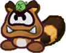

# Subpecies Compendium
{: .no_toc }

  

    Table of contents
  

  {: .text-delta }
- TOC
{:toc}

Subspecies aren't playable Species in and of themselves; instead, they act as templates you can apply to existing species. They can be applied to any of the existing Species, as long as they meet the requirements and your character's final Stats aren't reduced below 0.

See the example Subspecies on the next page for a quick primer, and a sample of some of the most common Subspecies.

Above all else, keep in mind that this is intended to easily put together unique concepts not covered by the base Species; if a particular combination of Species and Subspecies doesn't work the way you'd like, or you think certain qualities should be available to your concept, try talking it over with your GM.

{: .subspecie-callout }
> ## Subspecies- 
> {: .no_toc }
>
> 
> {: .float-right-desktop }
> A description of the subspecies and how they fit into the world.
>
> *[Tags]*{: .header-font } *Examples of pre-existing creatures which the subspecies could be used to create.*{: .italic }
>
> *Stat Modifiers*{: .text-gamma .header-font }  
> *Power/Defense Modifiers*{: .text-gamma .header-font }  
>
> {: .specie-inner-callout }
> > *Add*{: .text-gamma .header-font }  
> > The Pros – and Cons – that come with this subspecies, these are added onto the existing species.
> >
> > If a subspecies would duplicate any traits, *only one*{: .bold .underlined } instance of that trait is kept – typically the most impactful instance (the strongest value, or the worst Weakness, for instance).
> >
> > This can be subjective, so check with your GM if you're not sure.  
> > This doesn't apply to anything with a + sign; if a subspecies adds +1 Defense, that means it stacks directly onto your Defense!
> >
> > If an Immunity conflicts with a Weakness, with no remaining window for the Weakness to take effect, the Weakness is completely removed from the final species.
>
> {: .specie-inner-callout }
> > *Remove*{: .text-gamma .header-font }  
> > Everything that a creature of the existing species gives up for the subspecies. 
> > 
> > If multiple subspecies are being applied, this applies retroactively; the order you apply subspecies templates doesn't matter. If you'd lose something at any point in the process, typically, the final species can't have it.
> >
> > If however a character would gain something through this subspecies, but it's listed for removal on *the same subspecies*{: .bold .underlined }, they still keep it; additions take priority over removals!
>
> {: .specie-inner-callout }
> > *Added Tech Defaults*{: .text-gamma .header-font }  
> >
> > Sets of Technique Traits a character of this subspecies can include when they start designing a Technique, without affecting its cost.
> >
> > *No matter what*{: .bold .underlined }, if you apply a subspecies, the final species can't have more than 4 Tech Default sets (not counting *optional*{: .underlined .italic } or *required*{: .underlined .italic } sets). If you would have more than that, you have to choose what to keep and what to drop. 
> > 
> > If an effect is listed as "+ *Optional*{: .underlined .italic }", and you've taken the associated Tech Default on the subspecies, then you add the *optional*{: .underlined .italic } effect to the final species.
> > 
> > If an identical set of Tech Defaults, *optional*{: .underlined .italic } or *required*{: .underlined .italic } effects would be added twice, ignore any duplicates. 
> >
>
> {: .specie-inner-callout }
> > *Removed Tech Defaults*{: .text-gamma .header-font }  
> >
> > If the existing species has any of the listed traits in *any*{: .underlined } of its Tech Default sets, or in its *optional*{: .underlined .italic } or *required*{: .underlined .italic } effects, it loses each instance of it.
> >
> > Just like standard traits, these are removed retroactively, and you ignore anything the subspecies adds on itself.
> >
>
> {: .specie-inner-callout }
> > *Conditions*{: .text-gamma .header-font }  
> >
> > Conditions that must be met for the subspecies to be applied to a species, if applicable.
> >
>

---
{: .species-separator }

{: .subspecie-callout }
> ## Blessed- 
>
> 
> {: .float-right-desktop }
> Blessed creatures have the radiance of the stars themselves, whether it's inherited, earned or through some other twist of fate.  
> Though rare, their presence brings great comfort to people around the world, and many have risen to greatness – though, to be sure, there's nothing inherently good in the Stars' blessings.  
> They work in mysterious ways.
>
> *[Alignment]*{: .header-font } *e.g. Bulb Yoshi, Nimbi*{: .italic }
>
> ***-1 Spirit**{: .spirit-color }, **+1 Courage**{: .courage-color }*{: .text-gamma .header-font }  
>
> {: .specie-inner-callout }
> > *Add*{: .text-gamma .header-font }  
> > *+ Heal (Others)*{: .heart-color }  
> > *+ Notice (Dark Places)*{: .spirit-color }  
> > *+ Cheer (Encourage)*{: .courage-color }  
> > *or **+ Persuade (Earnestness)**{: .courage-color }*{: .mgl }  
> > Immune (Light, Stars)  
> > *You recover **HP**{: .heart-color } equal to the attack's raw damage (minimum **1 HP**{: .heart-color }).*{: .mgl .fs-3 }  
> > *If there's any excess **HP**{: .heart-color }, your **Cheer**{: .courage-color } is Boosted (1) for a number of turns equal to the excess **HP**{: .heart-color }.*{: .mgl .fs-3 }  
> > Immune (Poison)  
> > Weakness (Shadow)  
> > *You take double damage; if this Technique wouldn't usually deal damage, it deals 2 Piercing damage.*{: .mgl .fs-3 }  
> > *You're left Dazed (1) for a number of turns equal to the damage taken.*{: .mgl .fs-3 }  
> > Devotion (Light)  
> > *Non-Light elements are restricted.*{: .mgl .fs-3 }  
> > Efficient (Light)
> >
>
> {: .specie-inner-callout }
> > *Remove*{: .text-gamma .header-font }  
> > Specialisations from the base species in *Coordination*{: .heart-color }, *Trickery*{: .spirit-color } and *Bully*{: .courage-color }; remove any remaining specialisations from the final species one at a time until you have at most 3
> >
> > Weakness (Fear, Life Magic, Light, Magic, Stars) 
> > 
> > Undead
> > 
>
> {: .specie-inner-callout }
> > *Added Tech Defaults*{: .text-gamma .header-font }  
> >
> > Charm  
> > *Dismiss*{: .alt-grey-line }  
> > Element (Light/Stars)  
> > *+ **Optional**{: .underlined }: Element (Light/Stars) on Indirect or Ranged Techniques*{: .mgl .fs-3 }  
> > *Hearty x2*{: .alt-grey-line }  
> > Safe
> >
>
> {: .specie-inner-callout }
> > *Removed Tech Defaults*{: .text-gamma .header-font }  
> >
> > Confuse  
> > *Disarm*{: .alt-grey-line }  
> > Lingering  
> > *Provoke*{: .alt-grey-line }  
> > Snatch  
> > *Weaken*{: .alt-grey-line }  
> >
>
> {: .specie-inner-callout }
> > *Conditions*{: .text-gamma .header-font }  
> >
> > Can't be combined with other *[Alignment]*{: .header-font } subspecies.
> >
>

---
{: .species-separator }

{: .subspecie-callout }
> ## Bulky- 
>
> 
> {: .float-right-desktop }
> Bulky creatures are larger and far more imposing than their brethren. While they're less capable in most fields, they more than make up for it in their power and stamina.
>
> *[Size]*{: .header-font } *e.g. Boom Boom, Bulky Bob-Omb*{: .italic }
>
> ***+2 Heart**{: .heart-color }, **-1 Spirit**{: .spirit-color }, **-1 Courage**{: .courage-color }*{: .text-gamma .header-font }  
> *+1 Power*{: .text-gamma .header-font }  
>
> {: .specie-inner-callout }
> > *Add*{: .text-gamma .header-font }  
> > *+ Athletics (Brawn)*{: .heart-color }  
> > *+ Guard (Melee)*{: .heart-color }  
> > *+ Steady (Poise)*{: .courage-color }  
> > Carrier  
> > Hover  
> > *(if this subspecies would remove Fly from the final species)*{: .mgl .fs-3 }
> >
>
> {: .specie-inner-callout }
> > *Remove*{: .text-gamma .header-font }  
> > Specialisations from the base species in *Athletics*{: .heart-color }, *Coordination*{: .heart-color } and *Trickery*{: .spirit-color }; remove any remaining specialisations from the final species one at a time until you have at most 3
> >
> > Fly  
> > State (Scrunched)  
> > Weakness (Aerial, Air, Fear)
> > 
>
> {: .specie-inner-callout }
> > *Added Tech Defaults*{: .text-gamma .header-font }  
> >
> > Launch  
> > *Overrun*{: .alt-grey-line }  
> > Quake  
> > *Throw*{: .alt-grey-line }  
> >
> > *Required*{: .underlined }: Unwieldy (Primary) on attacks
> >
>
> {: .specie-inner-callout }
> > *Removed Tech Defaults*{: .text-gamma .header-font }  
> >
> > Aerial  
> > *Piercing*{: .alt-grey-line }
> >
>
> {: .specie-inner-callout }
> > *Conditions*{: .text-gamma .header-font }  
> >
> > Can't be combined with other *[Size]*{: .header-font } subspecies.
> >
>

---
{: .species-separator }

{: .subspecie-callout }
> ## Dank- 
>
> 
> {: .float-right-desktop }
> Creatures that thrive underground aren't much different from their surface-dwelling counterparts, but tend to be somewhat hardier and a good deal less pleasant.  
> They tend to lack ambition, settling for whatever they can get, which pairs poorly with the few opportunities they have.
>
> *e.g. Dark Craw, Gloomba*{: .italic }
>
> ***+1 Heart**{: .heart-color }, **-1 Courage**{: .courage-color }*{: .text-gamma .header-font }  
>
> {: .specie-inner-callout }
> > *Add*{: .text-gamma .header-font }  
> > *+ Notice (Dark Places)*{: .spirit-color }  
> > *+ Trickery (Darkness)*{: .spirit-color }  
> > *+ Bully (Status)*{: .courage-color }  
> > +1 Resist (Poison)  
> > Weakness (Sudden Light)  
> > *You are stunned by the light, Dazing (1) you for a turn for each point of damage taken (minimum 1 turn).*{: .mgl .fs-3 }
> >
>
> {: .specie-inner-callout }
> > *Remove*{: .text-gamma .header-font }  
> > Specialisations from the base species in *Heal*{: .heart-color }, *Knowhow*{: .spirit-color } and *Persuade*{: .courage-color }; remove any remaining specialisations from the final species one at a time until you have at most 3
> >
> > Weakness (Poison, Shadow) 
> > 
>
> {: .specie-inner-callout }
> > *Added Tech Defaults*{: .text-gamma .header-font }  
> >
> > Disorient  
> > *Lingering x2*{: .alt-grey-line }  
> > Provoke x2  
> > *Weaken (Any)*{: .alt-grey-line }
> >
>
> {: .specie-inner-callout }
> > *Removed Tech Defaults*{: .text-gamma .header-font }  
> >
> > Boost  
> > *Dismiss*{: .alt-grey-line }  
> > Hearty
> >
>
> {: .specie-inner-callout }
> > *Conditions*{: .text-gamma .header-font }  
> >
> > N/A
> >
>

---
{: .species-separator }

{: .subspecie-callout }
> ## Dreamy- 
>
> 
> {: .float-right-desktop }
> Ethereal beings made more of mind than matter, which have since taken form in the physical world.  
> Dreamy creatures tend to be distant, but are more in tune with the magical essence of life – giving them unshakeable bravado and a certain undeniable charisma.
>
> *[Material]*{: .header-font } *e.g. Cosmic Clone, Dreamy Shy Guy*{: .italic }
>
> ***-1 Heart**{: .heart-color }, **-1 Spirit**{: .spirit-color }, **+2 Courage**{: .courage-color }*{: .text-gamma .header-font }  
>
> {: .specie-inner-callout }
> > *Add*{: .text-gamma .header-font }  
> > *+ Magic (Dreams)*{: .spirit-color }  
> > *+ Perform (Appeal)*{: .courage-color }  
> > *+ Persuade (Charm)*{: .courage-color }  
> > Immune (Poison)  
> > Weakness (Sleep)  
> > *The Level and Duration of all statuses you suffer associated with sleep are doubled.*{: .mgl .fs-3 }  
> > Weakness (Fear, Magic, Shock)  
> > *If you're currently Intangible, you're wrenched back to a solid state with force, Dazing (1) you for a turn for each point of damage taken (minimum 1 turn).*{: .mgl .fs-3 }  
> > Clone  
> > Intangibility  
> > Mirage
> >
>
> {: .specie-inner-callout }
> > *Remove*{: .text-gamma .header-font }  
> > Specialisations from the base species in *Guard*{: .heart-color }, *Heal*{: .heart-color }, *Knowhow*{: .notice-color } and *Steady*{: .courage-color }; remove any remaining specialisations from the final species one at a time until you have at most 3  
> >
> > *Base*{: .underlined .bold } species Power is reduced to 1 (if it's more than 1)  
> > *Base*{: .underlined .bold } species Defense is reduced to 0  
> >
> > State (Berserk)  
> > Weakness (Charm, Confuse, Provoke)  
> >
> > Resists and Weaknesses from the *base*{: .underlined .bold } species
> > 
>
> {: .specie-inner-callout }
> > *Added Tech Defaults*{: .text-gamma .header-font }  
> >
> > Boost (Any)  
> > *Daze x2*{: .alt-grey-line }  
> > Charm  
> > *Terrain (Any)*{: .alt-grey-line }  
> > *Choose during character creation*{: .mgl .fs-3 .alt-grey-line }
> >
>
> {: .specie-inner-callout }
> > *Removed Tech Defaults*{: .text-gamma .header-font }  
> >
> > Dismiss  
> > *Hearty*{: .alt-grey-line }  
> > Launch  
> > *Quake*{: .alt-grey-line }  
> > Throw  
> > *Underfoot*{: .alt-grey-line }
> >
>
> {: .specie-inner-callout }
> > *Conditions*{: .text-gamma .header-font }  
> >
> > Can't be combined with other *[Material]*{: .header-font } subspecies.
> >
>

---
{: .species-separator }

{: .subspecie-callout }
> ## Dry- 
>
> 
> {: .float-right-desktop }
> Dry creatures are the skeletal remains of once healthy folk.  
> While they're weaker than their live counterparts, they're relentless, continuously picking themselves back up with an endless supply of bones.
>
> *[Material]*{: .header-font } *e.g. Bony Beetle, Dry Bones*{: .italic }
>
> ***-1 Heart**{: .heart-color }, **+1 Spirit**{: .spirit-color }*{: .text-gamma .header-font }  
> *+1 Defense*{: .text-gamma .header-font }  
>
> {: .specie-inner-callout }
> > *Add*{: .text-gamma .header-font }  
> > *+ Trickery (Camouflage)*{: .spirit-color }  
> > *+ Bully (Surprises)*{: .courage-color }  
> > *+ Steady (Resilience)*{: .courage-color }  
> > Immune (Charm, Fear, Fire, Ice, Poison)  
> > *Fire can be used to disable your Resilient Trait while crumpled or KO'd.*{: .mgl .fs-3 }  
> > Immune (Shadow)  
> > *You recover **HP**{: .heart-color } equal to the attack's raw damage (minimum **1 HP**{: .heart-color }).*{: .mgl .fs-3 }  
> > *If there's any excess **HP**{: .heart-color }, your Defense is Boosted (1) for a number of turns equal to the excess **HP**{: .heart-color }.*{: .mgl .fs-3 }  
> > Weakness (Air, Blast)  
> > *You crumble to the floor and are unable to act, as if you've been KO'd. You retain your **HP**{: .heart-color }, and as long as you're not actually KO'd, you can recover through your Resilient Trait.*{: .mgl .fs-3 }  
> > Weakness (Life Magic, Sudden Light, Stars)  
> > *Any **HP**{: .heart-color } you would normally recover is treated as damage instead; then, you take double damage.*{: .mgl .fs-3 }  
> > *If this Technique wouldn't usually deal damage, it deals 2 Piercing damage.*{: .mgl .fs-3 }  
> > *You're left Dazed (1) for a number of turns equal to the damage taken.*{: .mgl .fs-3 }  
> > Clone  
> > Resilient  
> > Undead
> >
>
> {: .specie-inner-callout }
> > *Remove*{: .text-gamma .header-font }  
> > Specialisations from the base species in *Athletics*{: .heart-color }, *Guard*{: .heart-color }, *Knowhow*{: .spirit-color }, *Magic*{: .spirit-color }, *Cheer*{: .courage-color } and *Persuade*{: .courage-color }; remove any remaining specialisations from the final species one at a time until you have at most 3
> > 
> > Construct  
> > Invisibility  
> > State (Berserk, Scrunched)  
> > Undead (Lifelike)  
> >
> > Weaknesses, Immunities and Resistances from the *base*{: .underlined } species
> > 
>
> {: .specie-inner-callout }
> > *Added Tech Defaults*{: .text-gamma .header-font }  
> >
> > Dismiss (Enemies Only)  
> > *Fear x2*{: .alt-grey-line }  
> > Minion (Skeletons)  
> > *Ranged*{: .alt-grey-line }  
> >
>
> {: .specie-inner-callout }
> > *Removed Tech Defaults*{: .text-gamma .header-font }  
> >
> > Element *(if from base species)*{: .fs-3 }  
> > *Flowery*{: .alt-grey-line }  
> > Hearty  
> > *Indirect*{: .alt-grey-line }
> >
>
> {: .specie-inner-callout }
> > *Conditions*{: .text-gamma .header-font }  
> >
> > Can't be combined with other *[Material]*{: .header-font } subspecies.
> >
>

---
{: .species-separator }

{: .subspecie-callout }
> ## Elementalist- 
>
> 
> {: .float-right-desktop }
> Some creatures are imbued with the elemental qualities of the natural world, it's a rare phenomenon, and outside of some Bro clans, tends to be met with confusion or fear...
>
> ... but despite the odds, it seems wherever these elemental beings go they rise above the crowd to make a name for themselves.
>
> *[Elemental]*{: .header-font } *e.g. Fire Bro, Frost Piranha, Petal Guy, Thunder Lakitu, Blimp Yoshi, Bombshell Koopa, Chill Bully, Pyro Guy*{: .italic }
>
> *Bombshell Koopa & Blimp Yoshi art: **@meineeds.rest**{: .courage-color }*{: .italic .fs-3 }
>
> ***+1 Spirit**{: .spirit-color }, **-1 Courage**{: .courage-color }*{: .text-gamma .header-font }  
>
> {: .specie-inner-callout }
> > *Add*{: .text-gamma .header-font }  
> > "Element" & "Environment": Any  
> > *These qualities are defined during character creation, unless the base species already defined them. They must be thematically tied.*{: .mgl .fs-3 }  
> > *+ Magic ("Element")*{: .spirit-color }  
> > *+ Notice ("Environment")*{: .spirit-color }  
> > *+ Steady ("Element")*{: .courage-color }  
> > 2 Resist ("Element")  
> > Weakness (Opposing Element)  
> > *You take double damage; if this Technique wouldn't usually deal damage, it deals 2 Piercing damage.*{: .mgl .fs-3 }  
> > *You take on a negative Status (1) for a number of turns equal to the damage taken.*{: .mgl .fs-3 }  
> > Devotion ("Element")  
> > *Elements besides your own are restricted.*{: .mgl .fs-3 }  
> > Efficient ("Element")
> >
> > {: .specie-inner-pros-callout }
> > > *Choose and add up to 4 positives from the below:*{: .bold .underlined }
> > >
> > > - "Element" & "Environment": Any Other  
> > > *Treat all references to "Element" and "Environment" from this subspecies as equivalent to either of your choices.*{: .mgl .fs-3 }
> > > - Immune ("Element")  
> > > *You recover **HP**{: .heart-color } equal to the attack's raw damage (minimum **1 HP**{: .heart-color }).*{: .mgl .fs-3 }  
> > > *If there's any excess **HP**{: .heart-color }, one of your qualities is Boosted (1) for a number of turns equal to the excess **HP**{: .heart-color }.*{: .mgl .fs-3 }  
> > > *Choose which quality is Boosted during character creation.*{: .mgl .fs-3 }
> > > - Immune (Status or Status Source)  
> > > *Can be chosen repeatedly, with a different Status or Status source each time.*{: .mgl .fs-3 }
> > > - +1 Defense
> > > - +2 Resist (Other Element)  
> > > *Can be chosen repeatedly, with a different Element each time.*{: .mgl .fs-3 }
> > > - Adapted (Environment)  
> > > *Can be chosen repeatedly, with a different Environment each time.*{: .mgl .fs-3 }  
> > > *May also be able to act as Carrier in the chosen Environment*{: .mgl .fs-3 }
> > > - Carrier
> > > - Contact  
> > > *The attacker takes 1 Piercing "Element" DMG, and you make a **Steady**{: .courage-color } check; the attacker suffers a negative Status (1) for 1 turn for each Grade of Success*{: .mgl .fs-3 }
> > > - Fly
> > > - Hover
> > > - Intangibility (in "Environment")
> > > - Latent (Related Power-Up)  
> > > *Can be chosen repeatedly, with a different Power-Up each time.*{: .mgl .fs-3 }  
> > > *For **5 FP**{: .spirit-color }*{: .mgl .fs-3 }  
> > > *Activate this Power-Up, targeting yourself.*{: .mgl-big .fs-3 }
> >
> > {: .specie-inner-cons-callout }
> > > *Choose and add from the below negatives, requiring at least as many negatives as positives:*{: .bold .underlined }
> > >
> > > - Weakness (Other Element)  
> > > *Can be chosen repeatedly, with a different Element each time.*{: .mgl .fs-3 }  
> > > *You take +2 damage and take on a negative Status (1) for a number of turns equal to the damage taken.*{: .mgl .fs-3 }
> > > - Weakness (Status or Status Source)  
> > > *Can be chosen repeatedly, with a different Status or Status source each time*{: .mgl .fs-3 }  
> > > *The Level and Duration of all associated statuses you suffer are doubled.*{: .mgl .fs-3 }
> > > - Sinker
> >
>
> {: .specie-inner-callout }
> > *Remove*{: .text-gamma .header-font }  
> > Specialisations from the base species in *Magic*{: .spirit-color }, *Notice*{: .spirit-color }, *Cheer*{: .courage-color } and *Persuade*{: .courage-color }; remove any remaining specialisations from the final species one at a time until you have at most 3
> >
> > Immune/Resist (Opposing Element(s))  
> > Weakness ("Element")  
> > 
>
> {: .specie-inner-callout }
> > *Added Tech Defaults*{: .text-gamma .header-font }  
> >
> > Element ("Element")  
> > *+ **Optional**{: .underlined }: Element ("Element") on attacks and Indirect or Ranged Techniques*{: .mgl .fs-3 }  
> > *Terrain*{: .alt-grey-line }  
> > *As appropriate to your environment(s); choose during character creation*{: .mgl .fs-3 .alt-grey-line }  
> >
> > +1 Custom Sets  
> > Custom Sets are customisable Tech Defaults defined during character creation.  
> > For Elementalists, each set can include any Traits totalling no more than *2 FP*{: .spirit-color }, *must*{: .underlined .bold } include Element ("Element") for no additional *FP cost*{: .spirit-color }, and can't include negative Traits.
> >
>
> {: .specie-inner-callout }
> > *Removed Tech Defaults*{: .text-gamma .header-font }  
> >
> > Element *(If from base Species)*{: .fs-3 }  
> > *Terrain **(If from base Species)**{: .fs-3 }*{: .alt-grey-line }  
> >
>
> {: .specie-inner-callout }
> > *Conditions*{: .text-gamma .header-font }  
> >
> > Can't be added onto Elementals.
> >
>

{: .center-img }

{: .tip-callout }
> *Elementalist- is a very flexible Subspecies, with a lot of freedom given to the player to define its strengths and its weaknesses. Even two fire-themed characters are likely to approach this in different ways!  
This flexibility brings a lot of added complexity, though. It's extremely important to work with your GM to make appropriate decisions that flesh out your character and their theming – even if they're not explicitly listed as options or requirements. Ideally you want a fun concept that you and your GM are both comfortable and satisfied with.* 
> {: .icon-right }

---
{: .species-separator }

{: .subspecie-callout }
> ## Gold- 
>
> 
> {: .float-right-desktop }
> Gold creatures are infused with enchanted gold, giving them a certain affinity for Coins and other treasure.  
> This affinity even extends to managing their finances, and seemingly conjuring treasure from thin air.  
> All this contributes to a certain confidence that can make them hard to deal with, and blind to their own failings – but undeniably charismatic.
>
> *[Material]*{: .header-font } *e.g. Amazy Dayzee, Bombshell Bill*{: .italic }
>
> ***-1 Heart**{: .heart-color }, **+1 Courage**{: .courage-color }*{: .text-gamma .header-font }  
>
> {: .specie-inner-callout }
> > *Add*{: .text-gamma .header-font }  
> > *+ Notice (Treasure)*{: .spirit-color }  
> > *+ Perform (Appeal)*{: .courage-color }  
> > *+ Persuade (Deals)*{: .courage-color }  
> > +½ Starting Coins
> >
>
> {: .specie-inner-callout }
> > *Remove*{: .text-gamma .header-font }  
> > Specialisations from the base species in *Heal*{: .heart-color }, *Magic*{: .spirit-color }, *Notice*{: .spirit-color } and *Cheer*{: .courage-color }; remove any remaining specialisations from the final species one at a time until you have at most 3
> > 
>
> {: .specie-inner-callout }
> > *Added Tech Defaults*{: .text-gamma .header-font }  
> >
> > Boost (Any)  
> > *Disorient*{: .alt-grey-line }  
> > Element (Light)  
> > *+ **Optional**{: .underlined }: Element (Light) on Indirect or Ranged attacks*{: .mgl .fs-3 }  
> > *Snatch*{: .alt-grey-line }  
> >
>
> {: .specie-inner-callout }
> > *Removed Tech Defaults*{: .text-gamma .header-font }  
> >
> > Daze  
> > *Dismiss*{: .alt-grey-line }  
> > Tutor  
> >
>
> {: .specie-inner-callout }
> > *Conditions*{: .text-gamma .header-font }  
> >
> > Can't be combined with other *[Material]*{: .header-font } subspecies.  
> > Can't be combined with Shadow-.
> >
>

---
{: .species-separator }

{: .subspecie-callout }
> ## Hyper- 
>
> 
> {: .float-right-desktop }
> Prolonged exposure to strange magic has caused some creatures to take on some magic properties themselves.  
> It doesn't do much for their social skills, but they're full of energy, able to empower themselves to a frightening degree and conjure all manner of strange effects.
>
> *e.g. Hyper Cleft, Hyper Goomba*{: .italic }
>
> ***+1 Spirit**{: .spirit-color }, **-1 Courage**{: .courage-color }*{: .text-gamma .header-font }  
>
> {: .specie-inner-callout }
> > *Add*{: .text-gamma .header-font }  
> > *+ Athletics (Brawn)*{: .heart-color }  
> > *+ Magic (Boosts)*{: .spirit-color }  
> > *or **+ Cheer (Boosts)**{: .courage-color }*{: .mgl }  
> > *+ Cheer (Aggression)*{: .courage-color }  
> > Immune (Fear)  
> > Weakness (Confuse)  
> > *The Level and Duration of any Confusion inflicted on you is doubled.*{: .mgl .fs-3 }
> >
>
> {: .specie-inner-callout }
> > *Remove*{: .text-gamma .header-font }  
> > Specialisations from the base species in *Guard*{: .heart-color }, *Knowhow*{: .spirit-color }, *Trickery*{: .spirit-color } and *Steady*{: .courage-color }; remove any remaining specialisations from the final species one at a time until you have at most 3
> > 
>
> {: .specie-inner-callout }
> > *Added Tech Defaults*{: .text-gamma .header-font }  
> >
> > Boost (Attack) x2, Self  
> > *Confuse x2*{: .alt-grey-line }  
> > Flowery  
> > *Overrun*{: .alt-grey-line }
> >
>
> {: .specie-inner-callout }
> > *Removed Tech Defaults*{: .text-gamma .header-font }  
> >
> > Boost  
> > *Charm*{: .alt-grey-line }  
> > Hearty  
> > *Weaken*{: .alt-grey-line }  
> >
>
> {: .specie-inner-callout }
> > *Conditions*{: .text-gamma .header-font }  
> >
> > N/A
> >
>

---
{: .species-separator }

{: .subspecie-callout }
> ## Marine- 
>
> 
> {: .float-right-desktop }
> Marine creatures are species adapted for life underwater, making them hardier and tougher in battle, though somewhat more awkward on land.  
> If they can get into the water, though, or bring water onto land, their speed is unmatched.
>
> *[Environmental]*{: .header-font } *e.g. Bob-Omb Fish, Torpedo Ted*{: .italic }
>
> ***+1 Heart**{: .heart-color }, **-1 Spirit**{: .spirit-color }*{: .text-gamma .header-font }  
>
> {: .specie-inner-callout }
> > *Add*{: .text-gamma .header-font }  
> > *+ Athletics (Swim)*{: .heart-color }  
> > *+ Knowhow (Fresh Water)*{: .spirit-color }  
> > *or **+ Knowhow (Ocean)**{: .spirit-color }*{: .mgl }  
> > *+ Notice (Underwater)*{: .spirit-color }  
> > +1 Resist (Fire, Ice, Water)  
> > Weakness (Shock)  
> > *You take +2 damage and become Dazed (1) for a number of turns equal to the damage taken.*{: .mgl .fs-3 }  
> > Adapted (Water)  
> > Carrier (In Water)
> >
>
> {: .specie-inner-callout }
> > *Remove*{: .text-gamma .header-font }  
> > Specialisations from the base species in *Athletics*{: .heart-color }, *Crafts*{: .spirit-color } and *Notice*{: .spirit-color }; remove any remaining specialisations from the final species one at a time until you have at most 3  
> >
> > Weakness (Fire, Ice, Water)  
> >
> > Hover  
> > Fly  
> > Sinker
> > 
>
> {: .specie-inner-callout }
> > *Added Tech Defaults*{: .text-gamma .header-font }  
> >
> > Element (Water)  
> > *+ **Optional**{: .underlined }: Element (Water) on Indirect or Ranged Techniques*{: .mgl .fs-3 }  
> > *Overrun*{: .alt-grey-line }  
> > Ranged  
> > *Weaken (Any)*{: .alt-grey-line }  
> >
>
> {: .specie-inner-callout }
> > *Removed Tech Defaults*{: .text-gamma .header-font }  
> >
> > Aerial  
> > *Quake*{: .alt-grey-line }  
> > Underfoot  
> > *Terrain*{: .alt-grey-line }  
> >
>
> {: .specie-inner-callout }
> > *Conditions*{: .text-gamma .header-font }  
> >
> > Can't be combined with other *[Environmental]*{: .header-font } subspecies.   
> > Can't be added if the base species would normally have Adapted (Water).
> >
>

---
{: .species-separator }

{: .subspecie-callout }
> ## Mecha- 
>
> 
> {: .float-right-desktop }
> Marvels of technology, mechas come in a variety of different forms. Cold, imposing and relentless, they're exceptional on the battlefield – but their calculating minds are even more impressive.  
> There are downsides to dreaming of electric Sleepy Sheep, though; without that spark of life, they struggle with magic, and can't enjoy delicious Mushrooms.
>
> *[Material]*{: .header-font } *e.g. Mechakoopa, Mechawiggler*{: .italic }
>
> ***+1 Spirit**{: .spirit-color }, **-2 Courage**{: .courage-color }*{: .text-gamma .header-font }  
> *+1 Power, +1 Defense*{: .text-gamma .header-font }  
>
> {: .specie-inner-callout }
> > *Add*{: .text-gamma .header-font }  
> > *+ Athletics (Brawn)*{: .heart-color }  
> > *+ Crafts (Gadgets)*{: .spirit-color }  
> > *+ Knowhow (Gadgets)*{: .spirit-color }  
> > Immune (Charm, Fear, Poison, Provoke, Sleep)  
> > +1 Resist (Air, Blast, Earth, Magic)  
> > Weakness (Shock Attacks, Water)  
> > *You take +2 damage, and become Confused (1) for a number of turns equal to the damage taken (minimum 1 turn).*{: .mgl .fs-3 }  
> > Construct  
> > Resilient  
> > Sinker
> >
>
> {: .specie-inner-callout }
> > *Remove*{: .text-gamma .header-font }  
> > Specialisations from the base species in *Athletics*{: .heart-color }, *Magic*{: .spirit-color }, *Cheer*{: .courage-color } and *Persuade*{: .courage-color }; remove any remaining specialisations from the final species one at a time until you have at most 3
> >
> > Weaknesses, Immunities and Resistances from the *base*{: .underlined .bold } species  
> > Weakness (Crushing, Magic)
> >
> > Construct (Lifelike)  
> > State (Berserk, Scrunched)  
> > Undead  
> >
> > Contact traits that deal elemental damage
> > 
>
> {: .specie-inner-callout }
> > *Added Tech Defaults*{: .text-gamma .header-font }  
> >
> > Element (Blast)  
> > *+ **Optional**{: .underlined }: Element (Blast) on Indirect or Ranged Techniques*{: .mgl .fs-3 }  
> > *Element (Shock)*{: .alt-grey-line }  
> > *+ **Optional**{: .underlined }: Element (Shock) on attacks*{: .mgl .fs-3 .alt-grey-line }  
> > Tool (Built-In)
> >
>
> {: .specie-inner-callout }
> > *Removed Tech Defaults*{: .text-gamma .header-font }  
> >
> > Element (Earth, Water)  
> > *Charm*{: .alt-grey-line }  
> > Drain  
> > *Flowery*{: .alt-grey-line }  
> > Lingering  
> > *Terrain*{: .alt-grey-line }
> >
>
> {: .specie-inner-callout }
> > *Conditions*{: .text-gamma .header-font }  
> >
> > Can't be combined with other *[Material]*{: .header-font } subspecies.
> >
>

---
{: .species-separator }

{: .subspecie-callout }
> ## Metal- 
>
> 
> {: .float-right-desktop }
> Metal creatures are by far the hardiest creatures alive, seemingly invincible and able to take just about any kind of punishment.  
> Whether their metal cladding is only skin-deep or if it's an intrinsic part of them, one thing's for certain – these guys are *tough*{: .underlined .bold }.
>
> *[Material]*{: .header-font } *e.g. Iron Cleft, Metal Guy*{: .italic }
>
> ***+1 Heart**{: .heart-color }, **-2 Spirit**{: .spirit-color }*{: .text-gamma .header-font }  
> *+2 Defense*{: .text-gamma .header-font }  
>
> {: .specie-inner-callout }
> > *Add*{: .text-gamma .header-font }  
> > *+ Guard (Melee)*{: .heart-color }  
> > *+ Crafts (Metalwork)*{: .spirit-color }  
> > *+ Steady (Poise)*{: .courage-color }  
> > Immune (Fire, Water)  
> > *Your form softens, Weakening your Defense and Resist traits for a duration equal to the damage taken.*{: .mgl .fs-3 }  
> > *The Status Level begins at 1, and increases by 1 each time this is triggered, until the status is recovered from.*{: .mgl .fs-3 }  
> > *If your Defense and Resist traits are reduced to 0 by this status, treat this trait as a Weakness that deals +2 damage for the duration instead.*{: .mgl .fs-3 }
> > Immune (Poison)  
> > +2 Resist (Air, Blast, Earth, Ice)  
> > Weakness (Shock)  
> > *You take on a Contact Trait, dealing Piercing Shock damage. The damage and duration are both equal to half the damage taken (minimum 1).*{: .mgl .fs-3 }  
> > Construct (Lifelike)  
> > Sinker
> >
>
> {: .specie-inner-callout }
> > *Remove*{: .text-gamma .header-font }  
> > Specialisations from the base species in *Athletics*{: .heart-color }, *Knowhow*{: .spirit-color }, *Trickery*{: .spirit-color }, *Cheer*{: .courage-color } and *Perform*{: .courage-color }; remove any remaining specialisations from the final species one at a time until you have at most 3
> >
> > Weaknesses, Immunities and Resistances from the *base*{: .underlined .bold } species  
> > Weakness (Air, Crushing)
> >
> > Adapted (Water)  
> > Clone  
> > Fly  
> > Hover  
> > Intangibility  
> > State (Scrunched)   
> >
> > Contact traits that deal elemental damage
>
> {: .specie-inner-callout }
> > *Added Tech Defaults*{: .text-gamma .header-font }  
> >
> > Boost (Defense) x2, Self  
> > *Daze x2*{: .alt-grey-line }  
> > Secure (Metal Form)  
> > *Strong*{: .alt-grey-line }  
> > 
> > *Required*{: .underlined }: Unwieldy (Primary) on attacks
> >
>
> {: .specie-inner-callout }
> > *Removed Tech Defaults*{: .text-gamma .header-font }  
> >
> > Aerial  
> > *Boost*{: .alt-grey-line }  
> > Dismiss  
> > *Flowery*{: .alt-grey-line }  
> > Hearty  
> > *Lingering*{: .alt-grey-line }  
> > Overrun
> >
>
> {: .specie-inner-callout }
> > *Conditions*{: .text-gamma .header-font }  
> >
> > Can't be combined with *[Material]*{: .header-font } subspecies.
> >
>

---
{: .species-separator }

{: .subspecie-callout }
> ## Mini- 
>
> 
> {: .float-right-desktop }
> Mini creatures are smaller than the norm for their kind, and with that comes a sharp reduction in their confidence and offensive capabilities.  
> They can't just throw their weight around, so to speak.  
> Still, being on the lighter side keeps them sharp – they're faster, harder to catch and a good deal more slippery.
>
> *[Size]*{: .header-font } *e.g. Nipper Plant, Thwimp*{: .italic }
>
> ***-1 Heart**{: .heart-color }, **+2 Spirit**{: .spirit-color }, **-1 Courage**{: .courage-color }*{: .text-gamma .header-font }  
> *-1 Power*{: .text-gamma .header-font }  
>
> {: .specie-inner-callout }
> > *Add*{: .text-gamma .header-font }  
> > *+ Athletics (Flight)*{: .heart-color }  
> > *or **+ Athletics (Jump)**{: .heart-color }*{: .mgl }  
> > *or **+ Athletics (Run)**{: .heart-color }*{: .mgl }  
> > *or **+ Athletics (Swim)**{: .heart-color }*{: .mgl }  
> > *+ Notice (Details)*{: .spirit-color }  
> > *+ Trickery (Dodge)*{: .spirit-color }  
> > *or **+ Trickery (Stealth)**{: .spirit-color }*{: .mgl }  
> > Weakness (Crushing)  
> > *You take +2 damage and become Dazed (1), lasting a number of turns equal to the damage dealt.*{: .mgl .fs-3 }
> >
>
> {: .specie-inner-callout }
> > *Remove*{: .text-gamma .header-font }  
> > Specialisations from the base species in *Coordination*{: .heart-color }, *Guard*{: .heart-color }, *Bully*{: .courage-color } and *Steady*{: .courage-color }; remove any remaining specialisations from the final species one at a time until you have at most 3
> >
> > Immune (Contact, Fear)  
> > Carrier  
> > Sinker
> > 
>
> {: .specie-inner-callout }
> > *Added Tech Defaults*{: .text-gamma .header-font }  
> >
> > Homing  
> > *Hustle*{: .alt-grey-line }  
> > *+ **Required**{: .underlined }: When Hustle is added as a Tech Default, add either Self or a single Split Slot (which can't contain Strikes). Only the user can be targeted with Hustle.*{: .mgl .fs-3 .alt-grey-line }  
> > Repeat  
> > *Selective*{: .alt-grey-line }  
> > Weaken (Attack)
> >
>
> {: .specie-inner-callout }
> > *Removed Tech Defaults*{: .text-gamma .header-font }  
> >
> > Quake  
> > *Strong*{: .alt-grey-line }  
> > Unwieldy
> >
>
> {: .specie-inner-callout }
> > *Conditions*{: .text-gamma .header-font }  
> >
> > Can't be combined with other *[Size]*{: .header-font } subspecies.
> >
>

---
{: .species-separator }

{: .subspecie-callout }
> ## Para- 
>
> 
> {: .float-right-desktop }
> Para creatures are winged variants of other races, making them more agile, though less sturdy and more reliant on their wings.
>
> *[Environmental]*{: .header-font } *e.g. Fly Guy, Paratroopa*{: .italic }
>
> ***-1 Heart**{: .heart-color }, **+1 Spirit**{: .spirit-color }*{: .text-gamma .header-font }  
>
> {: .specie-inner-callout }
> > *Add*{: .text-gamma .header-font }  
> > *+ Athletics (Flight)*{: .heart-color }  
> > *+ Notice (From Overhead)*{: .spirit-color }  
> > *+ Trickery (Dodge)*{: .spirit-color }  
> > Weakness (Air)  
> > *You must make a **Steady**{: .courage-color } check versus Disorientation (1), lasting a number of turns equal to the damage taken (minimum 1 turn).*{: .mgl .fs-3 }  
> > Carrier  
> > Fly
> >
>
> {: .specie-inner-callout }
> > *Remove*{: .text-gamma .header-font }  
> > Specialisations from the base species in *Athletics*{: .heart-color }, *Guard*{: .heart-color } and *Steady*{: .courage-color }; remove any remaining specialisations from the final species one at a time until you have at most 3
> >
> > Hover  
> > Sinker 
> > 
>
> {: .specie-inner-callout }
> > *Added Tech Defaults*{: .text-gamma .header-font }  
> >
> > Aerial  
> > *Disorient*{: .alt-grey-line }  
> > Element (Air)  
> > *+ **Optional**{: .underlined }: Element (Air) on Indirect and Ranged Techniques*{: .mgl .fs-3 }  
> > *Indirect*{: .alt-grey-line }
> >
>
> {: .specie-inner-callout }
> > *Removed Tech Defaults*{: .text-gamma .header-font }  
> >
> > Overrun  
> > *Quake*{: .alt-grey-line }  
> > Selective  
> > *Underfoot*{: .alt-grey-line }
> >
>
> {: .specie-inner-callout }
> > *Conditions*{: .text-gamma .header-font }  
> >
> > Can't be combined with other *[Environmental]*{: .header-font } subspecies.  
> > Can't be added if the base species would normally have Fly.
> >
>

---
{: .species-separator }

{: .subspecie-callout }
> ## Shadow- 
>
> 
> {: .float-right-desktop }
> Shadowy figments of creatures that turned away from the light long ago.  
> Those that remain are extremely rare, and seldom trusted – though they're quite good at getting their way.  
> All this leads them to further isolation and shadier lifestyles, despite the strengths they can offer.
>
> *[Alignment]*{: .header-font }*[Material]*{: .header-font } *e.g. Dark Goomba, Shadow Siren*{: .italic }
>
> ***-2 Heart**{: .heart-color }, **+1 Spirit**{: .spirit-color }, **+1 Courage**{: .courage-color }*{: .text-gamma .header-font }  
>
> {: .specie-inner-callout }
> > *Add*{: .text-gamma .header-font }  
> > *+ Notice (Dark Places)*{: .spirit-color }  
> > *+ Bully (Surprises)*{: .courage-color }  
> > *+ Persuade (Manipulate)*{: .courage-color }  
> > Immune (Fear)  
> > Immune (Shadow)  
> > *You recover **HP**{: .heart-color } equal to the attack's raw damage (minimum **1 HP**{: .heart-color }).*{: .mgl .fs-3 }  
> > *If there's any excess **HP**{: .heart-color }, your **Bully**{: .courage-color } is Boosted (1) for a number of turns equal to the excess **HP**{: .heart-color }.*{: .mgl .fs-3 }  
> > Weakness (Sudden Light, Stars)  
> > *You take double damage; if this Technique wouldn't usually deal damage, it deals 2 Piercing damage.*{: .mgl .fs-3 }   
> > *You're left Dazed (1) for a number of turns equal to the damage taken.*{: .mgl .fs-3 }  
> > Devotion (Shadow)  
> > *Non-Shadow elements are restricted.*{: .mgl .fs-3 }  
> > Efficient (Shadow)  
> > Hover  
> > Intangibility  
> > Invisibility
> > Mirage
> >
>
> {: .specie-inner-callout }
> > *Remove*{: .text-gamma .header-font }  
> > Specialisations from the base species in *Athletics*{: .heart-color }, *Guard*{: .heart-color } and *Steady*{: .courage-color }; remove any remaining specialisations from the final species one at a time until you have at most 3
> >
> > Immunities, Resistances and Weaknesses from the *base*{: .underlined .bold } species
> >
> > *All*{: .underlined .bold } Defense bonuses; the *final*{: .underlined .bold } species' Defense becomes 0  
> >
> > Adapted (Burrowing)  
> > Clone  
> > Construct  
> > Fly  
> > Resilient  
> >
> > Contact traits that deal non-elemental damage (e.g. from Spiny-) 
> >
>
> {: .specie-inner-callout }
> > *Added Tech Defaults*{: .text-gamma .header-font }  
> >
> > Charm  
> > *Drain*{: .alt-grey-line }  
> > Element (Shadow)  
> > *+ **Optional**{: .underlined }: Element (Shadow) on Indirect and Ranged Techniques*{: .mgl .fs-3 }  
> > *Secure (Intangible)*{: .alt-grey-line }  
> >
>
> {: .specie-inner-callout }
> > *Removed Tech Defaults*{: .text-gamma .header-font }  
> >
> > Boost  
> > *Dismiss*{: .alt-grey-line }  
> > Hearty  
> > *Launch*{: .alt-grey-line }  
> > Strong  
> > *Throw*{: .alt-grey-line }  
> >
>
> {: .specie-inner-callout }
> > *Conditions*{: .text-gamma .header-font }  
> >
> > Can't be combined with other *[Alignment]*{: .header-font } or *[Material]*{: .header-font } subspecies.
> >
>

---
{: .species-separator }

{: .subspecie-callout }
> ## Spectral- 
>
> 
> {: .float-right-desktop }
> Spectral creatures are ethereal echoes of once-healthy folk.  
> They're further removed from the living than typical Boos, with little interest in the affairs of mortals – though they're quite knowledgeable and extraordinarily quick-witted in their own right.
>
> *[Material]*{: .header-font } *e.g. Eerie, Ghoul Guy*{: .italic }
>
> ***-2 Heart**{: .heart-color }, **+2 Spirit**{: .spirit-color }*{: .text-gamma .header-font }  
>
> {: .specie-inner-callout }
> > *Add*{: .text-gamma .header-font }  
> > *+ Knowhow (Lore)*{: .spirit-color }  
> > *+ Magic (Illusion)*{: .spirit-color }  
> > *+ Bully (Surprises)*{: .courage-color }  
> > Immune (Fear, Poison)  
> > Immune (Shadow)  
> > *You recover **HP**{: .heart-color } equal to the attack's raw damage (minimum **1 HP**{: .heart-color }).*{: .mgl .fs-3 }  
> > *If there's any excess **HP**{: .heart-color }, your **Dodge**{: .spirit-color } is Boosted (1) for a number of turns equal to the excess **HP**{: .heart-color }, and you can make **Dodge**{: .spirit-color } checks in addition to **Guarding**{: .heart-color } until the Boost wears off.*{: .mgl .fs-3 }  
> > +2 Resist (Ice)  
> > Weakness (Life Magic, Sudden Light, Stars)  
> > *Any **HP**{: .heart-color } you would normally recover is treated as damage instead; then, you take double damage.*{: .mgl .fs-3 }  
> > *If this Technique wouldn't usually deal damage, it deals 2 Piercing damage.*{: .mgl .fs-3 }  
> > *You're left Dazed (1) for a number of turns equal to the damage taken.*{: .mgl .fs-3 }  
> > Hover  
> > Intangibility  
> > Invisibility  
> > Mirage  
> > Undead  
> >
>
> {: .specie-inner-callout }
> > *Remove*{: .text-gamma .header-font }  
> > Specialisations from the base species in *Athletics*{: .heart-color }, *Guard*{: .heart-color }, *Cheer*{: .courage-color }, *Persuade*{: .courage-color } and *Steady*{: .courage-color }; remove any remaining specialisations from the final species one at a time until you have at most 3
> >
> > Immunities, Resistances and Weaknesses from the *base*{: .underlinned .bold } species
> >
> > *All*{: .underlined .bold } Defense bonuses; the *final*{: .underlined .bold } species' Defense becomes 0
> >
> > Clone  
> > Construct  
> > Elevation  
> > Fly  
> > Resilient  
> >
> > Contact traits that deal untyped damage (e.g. from Spiny-) 
> > 
>
> {: .specie-inner-callout }
> > *Added Tech Defaults*{: .text-gamma .header-font }  
> >
> > Fear x2  
> > *Minion (Ghosts)*{: .alt-grey-line }  
> > Secure (Intangible)  
> >
>
> {: .specie-inner-callout }
> > *Removed Tech Defaults*{: .text-gamma .header-font }  
> >
> > Aerial  
> > *Boost*{: .alt-grey-line }  
> > Element *(if from **base**{: .underlined } species)*{: .fs-3 }  
> > *Dismiss*{: .alt-grey-line }  
> > Hearty  
> > *Launch*{: .alt-grey-line }  
> > Throw  
> > *Strong*{: .alt-grey-line }  
> > Unwieldy  
> > *Variant*{: .alt-grey-line }
> >
>
> {: .specie-inner-callout }
> > *Conditions*{: .text-gamma .header-font }  
> >
> > Can't be combined with other *[Material]*{: .header-font } subspecies.  
> > Can't be added onto Undead species.
> >
>

---
{: .species-separator }

{: .subspecie-callout }
> ## Spiny- 
>
> 
> {: .float-right-desktop }
> Spiny creatures are covered in spikes, making them stronger and more resilient in battle – although they aren't exactly known for their hospitality.  
> For any warrior, though, being Spiny would be quite the boon; Koopas in particular will go out of their way to acquire spikier shells.
>
> *e.g. Koopaling, Spiny*{: .italic }
>
> ***+1 Heart**{: .heart-color }, **-1 Courage**{: .courage-color }*{: .text-gamma .header-font }  
>
> {: .specie-inner-callout }
> > *Add*{: .text-gamma .header-font }  
> > Immune (Contact)  
> > *This Immunity is negated if the attacker uses an Indirect attack or is otherwise unaffected to your spikes.*{: .mgl .fs-3 }  
> > *Depending on the nature of the attack and the position of your spikes, certain attack may still bypass this immunity.*{: .mgl .fs-3 }  
> > Contact  
> > *The attacker takes 1 Piercing DMG, and you make a **Steady**{: .courage-color } check; the attacker is Dazed (1) for 1 turn for each Grade of Success.*{: .mgl .fs-3 }
> >
>
> {: .specie-inner-callout }
> > *Remove*{: .text-gamma .header-font }  
> > Carrier  
> > Contact
> > 
>
> {: .specie-inner-callout }
> > *Added Tech Defaults*{: .text-gamma .header-font }  
> >
> > Piercing  
> > *Strong*{: .alt-grey-line }  
> > Terrain (Spikes)
> >
>
> {: .specie-inner-callout }
> > *Removed Tech Defaults*{: .text-gamma .header-font }  
> >
> > Boost  
> > *Dismiss*{: .alt-grey-line }  
> > Flowery  
> > *Hearty*{: .alt-grey-line }
> >
>
> {: .specie-inner-callout }
> > *Conditions*{: .text-gamma .header-font }  
> >
> > Can't be added onto species which already have Immune (Contact).
> >
>

---
{: .species-separator }

{: .subspecie-callout }
> ## Tanooki- 
>
> 
> {: .float-right-desktop }
> Mischievous tricksters imbued with the innate abilities of Super Leaves.  
> Their magical feats are legendary in folklore, though they're quite rare – perhaps because of their natural cunning, they tend to shy away from direct confrontation.
>
> *e.g. Tail Thwomp, Tanoomba*{: .italic }
>
> ***-1 Heart**{: .heart-color }, **+1 Spirit**{: .spirit-color }*{: .text-gamma .header-font }  
>
> {: .specie-inner-callout }
> > *Add*{: .text-gamma .header-font }  
> > *+ Athletics (Fly)*{: .heart-color }  
> > *+ Trickery (Disguise)*{: .spirit-color }  
> > *+ Magic (Shape-Change)*{: .spirit-color }  
> > Fly  
> > Latent (Stone Cap)  
> > *For **5 FP**{: .spirit-color }:*{: .mgl .fs-3 }  
> > *Activate the effect of a Stone Cap, targeting yourself.*{: .mgl-big .fs-3 }  
> > Mimicry  
> > Mirage  
> > Weakness (Blast, Quake)  
> > *This Weakness only applies while in a stone form.*{: .mgl .fs-3 }  
> > *Your stone form is chipped, nullifying its effects and Dazing (1) you for a turn for each point of damage taken (minimum 1 turn).*{: .mgl .fs-3 }
> >
>
> {: .specie-inner-callout }
> > *Remove*{: .text-gamma .header-font }  
> > Specialisations from the base species in *Guard*{: .heart-color }, *Heal*{: .heart-color }, *Knowhow*{: .spirit-color }, *Bully*{: .courage-color } and *Steady*{: .courage-color }; remove any remaining specialisations from the final species one at a time until you have at most 3
> > 
> > Clone 
> > 
>
> {: .specie-inner-callout }
> > *Added Tech Defaults*{: .text-gamma .header-font }  
> >
> > Aerial  
> > *Indirect*{: .alt-grey-line }  
> > Secure (Stone Form)  
> >
>
> {: .specie-inner-callout }
> > *Removed Tech Defaults*{: .text-gamma .header-font }  
> >
> > Launch  
> > *Quake*{: .alt-grey-line }  
> > Throw  
> > *Underfoot*{: .alt-grey-line }
> >
>
> {: .specie-inner-callout }
> > *Conditions*{: .text-gamma .header-font }  
> >
> > N/A
> >
>

---
{: .species-separator }

{: .subspecie-callout }
> ## Toxic- 
>
> 
> {: .float-right-desktop }
> Creatures with volatile poison coursing through their veins.  
> Usually this adaptation is reserved for wildlife, where they show bright colours as a warning to predators.  
> Toxic creatures are generally seen as dangerous and difficult to get along with – but the strength of their poison is undeniable.
>
> *e.g. Poison Puff, Putrid Piranha*{: .italic }
>
> ***+1 Heart**{: .heart-color }, **-1 Courage**{: .courage-color }*{: .text-gamma .header-font }  
>
> {: .specie-inner-callout }
> > *Add*{: .text-gamma .header-font }  
> > *+ Guard (VS Unarmed)*{: .heart-color }  
> > *+ Knowhow (Poison)*{: .spirit-color }  
> > *+ Bully (Poison)*{: .courage-color }  
> > Immune (Poison)  
> > *You heal **+5 HP**{: .heart-color } instead.*{: .mgl .fs-3 }  
> > Weakness (Fire, Water)  
> > *Your poison is burned up, diluted or otherwise hampered, causing any checks you make to inflict Lingering poisons to be Weakened at a Status Level equal to half the damage taken (minimum 1).*{: .mgl .fs-3 }  
> > *This effect lasts for a number of turns equal to the damage taken (minimum 1 turn).*{: .mgl .fs-3 }
> >
>
> {: .specie-inner-callout }
> > *Remove*{: .text-gamma .header-font }  
> > Specialisations from the base species in *Heal*{: .heart-color }, *Trickery*{: .spirit-color }, *Cheer*{: .courage-color } and *Persuade*{: .courage-color }; remove any remaining specialisations from the final species one at a time until you have at most 3 
> > 
>
> {: .specie-inner-callout }
> > *Added Tech Defaults*{: .text-gamma .header-font }  
> >
> > Empower x2 *(for Lingering poisons only)*{: .fs-3 }  
> > *Lingering x3*{: .alt-grey-line }  
> > Terrain  
> > *Goop or Smog only; choose during character creation*{: .mgl .fs-3 }  
> > *Weaken (Defense)*{: .alt-grey-line }  
> >
>
> {: .specie-inner-callout }
> > *Removed Tech Defaults*{: .text-gamma .header-font }  
> >
> > Boost  
> > *Charm*{: .alt-grey-line }  
> > Dismiss  
> > *Flowery*{: .alt-grey-line }  
> > Hearty  
> > *Terrain*{: .alt-grey-line }
> >
>
> {: .specie-inner-callout }
> > *Conditions*{: .text-gamma .header-font }  
> >
> > N/A
> >
>
