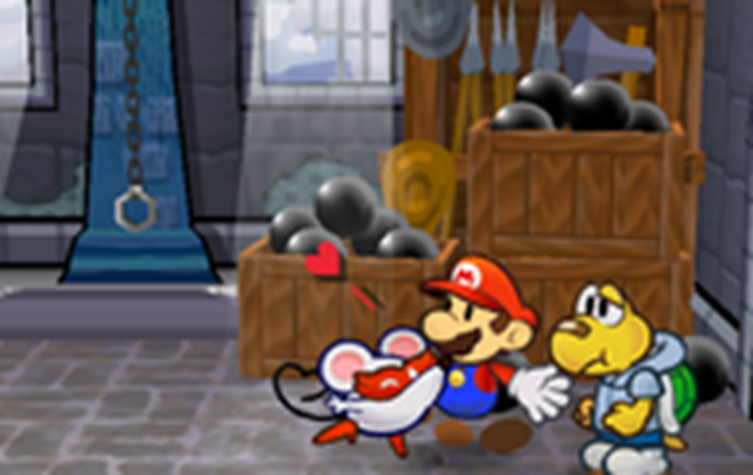
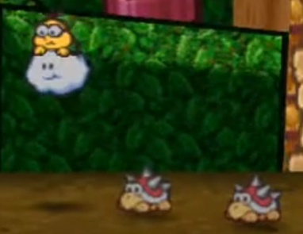
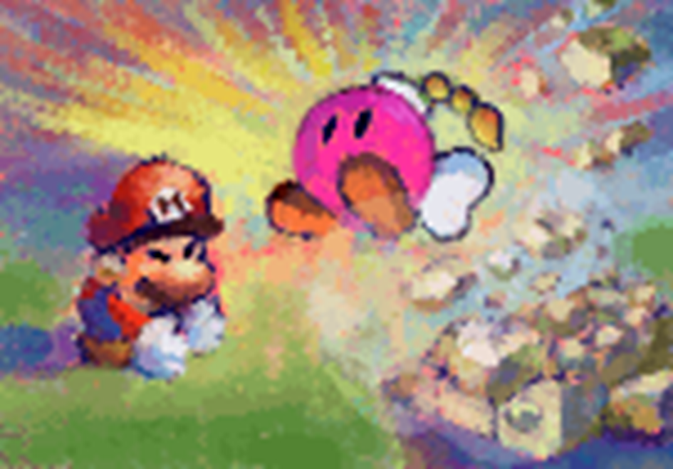

# Techniques
{: .no_toc }

  

    Table of contents
  

  {: .text-delta }
- TOC
{:toc}

Techniques are the myriad ways a character acts in combat, most often by attacking.  
Most of the time characters get by with their Innate Techniques, which they learn over time, but they can access even more Techniques through [Gear]({{ "/inventory#gear" | absolute_url }}), [Badges]({{ "/inventory#badges" | absolute_url }}), *[Magic]({{ "/skills_in_detail#magic---spontaneous-spells" | absolute_url }})*{: .underlined .spirit-color } and even *[Star Power]({{ "/star_power" | absolute_url }})*{: .underlined .courage-color }.

All Techniques start from the same basic template, functioning as either a single-strike or multi-strike attack:

{: .specie-inverted-callout }
> {: .specie-inner-callout }
> > *Basic Attack*{: .header-font } (*0 FP*{: .spirit-color })  
> > An ordinary single-strike melee attack.  
> > *Coordination*{: .heart-color }:  
> > Auto: [Power] DMG  
> > *Nice!*{: .nice-color }: [2 x Power] DMG  
> > *(No Traits)*{: .italic .fs-3 }
>
> {: .specie-inner-callout }
> > *Basic Double Attack*{: .header-font } (*0 FP*{: .spirit-color })  
> > An ordinary multi-strike melee attack.  
> > *Coordination*{: .heart-color }:  
> > Auto: [Power] DMG  
> > *Nice!*{: .nice-color }: [Power] DMG x2  
> > *(No Traits)*{: .italic .fs-3 }
> 

Techniques require the user to make what's called a Primary Check in order to deal damage, which defaults to their *Coordination*{: .heart-color }.  
Other traits might add on a Secondary Check, which is rolled after a successful Primary Check.

As always, better results generate better opportunities. But unlike most other checks, the threshold for an attack's Primary Check can be so simple as to work automatically – succeeding without so much as a single success!

Your traits might raise the Primary Check's floor from an automatic success up to *Nice*{: .nice-color } and above, like so:

{: .specie-inverted-callout }
> {: .specie-inner-callout }
> > *Unwieldy Attack*{: .header-font } (*0 FP*{: .spirit-color })  
> > An unwieldy single-strike melee attack.  
> > *Coordination*{: .heart-color }:  
> > *Nice!*{: .nice-color }: [Power] DMG  
> > *Good!*{: .good-color }: [2 x Power] DMG  
> > *Unwieldy*{: .italic .fs-3 }
>
> {: .specie-inner-callout }
> > *Unwieldy Double Attack*{: .header-font } (*0 FP*{: .spirit-color })  
> > An unwieldy multi-strike melee attack.  
> > *Coordination*{: .heart-color }:  
> > *Nice!*{: .nice-color }: [Power] DMG  
> > *Good!*{: .good-color }: [Power] DMG x2  
> > *Unwieldy*{: .italic .fs-3 }
> 

Bear in mind though that if a Technique doesn't earn enough Grades to achieve *any*{: .bold .underlined } result, or the Primary Check suffers a Critical Failure, it fails outright!

{: .example-callout}
> *Example: Primary Conflict*{: .header-font }
>
> A veteran Hammer Bro might have two attacks at their disposal; a simple hammer throw, and an unwieldy but devastating hammer whack!
>
> The throw has no traits modifying its required check, so it automatically works to deal damage equal to their Power, with a *Nice*{: .nice-color } result it can deal twice that!
>
> The whack is much more difficult; its traits have raised the required Grades four times! So a *Great*{: .great-color } result deals damage equal to their Power, a *Wonderful*{: .wonderful-color } result deals twice that – and anything else fails outright!
>

## Damage Calculation

Whenever a Technique would deal damage as part of a Strike, each Strike is modified by the user's Attack to get the Raw Damage.

Then, that damage value is reduced by the defender's Defense, any applicable Resistances they have and any other damage reduction they might have (such as a player's *[Guarding]({{ "/skills_in_detail#guard---guarding-reactively" | absolute_url }})*{: .underlined .heart-color }), and that amount of damage is taken from the target's *HP*{: .heart-color }.

Importantly, your Attack can be *negative*{: .bold .underlined } too! In this case, the Attack value is taken out of the Raw Damage, which might reduce it right down to 0!

## Strikes

A Technique can divide its potential damage up into any number of strikes.

{: .content-callout }
> ### Single-Strike  
> Single-Strike attacks can hit one target solidly. At a minimum they deal [Power] in DMG.
> Earning an extra Grade on top of that allows them to deal up to [2 x Power], and act as a Solid Hit.  

{: .content-callout }
> ### Multi-Strike  
> Multi-Strike attacks split some of the force up between their hits, hitting the same target multiple times.  
> Each Strike deals a portion of the attack's damage potential with each hit; as a general rule, each Strike should deal no more than than [Power] in damage.  
> The user Strikes once, then can make one more Strike for each additional Grade of Success earned, but the total base damage of the split Strikes can't be more than [2 x Power].

Taking damage at any point during a Technique (such as from a Contact Trait) interrupts and cancels the Technique.  
If a Strike caused the user to take damage, the Strike still resolves before the Technique ends, but no more Strikes can be made.

## Solid Hits

A Solid Hit is a more reliable type of Strike that carries a little more weight than normal.  
Regardless of the user's Power, a Solid Hit always threatens at least 1 Raw Damage.  

If the user has a positive Attack modifier, Solid Hits treat that Attack as *doubled*{: .bold .underlined }!

Unless otherwise specified, attacks with multiple targets can't deal Solid Hits; you simply can't focus well enough when dividing your attention like that.

{: .center-img }

{: .tip-callout }
> *Multi-Strike attacks take a bit more work than Single-Strike attacks, but the more strikes you make, the more damage you can get from Attack boosts!* 
> {: .icon-right }

## Technique Traits

When defining Techniques you have a wide variety of Traits to modify them with, which either increase or decrease the Technique's final *FP*{: .spirit-color } cost.  
If this reduces your *FP*{: .spirit-color } cost to 0 or less, the Technique doesn't cost any *FP*{: .spirit-color }!

Tech Defaults are especially useful here – you can add on one of your available Tech Default sets without modifying the *FP*{: .spirit-color } cost at all!  
Any Optional Tech Defaults which would apply can be added on as well without *FP*{: .spirit-color }.  
Required Tech Defaults *must*{: .underlined .bold } be added where they would apply, and don't modify *FP*{: .spirit-color }.

Some Traits can be taken multiple times, layering together to enhance their effects.  
If two instances of the same Trait have different qualities (e.g. different elements, or targeted stats), count them as separate distinct Traits.  

While you can stack as many Traits on a Techniqe as you please, there are limits to how much *FP*{: .spirit-color } you can save with negative Traits.  
You can only save *FP*{: .spirit-color } from 3 Traits at a time, plus one more Trait for every 2 of your levels.  
Any other negative Traits you add contribute to the overall Technique's effect, but don't modify *FP*{: .spirit-color } at all.

{: .example-callout}
> *Example: Negative Traits*{: .header-font }
>
> A level 1 Buzzy Beetle wants to begin play with a powerful *0 FP*{: .spirit-color } attack.  
> They add Strong for *2 FP*{: .spirit-color }, Overrun for *3 FP*{: .spirit-color } and Divider for *3 FP*{: .spirit-color }, allowing them to cleave through a group of foes and break their formation apart.  
> *8 FP*{: .spirit-color } is a lot to swallow, though. They can use up to 3 negative Traits to try and mitigate this cost.  
> After much deliberation, they decide on Exhausting (*-4 FP*{: .spirit-color }), Penalty (*-2 FP*{: .spirit-color }) and Unwieldy (*-2 FP*{: .spirit-color }), giving them an all-or-nothing attack that's difficult to execute, and leaves them Dazed afterwards.
>
> They could add more negative Traits if they really wanted, but they wouldn't be able to save any more *FP*{: .spirit-color } from those Traits.

While you can describe a Technique in shorthand by referring to its Traits, in practice it's better to write out the full effect for your own reference – you may not always remember that a Piercing attack ignores Defense, or you may need to record how your Boost Technique works at different Grades of Success.

{: .center-img }

{: .tip-callout }
> *Don't be disheartened if all these Technique Traits are overwhelming; the sheer volume of choices and interaction between different Traits is enough to make anyone's head spin.  
If you're having trouble creating your perfect Technique, talk to your GM about it and see what you can come up with together. These rules are a good starting point, but should never get in the way of a fun idea.*
 
> {: .icon-right }

## Trait Effects

Some Traits have similar functions which are referred to in shorthand, explained here.

{: .content-callout }
> ### [X]
> 
> This Trait can be chosen multiple times to strengthen its effects; additional instances are treated as the same singular Trait, but with effects varying based on how many times the Trait has been taken, [X].  
> If there's a limit on how many times it can be taken, this is referred to as the Cap; the total number of copies of that Trait active at any one time must always be equal to or less than the Cap.  

{: .content-callout }
> ### [Secondary]
> 
> After the Primary Check is resolved, as long as it didn't fail and there's still a valid target, some Techniques have follow-up effects which require a Secondary Check.  
> Unlike Primary Checks, the minimum floor for a Secondary Check to proceed is a *Nice*{: .nice-color } result.  
> The required Skill is defined by your Traits – if a [Secondary] Trait lists multiple Skills, choose one of them when you first define the Technique, and if the Technique has multiple [Secondary] Traits, choose one skill to represent all Secondary effects.  
> In any case, you only roll one Secondary Check for all relevant effects. If multiple targets would be affected, they all suffer the consequences of the same Secondary Check.

{: .content-callout }
> ### [Approach]
> 
> This Trait modifies the way the user approaches their target(s). Generally, multiple [Approach] Traits can't be taken at once.

{: .content-callout }
> ### [Target]
> 
> This Trait modifies the available targets for this Technique in some way. Generally, multiple [Target] Traits can't be taken at once.

{: .content-callout }
> ### [Strikes]
> 
> This Trait modifies the way Strikes and damage are allocated in some way, making it fundamentally different from a Single-Strike or Multi-Strike Technique.  
> Generally, multiple Strikes Traits can't be taken at once.

{: .content-callout }
> ### [Random]
> 
> This Trait features a random element. Multiple [Random] Traits can't be taken at once, unless otherwise specified.

{: .content-callout }
> ### [Slots]
> 
> This Trait includes Technique Slots, a smaller compartmentalised collection of Technique Traits. The exact number and nature of these slots depends on the Technique Trait.  
> Unless otherwise specified, Technique Slots calculate their *FP cost*{: .spirit-color } separately from the overall Technique; rather than paying the *FP Cost*{: .spirit-color } of the slot, it's used to determine the Technique's *FP cost*{: .spirit-color }.  
> When calculated in this way, each individual Technique Slot can benefit from the same number of negative Traits that the Technique itself would, but can't benefit from any Tech Defaults.  
> For the purpose of [X] Caps and duplicating Traits, Slots ignore all Traits in other Slots.

## Positive Technique Traits

{: .content-callout }
> ### *Aerial*{: .positive-color} ***(+2 FP)**{: .spirit-color } [Approach]*{: .normal-font }
> 
> At the user's option, this Technique's Primary Check can use *Athletics*{: .heart-color } instead.  
> The user flies through the air to deliver this attack, striking from above. This allows them to hit targets from anywhere in the fight, though they may struggle to hit targets who are blocked in some way (e.g. under a low ceiling).  
> If the user is flying when they make an Aerial attack, they can Plummet as they make this attack.  
> Plummeting attacks are made at +1 Power, but require one more Grade of Success on their Primary Check.  
> Regardless of the outcome, the user becomes grounded after a Plummeting attack.

{: .content-callout }
> ### *All*{: .positive-color} ***(+3 FP)**{: .spirit-color } [Target]*{: .normal-font }
>
> This Technique affects all available targets, be they friend or foe, besides the user. At the user's option this can also include the *Indirect*{: .positive-color } Trait for no additional cost.

{: .content-callout }
> ### *Allies*{: .positive-color} ***(+2 FP)**{: .spirit-color } [Target]*{: .normal-font }
>
> This Technique affects all of the user's allies, but not themselves. At the user's option this can also include the *Indirect*{: .positive-color } Trait for no additional cost.

{: .content-callout }
> ### *Alt-Cost*{: .positive-color} *(+2 FP)*{: .spirit-color .normal-font }
>
> Choose *HP*{: .heart-color }, *SP*{: .courage-color } or Coins:
> - *HP*{: .heart-color }: This Technique spends *HP*{: .heart-color } instead of *FP*{: .spirit-color }. It can't recover *HP*{: .heart-color }, and can't be combined with *Blowback*{: .negative-color } or varieties of *Self*{: .negative-color } that deal damage to the user.
> - *SP*{: .courage-color }: This Technique spends *SP*{: .courage-color } instead of *FP*{: .spirit-color }. It can't add *SP*{: .courage-color } to anyone's pool, though it can still generate *SP*{: .courage-color } for *[Exceptional Techniques]({{ "/exceptional_techniques" | absolute_url }})*{: .courage-color .underlined }.
> - Coins: This Technique spends 5 Coins for every *1 FP*{: .spirit-color } it would cost. It can't steal Coins through *Snatch*{: .positive-color }, and can't cover an equivalent cost of more than *10 FP*{: .spirit-color } (for 50 Coins).
>
> The effective *FP*{: .spirit-color } cost can't be reduced lower than *1 FP*{: .spirit-color } by negative Traits while using *Alt-Cost*{: .positive-color }.

{: .content-callout }
> ### *Bestow*{: .positive-color} ***(+2 FP)**{: .spirit-color } [Secondary – **Bully**{: .courage-color }/**Cheer**{: .courage-color }/**Knowhow**{: .spirit-color }/**Magic**{: .spirit-color }/**Trickery**{: .spirit-color }] [X]*{: .normal-font }
>
> The target temporarily acquires a [Personal Trait]({{ "/personal_traits" | absolute_url }}) of your choice, as if they were *[Enchanted]({{ "/skills_in_detail#enchantments" | absolute_url }})*{: .underlined .spirit-color }, lasting for [X] turns.  
> The exact Personal Traits added by this Trait are decided when this Trait is bought, and any special effects (such as an added Weakness) should be in line with similar effects.
>
> If the trait requires an action or check to activate (such as to take flight with Fly), it uses your action, and the results of your Secondary Check.  
>
> Numerical values of the Trait (e.g. Resist, Contact damage, Status Level) are all set to 1, even if they would normally be higher.  
> For every additional Grade of Success, incrase those numerical values by 1, to a maximum of [X].
>
> The target must pay *FP costs*{: .spirit-color } for their Traits as normal.
>
> If this Technique doesn't have *Variant*{: .positive-color }, and it uses *Cheer*{: .courage-color } for its skill check, this effect can only be used to add positive Traits to allies (e.g. Fly).  
> Otherwise if it doesn't have *Variant*{: .positive-color }, and it uses *Bully*{: .courage-color } or *Trickery*{: .spirit-color } for its skill check, this effect can only be used on enemies to add negative Traits (e.g. Weakness).

{: .content-callout }
> ### *Boost*{: .positive-color} ***(+2 FP)**{: .spirit-color } [Secondary - **Cheer**{: .courage-color }/**Heal**{: .heart-color }/**Magic**{: .spirit-color }] [X]*{: .normal-font }
>
> The target's abilities are [Boosted]({{ "/statuses#boosted" | absolute_url }}) for [X] turns – the exact abilities affected by the Boost are decided when this Trait is bought.  
> For every additional Grade of Success, increase the Status Level by 1, to a maximum of [X].  
>
> This Technique can also use the following skills for Secondary Checks, depending on the ability being Boosted:
> 
> - Attack: *Athletics*{: .heart-color } or *Coordination*{: .heart-color }
> - Defense: *Guard*{: .heart-color }
> - Dodge: *Trickery*{: .spirit-color }
> - Skill (e.g. *Steady*{: .courage-color }): The same Skill being Boosted
> 
> If this Boost Technique has an element, it also has the following effects depending on the ability Boosted:
> 
> - Attack: The target's attacks have the same element for the duration.
> - Defense: The target's Resist for that element is Boosted, too.

{: .content-callout }
> ### *Burst*{: .positive-color} ***(+1 FP)**{: .spirit-color } [Strikes] [Target] [X]*{: .normal-font }
> 
> This attack bursts either side of its initial target, reaching to strike the next [X] additional targets in front of them and the next [X] additional targets behind them, regarless of their elevation.
>
> The initial target takes damage equal to [Power], or with an additional Grade of Success [2 x Power].
> 
> Each new target (in either direction) is deal 1 less Raw Damage than the last; this can't reduce the Raw Damage below 0, so as long as the first strike could deal damage, the rest will deal at least 1 Raw Damage.  
>
> If it has no other element, the user can optionally give this Technique *Element (Blast)*{: .positive-color }.

{: .content-callout }
> ### *Charm*{: .positive-color} ***(+2 FP)**{: .spirit-color } [Secondary - **Magic**{: .spirit-color}/**Persuade**{: .courage-color }/**Trickery**{: .spirit-color }] [X]*{: .normal-font }
>
> The target is [Charmed]({{ "/statuses#charmed" | absolute_url }}), causing them to be easily persuaded, for [X] turns.  
> For every additional Grade of Success, increase the Status Level by 1, to a maximum of [X].
>
> 
> {: .center-img }
>
> {: .tip-callout }
> > *An enemy Charmed is an enemy you don't have to deal with, **and**{: .underlined } an asset to fight your enemies! Charm is an invaluable asset outside of combat, too – try using it to get past security, or negotiate a better deal.  
> > Just don't be surprised if they're made when your Charm wears off.* 
> > {: .icon-right }
>

{: .content-callout }
> ### *Coin Toss*{: .positive-color} ***(+? FP)**{: .spirit-color } [Random] [Slots]*{: .normal-font }
> 
> This Technique has 2 different Technique Slots, each assigned either Heads or Tails.
>
> When you use this Technique, flip a coin. Only the Slot whose side comes up is active for this use of the Technique, and the other Slot's Traits are ignored.  
>
> The overall *FP cost*{: .spirit-color } Coin Toss adds to your Technique is equal to the sum of the following:
>
> - ½ of the highest positive *FP cost*{: .spirit-color } in both Slots; if there's a tie, choose one.
> - *+1 FP*{: .spirit-color } for each Trait included in the Slot with the most Traits.
> - *-1 FP*{: .spirit-color } if one of the Slots is empty.
> - If either Slot has a *negative FP cost*{: .negative-color }, take ½ of away from Coin Toss' *FP cost*{: .spirit-color }.
> 
> If after this Coin Toss would have a *negative FP cost*{: .negative-color }, you can treat it as a negative Trait instead.
> 
> {: .example-callout}
> > *Example: Heads or Tails*{: .header-font }
> >
> > A gambling Shy Guy spins into a wild, uncontrolled kick!  
> > Essentially, they flip a coin; if it comes up Heads, they can add Strong to their kick! If it comes up Tails, though, they Exhaust themselves instead.  
> > 
> > With Heads, Strong would normally cost *2 FP*{: .spirit-color }, so that's *+1 FP*{: .spirit-color } to the cost.  
> > With Tails, Exhausting would save *-4 FP*{: .spirit-color }; so *-2 FP*{: .spirit-color } overall.  
> >
> > Both sides have the same number of Traits, so they add *+1 FP*{: .spirit-color } for 1 Trait.  
> > The gambler's kick is so risky, it works out to *0 FP*{: .spirit-color } overall!
> 

{: .content-callout }
> ### *Counter*{: .positive-color} ***(+2 FP)**{: .spirit-color } [X - Cap 3]*{: .normal-font }
> 
> If this Technique has a Primary Check, it defaults to either *Athletics*{: .heart-color } or *Steady*{: .courage-color }.
> 
> Instead of the usual effect of this Technique, the target gains the damage and other qualities of this Technique (excluding *Counter*{: .positive-color }, [Approach] and [Target] traits) as a [Contact]({{ "/personal_traits#contact" | absolute_url }}) Trait, either through some direct hazard or a counter-attack from the original user.  
> Ordinarily this Contact Trait persists until the next round, until it's triggered, or until the target takes damage.  
>
> Choose up to [X] of the following effects when you design this Technique:
> - This Contact Traits persists for [X] rounds, +1 round for each Grade of Success earned on the Primary Check. The trait persist when taking damage, and can be triggered multiple times.
> - This Contact Trait still activates when struck indirectly.
> - The target is rendered [Secure]({{ "/statuses#secure" | absolute_url }}) by their Contact Trait as they intercept and keep foes at bay. If their Secure state ends (e.g. by attacking), so does the Contact Trait.
>
> Primary and Secondary Checks for this Technique are rolled once when the Technique is used. Whenever the Contact Trait is triggered, the effects of those rolls are applied to the attacker.

{: .content-callout }
> ### *Confuse*{: .positive-color} ***(+1 FP)**{: .spirit-color } [Secondary - **Bully**{: .courage-color }/**Magic**{: .spirit-color }/**Trickery**{: .spirit-color }] [X]*{: .normal-font }
>
> The target is [Confused]({{ "/statuses#confused" | absolute_url }}), causing them to behave unpredictably, for [X] turns.  
> For every additional Grade of Success, increase the Status Level by 1, to a maximum of [X].

{: .content-callout }
> ### *Daze*{: .positive-color} ***(+1 FP)**{: .spirit-color } [Secondary - **Bully**{: .courage-color }/**Magic**{: .spirit-color }/**Trickery**{: .spirit-color }] [X]*{: .normal-font }
>
> The target is [Dazed]({{ "/statuses#dazed" | absolute_url }}) for [X] turns, preventing them from fighting back.  
> For every additional Grade of Success, increase the Status Level by 1, to a maximum of [X].
>
> 
> {: .center-img }
>
> {: .tip-callout }
> > *Dazing an enemy stops even the most dangerous foes in their tracks! If you coordinate with your allies and make sure their attacks don't rouse the Dazed enemy, you can buy yourselves a lot of time.* 
> > {: .icon-right }
>

{: .content-callout }
> ### *Disarm*{: .positive-color} ***(+1 FP)**{: .spirit-color } [Secondary - **Bully**{: .courage-color }/**Magic**{: .spirit-color }/**Trickery**{: .spirit-color }] [X]*{: .normal-font }
> 
> The target is [Disarmed]({{ "/statuses#disarmed" | absolute_url }}) for [X] turns, preventing them from using the targeted attack or Trait – the exact Traits (e.g. *Tool*{: .positive-color }) or manner of attack (e.g. jump attacks) affected by this status are decided when this Trait is chosen.  
> For every additional Grade of Success, increase the Status Level by 1, to a maximum of [X].

{: .content-callout }
> ### *Dismiss*{: .positive-color} ***(+2 FP)**{: .spirit-color } [Secondary - **Bully**{: .courage-color }/**Heal**{: .heart-color }/**Magic**{: .spirit-color }/**Trickery**{: .spirit-color }]*{: .normal-font }
>
> For each Grade of Success, the user can choose one of the target's Statuses, their current Power-Up or a temporary Terrain affecting them.
> 
> - *Statuses or Terrain*{: .bold }: Reduce duration by -1 for each Grade of Success this Technique earned overall.
> - *Power-Up*{: .bold }: The target must try to hold onto their Power-Up, as if they took damage; their check requires an additional Grade of Success for each Grade of Success this Secondary Check earned overall.
>
> If this Technique doesn't have *Variant*{: .positive-color }, and it uses *Heal*{: .heart-color } for its skill check, this effect can only be used to remove negative effects from allies (e.g. Weaken, debilitating Terrain).  
> Otherwise if it doesn't have *Variant*{: .positive-color }, and it uses *Bully*{: .courage-color } or *Trickery*{: .spirit-color } for its skill check, this effect can only be used on enemies to remove positive effects (e.g. Boost, Power-Ups, enhancing Terrain).

{: .content-callout }
> ### *Disorient*{: .positive-color} ***(+2 FP)**{: .spirit-color } [Secondary - **Bully**{: .courage-color }/**Magic**{: .spirit-color }/**Trickery**{: .spirit-color }] [X]*{: .normal-font }
> 
> The target is [Disoriented]({{ "/statuses#disoriented" | absolute_url }}) for [X] turns, reducing the effectiveness of all actions requiring their senses.  
> For every additional Grade of Success, increase the Status Level by 1, to a maximum of [X].

{: .content-callout }
> ### *Divider*{: .positive-color} ***(+3 FP)**{: .spirit-color } [Secondary - **Bully**{: .courage-color }/**Magic**{: .spirit-color }/**Trickery**{: .spirit-color }] [X]*{: .normal-font }
> 
> The target is cut off from their allies, separating into another distinct group for at least the next [X] full rounds – or until they can reasonably reconnect with the original group.  
> If there are multiple targets, they can be divided into separate groups, creating up to 1 other group for each additional Grade of Success and a maximum of [X] new groups.  
> If multiple targets are divided into the same group, they maintain their relative position and turn order in the new group.

{: .content-callout }
> ### *Drain*{: .positive-color} ***(+3 FP)**{: .spirit-color } [X – Cap 2]*{: .normal-font }
> 
> This attack's Strikes heal the user an amount of *HP*{: .heart-color } equal to ½ the damage dealt to *one*{: .underlined } of its targets; if [X] is 2, it heals that amount in *HP*{: .heart-color } instead.  
> As long as the Strike dealt damage, it heals a minimum of *1 HP*{: .heart-color }.  
> Each *additional*{: .underlined } target damaged by a Drain attack adds *+1 HP*{: .heart-color } to the total healing.

{: .content-callout }
> ### *Element*{: .positive-color} ***(+1 FP)**{: .spirit-color } [X]*{: .normal-font }
> 
> This attack carries up to [X] different elemental qualities, such as Fire, Ice or Shock. If it has multiple elements, they all apply at the same time.  
> Elements don't do anything on their own, but they can be useful in different situations.  
> Note that Immunities apply before Weaknesses, and Immunities and Weaknesses each overrule Resistances. So if one element would trigger an enemy's Immunity, the whole Technique does.

{: .content-callout }
> ### *Empower*{: .positive-color} ***(+2 FP)**{: .spirit-color } [X]*{: .normal-font }
> 
> As long as this Technique's Secondary Check succeeds, it functions as if it had [X] additional Grades of Success.

{: .content-callout }
> ### *Fear*{: .positive-color} ***(+1 FP)**{: .spirit-color } [Secondary - **Bully**{: .courage-color }/**Trickery**{: .spirit-color }] [X]*{: .normal-font }
>
> An affected target chooses between the below effects:
> - They attempt to flee the fight.
> - They become [Stunned]({{ "/statuses#stunned" | absolute_url }}) for [X] turns.
> - Their Attack is [Weakened]({{ "/statuses#weakened" | absolute_url }}) for [X] turns.
>
> For every additional Grade of Success increase the Status Level of a Status inflicted by this Trait by 1, to a maximum of [X].

{: .content-callout }
> ### *Flowery*{: .positive-color} ***(+2 FP)**{: .spirit-color } [Secondary - **Cheer**{: .courage-color }/**Magic**{: .spirit-color }] [X]*{: .normal-font }
> 
> This Technique restores *+1 FP*{: .spirit-color } to the target for every Grade of Success, to a maximum of *[X] FP*{: .spirit-color }.

{: .content-callout }
> ### *Group*{: .positive-color} ***(+5 FP)**{: .spirit-color } [Target]*{: .normal-font }
> 
> This Technique affects all targets in the chosen group. If targeting their own group, the user can choose whether or not it affects them too.  
> At the user's option this can include the *Indirect*{: .positive-color } Trait.

{: .content-callout }
> ### *Hearty*{: .positive-color} ***(+1 FP)**{: .spirit-color } [Secondary - **Heal**{: .heart-color }/**Magic**{: .spirit-color }] [X]*{: .normal-font }
> 
> This Technique heals the target *2 HP*{: .heart-color } for every Grade of Success, to a maximum of *[X+X] HP*{: .heart-color }.

{: .content-callout }
> ### *Homing*{: .positive-color} *(+1 FP)*{: .spirit-color .normal-font }
> 
> This Technique can't be *[Dodged]({{ "/skills_in_detail#trickery---dodging" | absolute_url }})*{: .underlined .spirit-color } and ignores the [Secure]({{ "/statuses#secure" | absolute_url }}) Status. It can still be *[Guarded]({{ "skills_in_detail#guard---guarding-reactively" | absolute_url }})*{: .underlined .heart-color } against.  
> If a target has any [Mirages]({{ "/personal_traits#mirage" | absolute_url }}) in battle, this Technique can ignore them to strike the target instead.

{: .content-callout }
> ### *Hustle*{: .positive-color} ***(+6 FP)**{: .spirit-color } [Secondary - **Athletics**{: .heart-color }/**Cheer**{: .courage-color}/**Magic**{: .spirit-color}][X - Cap 5]*{: .normal-font }
>
> The target begins to [Hustle]({{ "/statuses#hustled" | absolute_url }}), giving them additional actions for the next [X] full turns; if you begin to Hustle during your turn, this effect doesn't apply until your next turn.  
> For every additional Grade of Success, increase the Status Level by 1, to a maximum of [X].

{: .content-callout }
> ### *Indirect*{: .positive-color} *(+2 FP)*{: .spirit-color .normal-font }
> 
> This attack doesn't strike the target directly. The user is generally shielded from the consequences of the target's Contact Traits, though depending on the attack and the Contact trait there are exceptions.

{: .content-callout }
> ### *Launch*{: .positive-color} ***(+2 FP)**{: .spirit-color } [Secondary - **Athletics**{: .heart-color }/**Bully**{: .courage-color }] [X]*{: .normal-font }
>
> The target is launched across the battlefield after being attacked, flying through one valid target in the same group behind them (at the same elevation) for each Grade of Success. If they collide with a target with a relevant Contact trait, they stop flying and suffer the consequences of that Contact.  
> Each additional target hit during this launch takes damage equal to this Technique's Power, unmodified by the user's Attack; if the launched target has a relevant Contact trait, each new target suffers the consequences of that Contact.  
> A maximum of [X] targets can be launched by this Technique at once, with all launches being resolved simultaneously.  
> Afterwards, all targets return to their original position, if able – although in precarious fights, a solid enough launcher could shift the battlefield completely, or bring the fight to an early close.

{: .content-callout }
> ### *Lengthen*{: .positive-color} ***(+1 FP)**{: .spirit-color } [X]*{: .normal-font }
>
> The innate effects of this Technique which have a duration (e.g. Statuses, Minions, Terrains) last [X] more turns or rounds, as appropriate.  
> This does not impact effects generated from other sources, or after the Technique resolves (e.g. *[Exceptional Techniques]({{ "/exceptional_techniques" | absolute_url }})*{: .courage-color .underlined }, Weaknesses).

{: .content-callout }
> ### *Lingering*{: .positive-color} ***(+1 FP)**{: .spirit-color } [Secondary - **Bully**{: .courage-color }/**Magic**{: .spirit-color }] [X]*{: .normal-font }
>
> The target suffers a [Lingering]({{ "/statuses#lingering" | absolute_url }}) burn, poison or other degenerative effect, for [X] turns.  
> For every additional Grade of Success, increase the Status Level by 1, to a maximum of [X].

{: .content-callout }
> ### *Lucky Hit*{: .positive-color} ***(+? FP)**{: .spirit-color } [Random] [Slots]*{: .normal-font }
>
> This Technique has a rare special effect!  
> Add a single Technique Slot to this Technique; its overall *FP Cost*{: .spirit-color } *must*{: .underlined .bold } be positive.  
>
> When you use this Technique, roll 1d6; the Lucky Hit Slot's Traits are only active if you roll a 6.  
> 
> The overall *FP cost*{: .spirit-color } *Lucky Hit*{: .positive-color } adds to your Technique is equal to the sum of the following:
>
> - 1/3 of the overall *FP cost*{: .spirit-color }.
> - *+1 FP*{: .spirit-color } for each *pair*{: .underlined .bold } of Traits included in the Slot, including copies of the same Trait.
> 
> {: .example-callout}
> > *Example: Lucky Critical*{: .header-font }
> >
> > A roguish Swooper strikes from the shadows! Their attack has a 1 in 6 chance to land a devastating Lucky Hit!  
> > 
> > The Lucky Slot contains 4 instances of Strong, which would normally cost *8 FP*{: .spirit-color }.  
> > This cost is divided by 3 and rounded down, for *2 FP*{: .spirit-color }. Since it contains 4 Traits (two pairs), another *+2 FP*{: .spirit-color } is added.  
> > Overall, this Lucky Hit costs *4 FP*{: .spirit-color } – half the usual cost!
> 
> Unlike other [Random] traits, you *can*{: .underlined } combine *Lucky Hit*{: .positive-color } with *Fumble*{: .negative-color }.  
> If the Technique has both traits, roll the same die once for both effects.
>
> 
> {: .center-img }
>
> {: .tip-callout }
> > *You know what they say; better lucky than good.* 
> > {: .icon-right }
>

{: .content-callout }
> ### *Minion*{: .positive-color} ***(+3 FP)**{: .spirit-color } [Secondary - **Bully**{: .courage-color }/**Cheer**{: .courage-color }/**Magic**{: .magic-color }/**Persuade**{: .courage-color }] [Target] [X]*{: .normal-font }
>
> This Technique generates minions who obey your command.  
> A successful use of this Technique earns 1 minion Tier, with additional Grades of Success earning one more Tier, to a max of [X] Tiers.  
> You can then allocate those Tiers to generate any number of minions of the same Tier, allowing you to summon one strong minion at Tier [X], or a combination of weaker minions at a lower Tier.
>
> Generated minions join your group in any position you choose, and then become this Technique's target, taking on all other effects of this Technique (including damage, if applicable).
>
> Importantly, you design your minions separately for *each*{: .underlined } tier when you design this Technique.  
> Your Tier 1 minions always use the same qualities, your Tier 2 minions will always use the same qualities to generate a different, more capable, minion, and so on.
>
> {: .example-callout}
> > *Example: Goomba Stacking Minions*{: .header-font }
> >
> > A Goomba monarch summons a horde of Goombas to serve as his minions!
> >
> > Their Technique has Minion x3, allowing them to summon up to Tier 3 minions.  
> > They've previously defined Tier 1 (required a *Nice*{: .nice-color } result) as a simple Goomba, Tier 2 (*Good*{: .good-color }) as a Paragoomba and Tier 3 (*Great*{: .great-color }) as a Big Goomba.
> >
> > With a *Great*{: .great-color } result he can generate a Tier 3 Big Goomba!  
> > Alternatively he could generate a Tier 2 Paragoomba, or up to 3 Tier 1 Goombas.  
> > Because each generated minion has to be the same Tier, though, he wouldn't be able to generate another combination of 3 Tiers (like a Goomba and a Paragoomba).
>
> Minions don't act during the round they're summoned, and persist for the next [X] full rounds. If they would have the Elevation, Fly or similar movement Traits, they can be generated with these active with no further action required.
>
> Minions follow your orders, acting in turn order as usual.  
> They have one Innate Technique, and can reliably use their Personal Traits, but besides that they can't take on complicated tasks which would normally require a skill check (e.g. *Crafts*{: .spirit-color }, *Guard*{: .heart-color }, *Notice*{: .spirit-color }).
>
> For those actions they can carry out, minions automatically score a number of Grades of Success on all of their checks equal to their Tier.  
> Since htey don't make checks themselves, they can't generate *SP*{: .courage-color }, and they're unable to hold or use *SP*{: .courage-color } themselves (even for *[Exceptional Techniques]({{ "/exceptional_techniques" | absolute_url }})*{: .courage-color .underlined }).
>
> Each Tier of minion can allocate up to 5 times their Tier in points to any of the below qualities:
>
> {: .specie-inverted-callout }
> > {: .specie-inner-callout }
> > > *Health*{: .underlined .fs-5 }
> > >
> > > Minions receive *2 HP*{: .heart-color } for every 1 point assigned.  
> > > Just like regular characters, minions can't restore *HP*{: .heart-color } beyond their maximum.  
> > > They begin with just *1 HP*{: .heart-color }, with a cap of *5 HP*{: .heart-color } times their Tier.
> >
> > {: .specie-inner-callout }
> > > *Combat Ability*{: .underlined .fs-5 }
> > >
> > > Minions receive 1 Power or 1 Defense for every 1 point assigned.  
> > > Minions begin with 0 Power and 0 Defense, with a cap of ½ their Tier in either stat.
> >
> > {: .specie-inner-callout }
> > > *Technique Offsets*{: .underlined .fs-5 }
> > >
> > > The minion's Technique has *-1 FP cost*{: .spirit-color } for each point assigned.  
> > > The final *FP cost*{: .spirit-color } *must*{: .bold .underlined } be 0 for it to be used, and can't be offset by Traits like *Alt-Cost*{: .positive-color }.
> > > 
> > > A minion's Technique can have up to twice their Tier in positive Technique Traits and up to their Tier in negative Technique Traits, but [X] can never be higher than their Tier.
> > >
> > > Since Minions don't roll Primary or Secondary Checks, they can't use Traits which modify their required Grades – like *Simple*{: .positive-color }, *Commitment*{: .negative-color }, *Lacking*{: .negative-color } or *Unwieldy*{: .negative-color }.  
> > > Traits which add or benefit from higher results – like *Empower*{: .positive-color } or *Scaling*{: .positive-color } – can still be used.
> > 
> > {: .specie-inner-callout }
> > > *Traits*{: .underlined .fs-5 }
> > >
> > > Minions acquire a new Personal Trait for every 2 points assigned, with a Trait cap equal to their Tier.  
> > > Any numerical effects (e.g. damage Resisted or *HP*{: .heart-color } restored) are limited to a cap of ½ the minion's Tier.
> > >
> > > Distinct copies of the same Trait (e.g. Immune (Blast) and Immune (Fire)) must be paid for and added separately, and any effects of these Traits which need to be defined (such as an immunity that restores *HP*{: .heart-color }) are tailored to suit the minion – though they should always be similar in scope to existing Traits.
> > >
> > > Minions can also add negative Traits (e.g. Weakness) without paying for them, with a negative Trait cap equal to their Tier.  
> > > Each Trait added in this way offsets the cost of their other Personal Traits, making them free to add.
> >
>
> 
> {: .center-img }
>
> {: .tip-callout }
> > *Minions can get pretty complicated. If you don't want to overthink things, a bunch of Tier 1 minions is usually just as good as one high Tier minion. Many hands make light work!* 
> > {: .icon-right }
>

{: .content-callout }
> ### *Overrun*{: .positive-color} ***(+3 FP)**{: .spirit-color } [Target]*{: .normal-font }
>
> This Technique affects all targets in the target group at the same elevation, as long as the user can reach that height before attacking (such as by flight, elevation or even just jumping).

{: .content-callout }
> ### *Piercing*{: .positive-color} *(+3 FP)*{: .spirit-color .normal-font }
> 
> This attack ignores Defense, though it's still affected by Resistances and Immunities. It can still be *[Guarded]({{ "/skills_in_detail#guard---guarding-reactively" | absolute_url }})*{: .heart-color .underlined } against.

{: .content-callout }
> ### *Provoke*{: .positive-color} ***(+1 FP)**{: .spirit-color } [Secondary - **Bully**{: .courage-color }/**Magic**{: .spirit-color }/**Trickery**{: .spirit-color }/**Persuade**{: .courage-color }] [X]*{: .normal-font }
> 
> The target becomes [Provoked]({{ "/statuses#provoked" | absolute_url }}), causing them to focus their attention on a particular valid target (specified by you), for [X] turns.  
> For every additional Grade of Success, increase the Status Level by 1, to a maximum of [X+X].

{: .content-callout }
> ### *Quake*{: .positive-color} ***(+3 FP)**{: .spirit-color } [Approach] [Target]*{: .normal-font }
> 
> At the user's option, this Technique's Primary Check can use *Athletics*{: .heart-color } instead.  
> This attack affects all targets in the chosen group (besides the user) in contact with the ground, wall or ceiling.  
> As a result, it also functions as the *Indirect*{: .positive-color } Trait and, if it has no other element, has *Element (Earth)*{: .positive-color } and *Element(Quake)*{: .positive-color }.

{: .content-callout }
> ### *Ranged*{: .positive-color} ***(+2 FP)**{: .spirit-color } [Approach]*{: .normal-font }
> 
> This Technique's Primary Check defaults to *Aim*{: .heart-color }.  
> This Technique can affect its targets in battle without making contact, regardless of their relative position or other targets in the way.

{: .content-callout }
> ### *Reach*{: .positive-color} ***(+1 FP)**{: .spirit-color } [Approach]*{: .normal-font }
> 
> This Technique can target flying and grounded enemies that aren't blocked by another target, as if the user was at their elevation.  
> It still makes contact unless paired with *Indirect*{: .positive-color }.

{: .content-callout }
> ### *Repeat*{: .positive-color} ***(+3 FP)**{: .spirit-color } [Strikes]*{: .normal-font }
> 
> The user repeatedly attacks with a flurry of blows. They strike once, then one more time for each additional Grade of Success earned.
>
> The first Strike deals Raw Damage equal to [Power], to a minimum of 1 damage.  
> Each successive Strike then deals 1 less damage than the last, to a minimum of 1 damage (as long as the last Strike dealt some amount of damage).  
> This damage penalty is applied after Attack, Defense and other resistances are factored in, so as long as the first strike deals damage, each follow-up hit will deal at least 1 damage.
>
> There's no limit to the number of Strikes that can be made.

{: .content-callout }
> ### *Revive*{: .positive-color} ***(+10 FP)**{: .spirit-color } [Secondary - **Heal**{: .heart-color }/**Magic**{: .spirit-color }]*{: .normal-font }
>
> The target is revived from their KO with *1 HP*{: .heart-color } (in addition to any *HP*{: .heart-color } they would gain from this Technique), and if they haven't already acted this round, they can act during their turn or immediately after the user's turn (whichever would come later or be more appropriate).
>
> If for whatever reason this Technique would deal damage, it's dealt after they're revived and healed, and the target can resist as normal.

{: .content-callout }
> ### *Roulette*{: .positive-color} ***(+? FP)**{: .spirit-color } [Random] [Slots]*{: .normal-font }
>
> This Technique has 6 different Roulette Slots of Technique Traits, each with a different number between 1 and 6 assigned to them.  
> When you use this Technique, roll 1d6. Only the Slot whose number is rolled is active for this use of the Technique, and all other Roulette Slot Traits are ignored.  
> The overall *FP cost*{: .spirit-color } *Roulette*{: .positive-color } adds to your Technique is equal to the sum of the following:
>
> - The highest *FP cost*{: .spirit-color } in all your Roulette Slots (to a minimum of *0 FP*{: .spirit-color }); don't factor in the *FP cost*{: .spirit-color } for any other Slots.
> - *+1 FP*{: .spirit-color } for each *pair*{: .bold .underlined } of Trait included in the Roulette Slot with the most Traits (both positive and negative).
> - For each Slot with a *negative FP cost*{: .negative-color }, take *½ the FP cost*{: .spirit-color } of that Slot or *-1 FP*{: .spirit-color } (whichever reduces *FP*{: .spirit-color } more) away from the total.
>
> If after this *Roulette*{: .positive-color } would have a *negative FP cost*{: .negative-color }, you can treat it as a negative Trait instead.  
>
> {: .example-callout}
> > *Example: Elemental Roulette*{: .header-font }
> >
> > A Magikoopa conjures a blast of prismatic energy, shifting between 6 different elements at random.  
> > Each Roulette Slot has a different Element Trait, but no other Traits.  
> > The magician only has to pay for one of those Roulette Slots (costing *1 FP*{: .spirit-color }).  
> > They only have one trait per slot, so they don't have to add any more *FP*{: .spirit-color } to the cost!  
> > Thus, Roulette would add *+1 FP*{: .spirit-color } for one Element, instead of the *+6 FP*{: .spirit-color } normally paid for each Element added together.
>
> 
> {: .center-img }
>
> {: .tip-callout }
> > *Why settle for one versatile and useful Technique when you could have six useless gimmicks that you have no control over?  
The Roulette spinner's world is limitless.* 
> > {: .icon-right }
>

{: .content-callout }
> ### *Safe*{: .positive-color} *(+2 FP)*{: .spirit-color .normal-font }
>
> This Trait can only be applied to multi-target attacks. The user and their allies are shielded from the negative consequences of this attack (e.g. damage).

{: .content-callout }
> ### *Scaling*{: .positive-color} ***(+3 FP)**{: .spirit-color } [X]*{: .normal-font }
>
> When resolving this Technique's Primary Check, once the maximum result is earned each *additional*{: .underlined } Grade of Success beyond that point increases its Power by +1.  
> This additional Power cannot be used to increase the number of Strikes.  
> Can't be combined with Techniques with no effective maximum (e.g. *Repeat*{: .positive-color }, *Sequential*{: .positive-color }).
>
> {: .example-callout}
> > *Example: Devastating Scaling*{: .header-font }
> >
> > A single-strike 1 Power hammer whack can deal a maximum of 2 DMG with a *Nice*{: .nice-color } result; inwhich case, Scaling would start to add Power with *Good*{: .good-color } results and above, adding +2 damage at each step.  
> >
> > A multi-hitting 2 Power slap attack would typically max out with 4 Strikes, each dealing 1 DMG, with a *Great*{: .great-color } result; Scaling could still add Power and increase the total pool of damage dealt, but it can't add Strikes.  
> > So a *Wonderful*{: .wonderful-color } result might add +1 DMG to 2 strikes, an *Excellent*{: .excellent-color } might add +1 DMG to 2 other Strikes, and so on.

{: .content-callout }
> ### *Secure*{: .positive-color} ***(+4 FP)**{: .spirit-color } [Secondary - **Guard**{: .heart-color }/**Magic**{: .spirit-color }/**Trickery**{: .spirit-color }]*{: .normal-font }
>
> The target becomes [Secure]({{ "/statuses#secure" | absolute_url }}), rendering them completely immune to most Techniques targeting them for 1 turn; if this Technique would deal damage to or inflict status on the target, those effects take priority first.

{: .content-callout }
> ### *Selective*{: .positive-color} ***(+1 FP)**{: .spirit-color } [Target]*{: .normal-font }
> 
> This Technique can target any one foe at the same elevation as the user, regardless of blocking or their relative position.

{: .content-callout }
> ### *Sequential*{: .positive-color} ***(+1 FP)**{: .spirit-color } [Strikes] [Target]*{: .normal-font }
>
> The user Strikes their target once, then moves to and attacks the next foe behind them with another Strike.  
> Each additional Grade of Success adds another target and another Strike in the same manner.
>
> Each Strike deals [Power] damage. Each target is struck one after another, and can be attacked in melee even if they would normally be blocked by a previously struck foe.

{: .content-callout }
> ### *Shared*{: .positive-color} *(+1 FP)*{: .spirit-color .normal-font }
>
> The user can share in all or part of the effects of this Technique's Secondary Check, as if they were targeted by it.  
> If the Technique would have targeted them anyway, they don't receive any additional benefit; they're only added as a target.

{: .content-callout }
> ### *Simple*{: .positive-color} ***(+2 FP)**{: .spirit-color } [X]*{: .normal-font }
>
> This Technique is easier to use, acting as if it scored [X] additional Grades of Success on the Primary Check; if the maximum effectiveness can be reached with only those Grades, then the user can choose to forego their roll for the Primary Check.

{: .content-callout }
> ### *Snatch*{: .positive-color} ***(+2 FP)**{: .spirit-color } [Secondary - **Bully**{: .courage-color }/**Trickery**{: .spirit-color }]*{: .normal-font }
>
> Based on the number of Grades of Success, you can choose to take one of the following from the target (if they have something to take):
>
> - *Nice!*{: .nice-color }: 1d6 Coins for each Grade of Success.
> - *Good!*{: .good-color }: A small Item
> - *Great!*{: .great-color }: A large Item
> - *Wonderful!*{: .wonderful-color }: An equipped Item, such as a Tool or a Badge
>
> If multiple targets would be affected by this Technique, you can attempt to steal from each of them by dividing the total Grades of Success between all applicable targets.
>
> Players can [oppose]({{ "/grades_of_success#opposed-checks" | absolute_url }}) this check with *Athletics*{: .heart-color }, *Coordination*{: .heart-color } or *Steady*{: .courage-color }.
>
> {: .example-callout}
> > *Example: Multi-Snatch*{: .header-font }
> >
> > An Overrun Snatch that affected three targets with a *Wonderful*{: .wonderful-color } result could assign two Grades of Success to one target (stealing a small Item), and split up the remaining two Grades of Success to steal from the other targets (stealing 1d6 Coins from each). 
>
> 
> {: .center-img }
>
> {: .tip-callout }
> > *A little bit of tactical thievery can go a long way over the course of an adventure. You never know what cool items you could be missing out on!* 
> > {: .icon-right }
>

{: .content-callout }
> ### *Spillover*{: .positive-color} ***(+2 FP)**{: .spirit-color } [Target]*{: .normal-font }
> 
> This Technique initially targets a single valid target.  
> If one of its Strikes deals enough damage to KO its initial target, you can re-allocate the excess damage and any additional Strikes to another valid target.
>
> Continue on until all of this Technique's Raw Damage and Strikes have been allocated.  
> If a Strike from this Technique would be a Solid Hit, all damage allocated once it spills over is still treated as a Solid Hit.

{: .content-callout }
> ### *Split*{: .positive-color} ***(+2 FP)**{: .spirit-color } [Slots]*{: .normal-font }
> 
> This Technique can include any number of Technique Slots; any slot added by this trait is treated as a Split Slot.  
> Unlike other [Slots] Traits, the traits included in a Split Slot are calculated exactly as if they were outside that slot; they contribute to the Technique's *FP cost*{: .spirit-color } and can include Tech Defaults, as normal.
>
> Any Trait or Strike left outside of a Split Slot is directed at the Technique's original target(s).
>
> Each Split Slot can include its own [Approach] and [Target] traits, and one or more of the Technique's Strikes can be allocated to that slot. If a Split Slot no [Approach] or [Target] traits on its own, it defaults to the same targeting options as the main Technique.
>
> Whenever you use this Technique, your Split Slots and the main Technique resolve in order, allocating targets as your direct.  
> The exact order everything resolves is defined by you when you design this Technique.  
> Any Primary and Secondary checks required are shared between Split Slots, as normal.
>
> A Split Slot can't contain the *Harmless*{: .negative-color } Trait; but if it has no Strikes it deals no damage, exactly as if it was *Harmless*{: .negative-color }.
>
> {: .example-callout}
> > *Example: Splitting your Harming and Healing*{: .header-font }
> > 
> > Split gives you a lot of versatility in designing your Techniques; for a simple example, you could deal damage to a foe while healing your allies!
> >
> > To do this with Split, you would need to include the traits Hearty and Allies, then assign them to a Split Slot.  
> > You want the healing to trigger after you make your attack, so you have the bulk of the Technique resolve first, then the Split Slot afterwards.
> >
> > The Technique could then be used to attack a single target in melee (as normal for a Technique without a [Target] trait).  
> > Afterwards, your allies would receive the *HP*{: .heart-color } recovered from Hearty!
>

{: .content-callout }
> ### *Strike-Through*{: .positive-color} ***(+1 FP)**{: .spirit-color } [Strikes] [Target] [X]*{: .normal-font }
>
> This attack pierces past its initial target to strike the next [X] additional targets at the same elevation.
> 
> The first target takes [Power] damage, or [2 x Power] as a Solid Hit with an additional Grade of Success.  
> The attack then repeats with a Strike on up to [X] valid targets behind the first, at the same elevation.  
> Each new Strike deals 1 less Raw Damage than the last; this can't reduce the Raw Damage below 0, so as long as the first strike could deal damage, the rest will deal at least 1 Raw Damage.  
> If the initial Strike was a Solid Hit, the subsequent Strikes are too.

{: .content-callout }
> ### *Strong*{: .positive-color} ***(+2 FP)**{: .spirit-color } [X]*{: .normal-font }
>
> This Technique has +[X] Power.

{: .content-callout }
> ### *Stun*{: .positive-color} ***(+2 FP)**{: .spirit-color } [Secondary - **Bully**{: .courage-color }/**Magic**{: .spirit-color }/**Trickery**{: .spirit-color }] [X]*{: .normal-font }
>
> The target is [Stunned]({{ "/statuses#stunned" | absolute_url }}) for [X] turns, stopped dead in their tracks.  
> For every additional Grade of Success, increase the Status Level by 1, to a maximum of [X+X].

{: .content-callout }
> ### *Swap*{: .positive-color} ***(+1 FP)**{: .spirit-color } [Secondary - **Bully**{: .courage-color }/**Coordination**{: .heart-color }/**Magic**{: .spirit-color }/**Trickery**{: .spirit-color }] [X]*{: .normal-font }
>
> The target swaps position with another target in the same group as you direct, maintaining their current elevation where possible.  
> The second target can't be further away in group order than 1 space for each Grade of Success, to a maximum of [X] spaces away.
>
> If this Technique affects multiple targets, each target can only be swapped once.

{: .content-callout }
> ### *Terrain*{: .positive-color} ***(+3 FP)**{: .spirit-color } [Secondary - **Crafts**{: .spirit-color }/**Magic**{: .spirit-color }] [X]*{: .normal-font }
>
> The environment around the target shifts for [X] full rounds, causing a [Terrain]({{ "/terrain" | absolute_url }}) to form around them.  
> The exact Terrain this Technique causes is chosen when this Trait is bought.  
> 
> For every additional Grade of Success, increase the Terrain Level by 1, to a maximum of [X].  
>
> If the target is already in a similar Terrain (e.g. both Terrains are Weathers), the new Terrain overrides the old one for the duration.  

{: .content-callout }
> ### *Throw*{: .positive-color} ***(+2 FP)**{: .spirit-color } [Target] [Strikes] [X - Cap 2]*{: .normal-font }
>
> At the user's option, this Technique's Primary Check can use *Athletics*{: .heart-color } instead.  
> 
> The target is bodily hurled into the next available target.  
> Both targets are struck at once, and trigger any Contact Traits the other target has.
>
> Each target takes [Power] damage, or [2 x Power] as a Solid Hit with an additional Grade of Success.
>
> If this Technique has a Secondary Check that would affect the original target, it affects the new target as well.
>
> If [X] is 2, you can aim the target as if with the *Ranged*{: .positive-color } Trait, and can use *Aim*{: .heart-color } as the Primary Check.

{: .content-callout }
> ### *Tool*{: .positive-color} *(+1 FP)*{: .spirit-color .normal-font }
> 
> This Technique relies on a hand-held tool, such as a hammer or staff, and can't be used if the appropriate equipment isn't available. As a result it also has *Indirect*{: .positive-color } or *Ranged*{: .positive-color }, at the user's option.  
>
> The [Basic Gear]({{ "/inventory#gear" | absolute_url }}) used for these Techniques don't cost anything during character creation, but they take up an inventory slot, and replacements may need to be bought.  
> Ammunition isn't tracked; if a Tool is represented by a large number of disposable equipment (such as throwing weapons), one Tool is enough to represent the user's supply.
>
> Built-In Tools (used by [Constructs]({{ "/personal_traits#constructs" | absolute_url }})) are functionally the same as Tools, but are built into the user's body.  
> They still take up an inventory slot.
>
> 
> {: .center-img }
>
> {: .tip-callout }
> > *Tools are the easiest way to keep your distance in a fight. If you don't want to dedicate a Technique to a simple attack, why not try picking up some Gear?* 
> > {: .icon-right }
>

{: .content-callout }
> ### *Tutor*{: .positive-color} ***(+1 FP)**{: .spirit-color } [Secondary - **Bully**{: .courage-color }/**Cheer**{: .courage-color }/**Knowhow**{: .spirit-color }/**Magic**{: .spirit-color }] [X]*{: .normal-font }
> 
> Choose up to [X] of this Technique's Traits; multiple instances of a Trait (e.g. *Lingering x2*{: .positive-color }) must be selected individually (requiring you to select both instances of *Lingering*{: .positive-color }).  
> Those Traits have no effect on this Technique, and the target instead becomes [Tutored]({{ "/statuses#tutored" | absolute_url }}) in their use for [X] turns; for each additional Grade of Success, increase the Status Level by 1, to a maximum of [X].  
> 
> Depending on the exact nature of the Traits being Tutored and how the tutelage is carried out, you may also be [Disarmed]({{ "/statuses#disarmed" | absolute_url }}) when trying to use relevant Techniques for the same duration (e.g. if you Tutor someone in *Tool*{: .positive-color } by handing them your equipment).  
>
> If the Tutored Traits are negative, any *FP*{: .spirit-color } that would be saved by them instead becomes a positive value (e.g. *Unwieldy*{: .negative-color } goes from *-2 FP*{: .spirit-color } to *+2 FP*{: .spirit-color }).  
>
> If this Technique doesn't have *Variant*{: .positive-color }, and it uses *Cheer*{: .courage-color } for its skill check, you must include at least one positive Trait.  
> Otherwise if it doesn't have *Variant*{: .positive-color }, and it uses *Bully*{: .courage-color } for its skill check, you can't include *any*{: .underlined } positive Traits.

{: .content-callout }
> ### *Underfoot*{: .positive-color} ***(+2 FP)**{: .spirit-color } [Approach] [Target]*{: .normal-font }
>
> At the user's option, this Technique's Primary Check can use *Athletics*{: .heart-color } instead.  
> 
> This Technique comes from the ground, affecting all targets in the target group in contact with the ground, besides the user.  
> As a result, it also functions as the *Indirect*{: .positive-color } Trait and, if it has no other element, has *Element (Earth)*{: .positive-color } and/or *Element (Quake)*{: .positive-color }.

{: .content-callout }
> ### *Variant*{: .positive-color} ***(+1 FP)**{: .spirit-color } [X - Cap 2]*{: .normal-font }
>
> You may choose a different skill to use for either your Primary or Secondary check for this Technique.

{: .content-callout }
> ### *Versatile*{: .positive-color} ***(+3 FP)**{: .spirit-color } [X] [Slots]*{: .normal-font }
>
> This Technique has up to [X] different Versatile Slots full of Technique Traits.
>
> Track the *FP cost*{: .spirit-color } of each Versatile Slot separately.
>
> When you use this Technique, you can choose one of your Versatile Slots. Only the chosen Slot is active, and the Technique's *FP cost*{: .spirit-color } is temporarily modified by that Slot's *FP Cost*{: .spirit-color }.  
> All unchosen Versatile Slots are ignored.
>
> {: .example-callout}
> > *Example: Versatile Casting*{: .header-font }
> > 
> > A Shaman from the mountains has mastered a magical Technique which turns the might of the mountain upon their foes, using two Versatile Slots.
> >
> > The overall Technique has Element (*+1 FP*{: .spirit-color }); now even if they don't choose a Versatile SLot, their Technique still innately deals Earth damage.  
> > The cost of each Versatile Slot must also be paid (*+6 FP*{: .spirit-color }), and they choose to add Variant (*+1 FP*{: .spirit-coor }) to rely on their superior *Magic*{: .spirit-color } skill.  
> > At first level they have access to 3 negative traits to save FP, so they add Unwieldy x2 (*-4 FP*{: .spirit-color }) and Commitment (*-2 FP*{: .spirit-color }), for a base cost of *2 FP*{: .spirit-color }.
> > 
> > In the first Slot they add All (*+3 FP*{: .spirit-color }), Strong x2 (*+4 FP*{: .spirit-color }) and Blowback (*-4 FP*{: .spirit-color }), for a total of *+3 FP*{: .spirit-color } – representing boulders raining down.
> >
> > In the second Slot they add Underfoot (*+2 FP*{: .spirit-color }), Piercing (*+3 FP*{: .spirit-color }) and Exhausting (*-4 FP*{: .spirit-color }), for a total of *+1 FP*{: .spirit-color } – representing geysers bursting out from underneath their enemies.
> >
> > Even though they used 3 negative traits earlier, each Slot has the same limit of 3 negative traits, allowing them to save even more *FP*{: .spirit-color } on each Slot!  
> > The end result is a Technique which can strike one foe in melee (*2 FP*{: .spirit-color }), rain boulders from above (*5 FP*{: .spirit-color }) or strike with geysers from below (*3 FP*{: .spirit-color }).
>

{: .content-callout }
> ### *Weaken*{: .positive-color} ***(+2 FP)**{: .spirit-color } [Secondary - **Bully**{: .courage-color }/**Magic**{: .spirit-color }/**Trickery**{: .spirit-color }] [X]*{: .normal-font }
>
> The target's abilities are [Weakened]({{ "/statuses#weakened" | absolute_url }}) for [X] turns – the exact abilities affected by the Weakening are decided when this Trait is chosen.  
> For every additional Grade of Success, increase the Status Level by 1, to a maximum of [X].

{: .center-img }

{: .tip-callout }
> *If you're confident you can hit your targets, Scaling and Strong combo well with Unwieldy to make your attacks much more powerful! Consider adding these traits on as you level up and get better at making checks.* 
> {: .icon-right }

## Negative Technique Traits

{: .content-callout }
> ### *Blowback*{: .negative-color} *(-4 FP)*{: .spirit-color .normal-font }
>
> After finishing this attack, the user loses *HP*{: .heart-color } equal to ½ the Raw Damage thhis attack would deal to a single target; if there's a range of different damage totals, refer to the highest Raw Damage potential possible.  
>
> If this attack would affect the target with a Secondary Check, the user is affected as well, though they can resist with *Steady*{: .courage-color } as normal.  
>
> The user's *HP*{: .heart-color } loss can't be resisted in any way (including Defense, *Safe*{: .positive-color } or *Secure*{: .positive-color }) and ignores the user's Weaknesses, Resistances or Immunities.  
>
> This Trait cannot be combined with *Harmless*{: .negative-color } or *Self*{: .negative-color }.

{: .content-callout }
> ### *Commitment*{: .negative-color} ***(-2 FP)**{: .spirit-color } [X - Cap 2]*{: .normal-font }
>
> Choose Primary Check or Secondary Check:
> 
> - Primary: This Technique's Primary Check fails unless its maximum possible effectiveness is achieved, and no higher roll is possible.  
> Can't be combined with Traits that have no functional maximum (e.g. *Repeat*{: .positive-color }, *Scaling*{: .positive-color }, *Sequential*{: .positive-color }), or Techniques without a useable reduced state (e.g. 0 Power).
> - Secondary: This Technique's Secondary Check only works if the maximum possible result is achieved.  
> You can't combine this effect with a Secondary Check that only has one potential outcome, (e.g. *Nice!*{: .nice-color } with no benefits for a *Good!*{: .good-color } result), or a *Team*{: .negative-color } effect which has no additional benefit for extra successes.
> 
> The Technique must have a Primary or a Secondary Check in order for Commitment to be applied to either.

{: .content-callout }
> ### *Conditional*{: .negative-color} ***(-1 FP)**{: .spirit-color } [X]*{: .normal-font }
> 
> Choose up to [X] of this Technique's distinct Positive Traits; they only function in specific circumstances (e.g. midair, underwater), or against specific targets (e.g. Goombas, sleeping targets).  
> If the Trait has multiple instances, this condition applies to all instances of that trait, and the specific circumstances are defined for each Trait separately.  
> 
> Otherwise, the Technique continues to function.  
> The circumstances don't need to be extremely rare but they can't be so common as to almost always be applicable for the user (e.g. "enemies that can breathe").  
> Can't be combined with *Situational*{: .negative-color } effects involving the same circumstance.

{: .content-callout }
> ### *Cooldown*{: .negative-color} ***(-1 FP)**{: .spirit-color } [X - Cap 5]*{: .normal-font }
> 
> This Technique can't be used again until [X] of the user's actionable turns (i.e. turns where they otherwise could have used this Technique) have passed, counting from the next turn.

{: .content-callout }
> ### *Delayed*{: .negative-color} ***(-2 FP)**{: .spirit-color } [X - Cap 5]*{: .normal-font }
> 
> This Technique doesn't take effect immediately, instead being executed [X] rounds after it was used as a free action at the end of the round.  
> Targets are declared, *FP*{: .spirit-color } is spent and checks are rolled when this Technique is first used.  
>
> If the target is invalid when the Technique is executed, it either targets the same area (if a valid target has taken the initial target's place), or fails.  
> Instead of swapping with their allies, if a targeted character would swap under their own power, they can move the targeted space for this Technique the same distance – and can even move it outside of their group to completely dodge it.

{: .content-callout }
> ### *Drip-Feed*{: .negative-color} ***(-1 FP)**{: .spirit-color } [X - Cap 5]*{: .normal-font }
> 
> This Technique takes time to reach its full effect, instead dividing its Status Levels, *HP*{: .heart-color } restored and *FP*{: .spirit-color } restored evenly over the course of the next [X+X] turns for all targets.
>
> Status Levels added on in this way are compounded with the existing Status, allowing it to gradually grow stronger without impacting the duration.  
> If a target loses the effect of one of the Technique's Statuses before it reaches its full potential, the Status ends, and no more Status Levels are added on from this Trait.
>
> The Technique must have at least one effect (e.g. *HP*{: .heart-color }, *FP*{: .spirit-color } or Status Level) with a value of [X+X] in order to stretch it out to that extent.  
> If one of those effects is completely dealt out before [X+X] turns are up, stop assigning that effect to targets.
>
> If its effects can't be divided evenly, allocate any remainders to the first turn.
>
> {: .example-callout}
> > *Example: Gradual Boosting with Drip-Feed*{: .header-font }
> > 
> > Drip-Feed allows you to regenerate over time or slowly build up the effects of your Technique.
> >
> > For instance, a Boost (4) Status could be divided across four turns with Drip-Feed x2; providing Boost (1) upfront, Boost (2) the next turn, then Boost (3) and finally Boost (4).  
> > A shorter burst could be made with Drip-Feed x1, providing Boost (2) upfront, and Boost (4) the following turn.
>

{: .content-callout }
> ### *Exhausting*{: .negative-color} ***(-4 FP)**{: .spirit-color } [X]*{: .normal-font }
>
> The user can't take any more actions for [X] turns. They can still talk, move around (without changing position), take part in other characters' actions (such as *Team*{: .negative-color } Techniques and swapping with *Coordination*{: .heart-color }), and can react freely.

{: .content-callout }
> ### *Fumble*{: .negative-color} ***(-? FP)**{: .spirit-color } [Random] [Slots]*{: .normal-font }
> 
> This Technique has a rare chance to backfire.  
> Add a single Technique Slot to this Technique; its overall *FP cost*{: .spirit-color } *must*{: .bold .underlined } be negative.
>
> When you use this Technique, roll 1d6; the Fumble Slot's Traits are suppressed, as long as you don't roll a 1.  
>
> The amount of *FP*{: .spirit-color } *Fumble*{: .negative-color } takes off of your Technique is equal to 1/3 of the Fumble Slot's *FP cost*{: .spirit-color }.
>
> {: .example-callout}
> > *Example: Fumbled Attack*{: .header-font }
> >
> > A Hammer Bro swings with a devastating melee attack – but their hammer is so heavy, it has a 1 in 6 chance to Fumble!  
> >
> > The Fumble Slot contains Harmless, and 6 instances of Penalty (Disarm (Tool)), which would normally save *-9 FP*{: .spirit-color }.  
> > This cost is divided by 3, for *-3 FP*{: .spirit-color }.  
> > When the Hammer Bro fumbles, they're unable to swing – and worse, they lose their grip on their hammer!
>
> Unlike other [Random] traits, you *can*{: .underlined } combine *Lucky Hit*{: .positive-color } with *Fumble*{: .negative-color }.  
> If the Technique has both traits, roll the same die once for both effects.

{: .content-callout }
> ### *Harmless*{: .negative-color} ***(-3 FP)**{: .spirit-color } [Strikes]*{: .normal-font }
> 
> This Technique doesn't deal damage at all; it includes no Strikes, isn't affected by Attack and has no Primary Check, instead skipping to the Secondary Check (if applicable).  
> 
> Since it has no need to physically strike at the target, it can also include the *Indirect*{: .positive-color } Trait at the user's option for no added cost.  
> This Trait can't be combined with *Weak*{: .negative-color }, or added to Split Slots with *Split*{: .positive-color }.
>
> 
> {: .center-img }
>
> {: .tip-callout }
> > *Lots of iconic moves are best represented with Harmless effects! The option to trade away damage does a lot to mitigate expensive FP costs when you're stacking lots of traits.* 
> > {: .icon-right }
>

{: .content-callout }
> ### *Lacking*{: .negative-color} ***(-1 FP)**{: .spirit-color } [X]*{: .normal-font }
>
> Choose one of this Technique's distinct Positive Traits; it needs [X] additional Grades of Success in order to function, and is inactive if that threshold isn't met. If that Trait has multiple instances, this *Lacking*{: .negative-color } effect applies to all instances of that trait.  
>
> If you have multiple instances of *Lacking*{: .negative-color } targeting different traits, you can split the additional [X] Grades of Success between them freely.  
> 
> This Trait can't save more *FP*{: .spirit-color } than the target Trait's total *FP*{: .spirit-color } cost.  
> This Trait can't be added if it would raise the minimum floor for the overall success of relevant checks.
>
> {: .example-callout}
> > *Example: Lacking Status*{: .header-font }
> >
> > If a Technique had both Lingering x3 and Daze x2, you could add Lacking (Daze) to require a *Good*{: .good-color } result or higher for Daze to function.  
> > You couldn't then add Lacking (Lingering), because then the Secondary Check would require a *Good*{: .good-color } result at minimum.
>

{: .content-callout }
> ### *Limitation*{: .negative-color } *(-? FP)*{: .spirit-color .normal-font }
>
> The positive effects of this Technique and the way it's used are restricted in some way not easily represented through other traits, such as to restrict *[Exceptional Techniques]({{ "/exceptional_techniques" | absolute_url }})*{: .courage-color .underlined } use, consume some of their Items for each use, or to force the user to make certain choices they wouldn't normally have to define.  
>
> The exact amount of *FP*{: .spirit-color } saved depends on the nature of this limitation and is ultimately up to the GM to decide on a case-by-case basis.
>
> *-2 FP*{: .spirit-color } is recommended for most limitations, but especially harsh limitations might warrant a bigger discount.  
> On the other hand, particularly lax limitations might be worth just *-1 FP*{: .spirit-color }, if they qualify at all.
>
> 
> {: .center-img }
>
> {: .tip-callout }
> > *While there's a lot of variety in Technique Traits, sometimes when you're going for a specific niche, it's difficult to get the effects just right.  
Limitations can help bridge this gap, but by their nature they're extremely open-ended. Be sure to discuss this trait with your GM first!* 
> > {: .icon-right }
>

{: .content-callout }
> ### *Others*{: .negative-color } ***(-1 FP)**{: .spirit-color } [Target]*{: .normal-font }
>
> This Technique can only be used on one other willing target (e.g. allies), and not the user or their enemies.

{: .content-callout }
> ### *Penalty*{: .negative-color} ***(-2 FP)**{: .spirit-color } [X - Cap 3]*{: .normal-font }
> 
> Choose up to [X] negative Statuses when you add this Trait (e.g. [Confused]({{ "/statuses#confused" | absolute_url }}), [Dazed]({{ "/statuses#dazed" | absolute_url }}), [Disarmed]({{ "/statuses#disarmed" | absolute_url }}), [Disoriented]({{ "/statuses#disoriented" | absolute_url }}), [Lingering]({{ "/statuses#lingering" | absolute_url }}), [Provoked]({{ "/statuses#provoked" | absolute_url }}), [Stunned]({{ "/statuses#stunned" | absolute_url }}) or [Weakened]({{ "/statuses#weakened" | absolute_url }})).  
>
> After this Technique resolves, you receive those Statuses with no opportunity to resist.  
> The Status Level and duration of each Status added must add up to at least [X+X+X+X], and their duration is unaffected by *Shorten*{: .negative-color }.  
> If you choose a Status you have an Immunity to, this effect bypasses that Immunity.  
> You can reduce this Status with *Steady*{: .courage-color } in later turns, as normal for any Status.

{: .content-callout }
> ### *Self*{: .negative-color} ***(-? FP)**{: .spirit-color } [Target]*{: .normal-font }
> 
> This Technique can only be used on the user.  
>
> If this Technique has *Counter*{: .positive-color } or *Harmless*{: .negative-color }, or if this trait is contained in a Split Slot with no Strikes, this trait is worth *-1 FP*{: .spirit-color }.  
>
> Otherwise, this trait is worth *-2 FP*{: .spirit-color } for each point of Power in this Technique (after applying other Traits), and the user can't bypass or otherwise resist its damage through Immunities, Resistances, Secure or any other effect.

{: .content-callout }
> ### *Shorten*{: .negative-color} ***(-1 FP)**{: .spirit-color } [X]*{: .normal-font }
> 
> The effects of this Technique last for [X] less turns/rounds, to a minimum of 1.  
>
> This Trait can't be added if it would have no further effect on the Technique's duration (e.g. if all durations are already reduced to 1 turn).

{: .content-callout }
> ### *Side-Effect*{: .negative-color} ***(-2 FP)**{: .spirit-color } [X - Cap 3]*{: .normal-font }
> 
> Choose up to [X] positive Statuses when you add this Trait (e.g. [Boosted]({{ "/statuses#boosted" | absolute_url }}), [Hustled]({{ "/statuses#hustled" | absolute_url }}) or [Secure]({{ "/statuses#secure" | absolute_url }})).  
>
> Before this Technique resolves, regardless of its check result, all targeted enemies receive that Status. The Status Level and duration of each Status added must add up to at least [X+X+X+X], their duration is unaffected by *Shorten*{: .negative-color }, and the Status Level can't exceed the maximum allowed for the Status (e.g. Secure can't go beyond Status Level 1).  
>
> Any Status added with this Trait must be impactful and useful to a general enemy; Boost (Attack) would be fine for most cases, but something like Boost (*Knowhow*{: .spirit-color }) would generally be too niche and require GM approval.

{: .content-callout }
> ### *Situational*{: .negative-color} *(-? FP)*{: .spirit-color .normal-font }
>
> Choose one:
>
> - For *-2 FP*{: .spirit-color }, choose one or more Common Situations which you might be reasonably expected to face, such as while in a specific State or while on the ground.  
> In those situations, the Technique can't be used.
> - For *-4 FP*{: .spirit-color }, choose an Uncommon Situation which is (typically) outside your control, such as while underwater or while the target is at full health. 
> This Technique can't be used at all outside of that situation.
> 
> Depending on the circumstances, a *Situational*{: .negative-color } Technique may even be able to work when any other Technique would be impossible – like a Technique that only works while sleeping!
>
> Can't be combined with *Conditional*{: .negative-color } effects involving the same circumstances.
>
> 
> {: .center-img }
>
> {: .tip-callout }
> > *Shady Koopas are infamous for their tricky backspin! Turning a weakness into a strength can make for a truly memorable Situational attack.* 
> > {: .icon-right }
>

{: .content-callout }
> ### *Team*{: .negative-color} ***(-2 FP)**{: .spirit-color } [Secondary - **Coordination**{: .heart-color }/**Cheer**{: .courage-color }] [X]*{: .normal-font }
>
> This Technique requires the user and [X] other allies to roll for this Technique's Secondary Check first, before the Primary Check is rolled; if any participant's roll fails to meet the Secondary Check's minimum requirements, the Technique fails.  
>
> Otherwise, you can use the result of any other participant's Secondary Check in place of your Primary Check and/or your Secondary Check.  
> If you replace your Primary Check in this way, don't roll for your own Primary Check.  
>
> For the purposes of *[Exceptional Results]({{ "/grades_of_success#exceptional-results" | absolute_url }})*{: .underlined .courage-color } and *[Exceptional Techniques]({{ "/exceptional_techniques" | absolute_url }})*{: .courage-color .underlined }, the user makes all decisions, but any generated *SP*{: .courage-color } goes to the character who made the check, and only the checks used for the final Technique can earn *SP*{: .courage-color }.
>
> 
> {: .center-img }
>
> {: .tip-callout }
> > *Team Techniques aren't just a good way to save FP – they're also a great way to combine your strengths and connect with your allies! A team that fights together, stays together!* 
> > {: .icon-right }
>

{: .content-callout }
> ### *Unwieldy*{: .negative-color} ***(-2 FP)**{: .spirit-color } [X]*{: .normal-font }
>
> This Technique requires [X] more Grades of Success to function; you can apply these additional requirements to either its Primary or Secondary checks freely.

{: .content-callout }
> ### *Weak*{: .negative-color} ***(-2 FP)**{: .spirit-color } [X - Cap by Power]*{: .normal-font }
>
> This Technique has –[X] Power.
>
> This Trait cannot be combined with *Harmless*{: .negative-color }, and cannot reduce Power lower than 0.

{: .center-img }
{: .tip-callout }
> *It can be tempting to only rely on the safest negative traits you can find, but there's a lot of fun flavour to be found when you work with some restrictions.  
Don't just look at them as a way to save FP, but as a key part of your Technique's stylistic flair!* 
> {: .icon-right }